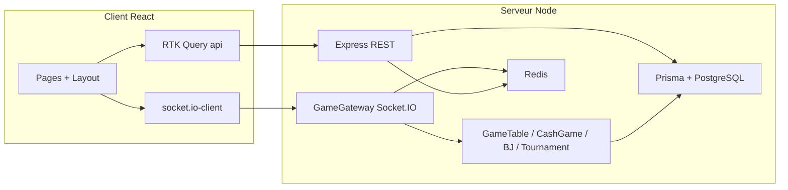

# Quantum Bluff — Architecture (état du dépôt)

Document de référence décrivant la structure actuelle du monorepo **quantum-bluff** : client React, serveur Node/Express, persistance, temps réel, jeux et transverses (auth, i18n, observabilité, empaquetage).

---

## 1. Vue d’ensemble

| Couche | Rôle principal |
|--------|----------------|
| **Client** (`client/`) | SPA React (Vite), UI poker/blackjack/tournois/casino, Socket.IO, RTK Query, i18n, PWA / Capacitor / Electron possibles |
| **Serveur** (`server/`) | API REST Express, **Socket.IO** (`GameGateway`), logique de jeu, Prisma → **PostgreSQL**, **Redis** (rate-limit, action log, adapter multi-instance) |
| **Base** (`database/`) | Docker Compose pour PostgreSQL local + `init.sql` |
| **Racine** | `package.json` orchestre `concurrently` : DB, script IA dev, serveur, client |

Flux typique : le client authentifie via JWT (`localStorage` côté client), appelle `/api/*` avec `Authorization: Bearer`, ouvre une socket avec le même token ; le serveur valide HTTP (middlewares) et socket (`socketAuth`), exécute les routes ou les handlers `GameGateway`, persiste via **Prisma**.

---

## 2. Monorepo & scripts

```
quantum-bluff/
├── client/                 # Frontend Vite + React
├── server/                 # Backend Express + Socket.IO + Prisma
├── database/               # docker-compose PostgreSQL
├── scripts/                # dev-ai, packaging iOS/Android, version bump, compose prod
├── docs/                   # documentation (dont ce fichier)
└── package.json            # dev: DB + AI + SERVER + CLIENT en parallèle
```

- **`npm run dev`** (racine) : lance DB Docker, script `scripts/dev-ai.js`, `server` (nodemon/tsx), `client` (Vite).
- **`client`** : build web, Capacitor, Electron (voir `client/package.json`).
- **`server`** : `prisma generate`, `tsc`, tests Jest.

---

## 3. Client (`client/`)

### 3.1 Stack technique

- **React 19**, **TypeScript**, **Vite 7**
- **react-router-dom** v7 (`BrowserRouter` ou `HashRouter` si `file:` — Electron packagé)
- **Tailwind CSS** + **Radix UI** (`client/src/components/ui/*`)
- **@reduxjs/toolkit** : store minimal + **RTK Query** (`client/src/services/api.ts`)
- **socket.io-client** (`client/src/services/socket.ts`, `SocketContext.tsx`)
- **i18next** + **react-i18next** (`client/src/i18n/`) — locales : `en`, `fr`, `es`, `ar`, `uk`
- **Vitest** + **Playwright** (e2e), **ESLint**

### 3.2 Point d’entrée & arborescence providers

- **`client/src/main.tsx`**  
  Ordre global : `ErrorBoundary` → `LoaderProvider` → `Redux Provider` → `ToastProvider` → `UserProvider` → `SocketProvider` → `QuantumHUDProvider` → `HiddenBetsProvider` → `AudioProvider` → **`App`**.

- **`client/src/App.tsx`**  
  Ré-enveloppe partiellement (`LoaderProvider` interne, `InvitationAcceptProvider`, `Layout`) et déclare **toutes les routes** (voir §3.4).

> Remarque : `LoaderProvider` apparaît à la fois dans `main.tsx` et dans `App.tsx` (imbrication volontaire ou historique selon évolutions).

### 3.3 Contextes React (`client/src/contexts/`)

| Contexte | Rôle |
|----------|------|
| `SocketContext` | Connexion Socket.IO, toasts liés aux événements réseau / amis |
| `UserContext` | Profil / utilisateur côté UI |
| `ToastContext` | Notifications |
| `LoaderContext` | Overlay chargement global (`showLoader` / `hideLoader`) — textes **forcés en anglais** via `useTranslation(..., { lng: 'en' })` pour l’overlay uniquement |
| `QuantumHUDContext` | HUD jeu |
| `HiddenBetsContext` | Paris cachés poker |
| `TableThemeProvider` | Thème table (feutre, etc.) |
| `MusicContext` (`AudioProvider`) | Audio |
| `AccessibilityContext` / `AccessibilityMenuOpenContext` | Accessibilité |
| `TopBarContext` | Barre supérieure |
| `InvitationAcceptProvider` | Acceptation d’invitations |

### 3.4 Routage (`App.tsx`)

**Public**

| Chemin | Composant |
|--------|-----------|
| `/` | `StartScreen` (splash + chargement simulé ; i18n **lng: `en`** pour cet écran) |
| `/auth` | `Auth` (email / login / register / mot de passe oublié ; **lng: `en`**) |
| `/auth/admin` | `AdminAuth` (**lng: `en`**) |

**Protégé utilisateur** (`ProtectedRoute` + `Layout`)

| Zone | Chemins (extraits) |
|------|---------------------|
| Hub | `/lobby`, `/profile`, `/friends`, `/edit-profile`, `/leaderboard` |
| Poker | `/game`, `/game-deal`, `/game-example`, `/waiting-room`, `/bot-configuration`, `/results`, `/hidden-bets-result` |
| Blackjack | `/blackjack`, `/blackjack/lobby`, `/blackjack/lobby/:roomId`, `/blackjack/table/:gameId` |
| Tournois | `/tournaments/:id/waiting`, `/tournaments/:id`, `/tournaments/:id/results` |
| Casino / mini-jeux | `/minigames` (hub), jeux dédiés dans pages (`SlotMachine`, `Roulette`, etc. selon navigation interne) |
| Tutoriel | `/tutorial/game` |

**Admin**

| Chemin | Composant |
|--------|-----------|
| `/admin/console` | `AdminConsole` sous `AdminProtectedRoute` |

Pages legacy ou secondaires encore présentes dans `client/src/pages/` : `Login.tsx`, `Register.tsx`, `GameExample.tsx`, etc. (routes effectives = surtout `App.tsx`).

### 3.5 Fonctionnalités modulaires (`client/src/features/`)

- **`tournament/`** : `TournamentRoom`, `TournamentWaiting`, `TournamentResults`, `TournamentWinnerBetsPanel`, hooks socket, API dédiées.
- **`blackjack/`** : `runtimeStatus.ts` (statut runtime table multi).
- **`tutorial/`** : `tutorialHandScript.ts` (script tutoriel).

### 3.6 Composants majeurs (`client/src/components/`)

Représentatif (non exhaustif) :

- **Jeu poker** : `PokerTable`, `CommunityCards`, `ShowdownDisplay`, `PokerChat`, `PlayerDashboard`, `QuantumHUD`, overlays (tour, deck shuffle, etc.).
- **Blackjack** : `blackjack/BlackjackMultiCasinoTable`, `BlackjackRoundReveal`, etc.
- **Lobby / social** : `LobbyBlackjackMultiSection`, `FriendsList`, `FriendSearch`, `InvitationBanner`, modales invitation / quit game.
- **Transverse** : `Layout` (shell principal, breadcrumbs, language switcher, wallet, etc.), `LanguageSwitcher`, `ProtectedRoute`, `AdminProtectedRoute`, `ErrorBoundary`, `Toast`, nombreux `ui/*` (shadcn-like).

### 3.7 État serveur & API

- **`client/src/store/index.ts`** : un seul slice RTK Query — **`api`** (`services/api.ts`).
- **`api.ts`** : `fetchBaseQuery` vers `${API}/api`, header JWT depuis `authStorage`, endpoints typés (auth, profil, amis, parties, bot, slot, roulette, blackjack, tournois, daily challenges, wallet, etc.).

### 3.8 Utilitaires client (`client/src/utils/`)

Exemples : `apiBase`, `authStorage`, `authRegisterErrors`, `gamificationStorage`, `pokerHandCategory`, `pokerMonteCarloEquity`, `iban`, `avatars`, `errorReporting`, etc.

### 3.9 Internationalisation

- **`client/src/i18n/config.ts`** : ressources par langue, `LanguageDetector` (`localStorage` + navigateur).
- **Écrans “guest” en anglais** sans écraser la préférence globale : `useTranslation(undefined, { lng: 'en' })` sur **Auth**, **AdminAuth**, **StartScreen** (chargement), et **LoaderContext** ; le reste de l’app utilise la langue persistée après connexion.

### 3.10 Assets

- **`client/src/assets/`** : logos, avatars, fonds (`background/`, `nappe/`, etc.), médias liés au thème table.

### 3.11 Tests front

- **`client/src/__tests__/**`** : tests Vitest ciblés.
- **`client/e2e/`** : Playwright (`smoke.spec.ts`).
- Fichiers `*.test.tsx` à côté de certains modules.

---

## 4. Serveur (`server/`)

### 4.1 Stack

- **Node** (ESM `type: "module"`), **Express 4**, **Socket.IO 4**
- **Prisma 6** + client généré dans `server/src/generated/prisma`
- **PostgreSQL** via `@prisma/adapter-pg` + pool `pg`
- **Redis** : rate limiting distribué, journal d’actions, **adapter Redis** pour Socket.IO multi-instances (`@socket.io/redis-adapter`)
- **JWT** (`jsonwebtoken`), **bcryptjs**, **Zod**, **sanitize-html**
- **OpenTelemetry**, **pino**, **prom-client** (`/metrics`)
- **Swagger** : `/api-docs`
- **Jest** + **Supertest**

### 4.2 Démarrage (`server/src/index.ts`)

Séquence indicative :

1. Observabilité précoce (`otelEarly`), **Express** + **Helmet** + **CORS** (origines depuis `env`).
2. Middlewares : `requestId`, logs HTTP, **rate limit** global (avec exemptions ex. balance, admin), **JSON** (limite ~2.5 Mo pour avatars), **antiCheat**, **timeout**, **idempotency**.
3. Montage des routes `/api/...` (liste §4.4).
4. **HTTP server** + **Socket.IO** sur `/socket.io`, **adapter Redis** si possible.
5. `socketAuth` sur `io`, **`GameGateway`** instancié, `setGameIo`, **scheduler tournois**, jobs de nettoyage, recovery blackjack / tournois au boot, **listen** port `env.port`.

### 4.3 Gateway temps réel (`server/src/sockets/game.gateway.ts`)

- Authentification socket (token handshake / header).
- Rooms utilisateur `user:{userId}`, rooms de partie poker/blackjack, tournoi, etc.
- Orchestration : **`GameTable`**, **`CashGameController`**, blackjack (stores + locks), **actions poker** (`pokerActionOrchestrator`), bots practice, **hidden bets**, **prêts entre amis** (socket + ledger), **présence** (`presence.service`), **daily challenges**, wallet côté casino, **anti-triche** (timings, monitoring).
- Fichier volumineux : cœur du multijoueur temps réel.

### 4.4 Routes HTTP REST (montage dans `index.ts`)

| Préfixe | Module | Domaine |
|---------|--------|---------|
| `/api` | `game.routes` | Jeu / salles (niveau “game” racine) |
| `/api/auth` | `auth.routes` | Inscription, login, profil, avatars, balance… |
| `/api/auth/2fa` | `twofa.routes` | TOTP |
| `/api/friends` (+ sous-chemins) | `friends`, `friendLoan`, `invitation` | Amis, prêts, invitations |
| `/api/waiting-room` | `waitingRoom.routes` | Salle d’attente |
| `/api/tournaments` | `tournament`, `tournamentWinnerBets` | Tournois + paris vainqueur |
| `/api/game` | `game.api.routes` | API métier partie |
| `/api/bot` | `bot.routes` | Bot / IA HTTP |
| `/api/slot`, `/api/roulette`, `/api/blackjack` | … | Casino “machine”, roulette, blackjack solo |
| `/api/hidden-bets` | `hiddenBets.routes` | Marchés paris cachés |
| `/api/feedback`, `/api/reports` | … | Feedback, signalements joueurs |
| `/api/admin/console` | `adminConsole.routes` | Console admin (JWT rôle admin) |
| `/api/blackjack-tables` | `blackjackMulti.routes` | Blackjack multijoueur (tables) |
| `/api/leaderboard` | `leaderboard.routes` | Classements |
| `/api/invitations` | `invitation.routes` | Invitations parties |
| `/api/daily-challenges`, `/api/daily-login` | … | Défis / streak connexion |
| `/api/free-recharge`, `/api/gift-codes`, `/api/wallet` | … | Recharge promo, codes cadeau, ledger wallet |
| `/` (racine fichier) | `updates.routes` | Mises à jour app (Electron) |

**Routes admin dev uniquement** (`!env.isProduction`) : runtime blackjack/poker, override roulette, `admin.routes`.

Santé : `/api/health/live`, `/api/health/ready`, `/api/health`, `/metrics` (Bearer optionnel).

### 4.5 Logique métier & modules serveur

| Dossier | Contenu |
|---------|---------|
| `logic/` | **`GameTable`**, **`CashGameController`**, **`BlackjackTableController`**, **`Evaluator`**, **`Deck`**, **`botAI`**, **`slotMachine`**, **`roulette`**, **`blackjack`**, règles pot/showdown, **gamification** (XP), etc. |
| `poker/` | Domaine actions, **store** runtime (`pokerStateStore`), **cash ledger**, **hidden bets** (marchés, pricing, résolution), **locks** table, recovery |
| `blackjack/` | **État** (in-memory / redis), **sync**, **recovery**, **locks**, types domaine |
| `tournament/` | Création, bracket, runtime table factory, scheduler, recovery, **winner bets** service, récompenses |
| `casino/` | Services **wallet** / contexte rounds |
| `dailyChallenges/`, `dailyLogin/`, `freeRecharge/`, `giftCodes/`, `wallet/` | Boucles engagement / monétisation légère |
| `auth/` | Logique auth (hash, tokens…) utilisée par routes |
| `services/` | **game**, **antiCheat**, **presence**, **friendLoan** (+ émissions socket), **db**, **botAi** |
| `repositories/` | Accès données complémentaires |
| `middleware/` | Auth admin, socket, timeout, idempotency, etc. |
| `validation/` | Schémas (ex. auth) |
| `observability/` | Logger, métriques, OTEL, readiness/drain, rate limit instrumenté |
| `rng/` | Composants aléatoires contrôlés |
| `shared/` | Registres **activeGames**, **activeBlackjackGames**, stores partagés, ids bot practice |
| `config/` | `env`, `database`, redis, swagger |
| `generated/prisma` | Client Prisma généré |

### 4.6 Persistance — Prisma (`server/prisma/schema.prisma`)

- **PostgreSQL** ; client généré sous `server/src/generated/prisma`.
- Modèle central **`User`** (auth, jetons, XP/niveau, 2FA, anti-cheat, avatar binaire ou URL, streak login, relations amis/tournois/blackjack/etc.).
- Nombreuses entités : **Friendship**, **GameInvitation**, **Room** / **RoomPlayer**, **poker** (historiques, actions), **blackjack** rooms & seats, **Tournament** & **TournamentPlayer**, **HiddenBetTicket**, **WalletLedgerEntry**, **Loan** / **LoanRequest**, **DailyChallengeProgress**, **GameRating**, **PlayerReport**, **FreeRecharge**, **GiftCodeUsage**, etc. (voir schéma complet dans le fichier Prisma — ~1000+ lignes).

### 4.7 Tests serveur

- **`server/src/__tests__/**`** : intégration runtime poker/blackjack, validation, bot, casino, etc.

---

## 5. Base de données locale (`database/`)

- **`docker-compose.yml`** : service PostgreSQL pour le dev.
- **`init.sql`** : initialisation / extensions si besoin.
- **`Quantum_Bluff_README.md`** : notes projet base.

---

## 6. Sécurité & conformité (transverse)

- **Helmet** + CSP configurée (fonts Google, images, etc.).
- **CORS** liste blanche `env.corsOrigins`.
- **Rate limiting** segmenté (API générale, bot, slot, roulette, blackjack, multi-BJ, hidden-bets).
- **JWT** sur HTTP et WebSocket ; rôles **admin** pour routes console / admin.
- **Anti-triche** : middleware HTTP + service + monitoring dans `GameGateway`.
- **Sanitisation** HTML / contenu chat (censure liens).
- **Graceful shutdown** : drain readiness, fermeture HTTP + `io.close`, OTEL + Redis.

---

## 7. Schéma de flux (haut niveau)



---

## 8. Résumé des “produits” jeu dans l’app

1. **Poker multijoueur / cash game** — tables, sockets, historique, défis quotidiens, paris cachés, prêts amis intégrés aux settlements.
2. **Poker vs bot** — configuration dédiée + runtime practice bot.
3. **Blackjack** — solo et **multi-tables** (salles, invitations, recovery).
4. **Tournois** — attente, salle, résultats, **paris sur le vainqueur**.
5. **Mini-jeux casino** — slot, roulette (routes + pages dédiées).
6. **Social** — amis, messages, invitations, prêts, présence.
7. **Progression** — XP, niveaux, défis, login streak, wallet / gift codes / free recharge.
8. **Admin** — console web séparée + auth admin ; routes techniques dev pour runtime.

---

## 9. Évolution / points d’attention

- **Double `LoaderProvider`** (`main.tsx` + `App.tsx`) : à clarifier si une seule instance suffit.
- Dépendance **`mongoose`** listée côté serveur mais usage non repéré dans `server/src` (possible vestige) ; persistance principale = **Prisma**.
- Langues i18n : les fichiers `translation.json` doivent rester alignés lors de l’ajout de clés (ex. `app.loadingDefaultMessage`).

---

*Document généré à partir de la structure du dépôt ; pour le détail exact des champs Prisma ou de chaque event socket, se référer aux fichiers sources cités.*
