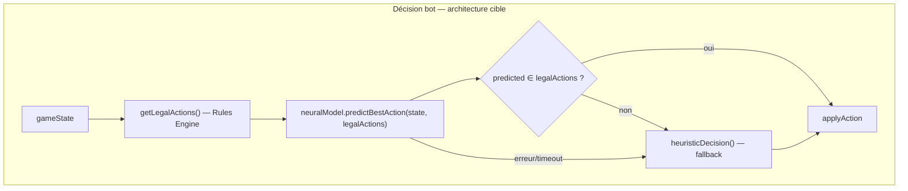

# Plan — Belote Neural AI

## Les 2 décisions qui évitent 80 % des problèmes futurs

1. **Garde-fou légal** — `if (!legalActions.includes(predicted)) return heuristicDecision(legalActions)`  
   → 0 action illégale même si modèle cassé, mal entraîné, timeout ou bug.

2. **Analytics avant entraînement** — Phase 0 (puis Benchmark 0.5) **avant** Phase 2 Dataset.  
   → On ne passe plus de « on entraîne et on espère » à une boucle mesurée.

## Vision produit — 6 couches validables indépendamment

```text
Belote Assisted AI (V1)
        ↓
Analytics (Phase 0)
        ↓
Benchmark Suite (Phase 0.5)
        ↓
Dataset (Phase 2)
        ↓
Training (Phase 4)
        ↓
Neural Deployment (Phase 5)
```

Chaque couche a des **gates** : on ne monte pas d’étage sans validation de la précédente.

## Vision produit

**Nom** : Belote Neural AI  
**Pitch** : Une IA Belote entraînée sur parties réelles et self-play, capable de choisir statistiquement la meilleure action **parmi les coups légaux uniquement**.

**Version « startup parfaite »** :

| Couche | Rôle |
|--------|------|
| **Rules Engine** (symbolique) | Garantit qu’aucune action illégale n’est jouée |
| **Neural AI** (statistique) | Choisit la meilleure action parmi `legalActions` |
| **Self-play** | Améliore le modèle |
| **Analytics** | Vérifie la qualité |
| **Fallback heuristique** | Évite les crashes si modèle indisponible |



**Contrat d’API interne** (jamais `predict()` sans filtre légal) :

```ts
const legalActions = getLegalActions(table, botPlayerId)
const action = await predictBestAction(features, legalActions) // softmax sur legalActions only
if (!legalActions.includes(action)) return heuristicDecision(legalActions)
```

### Invariant architectural #1 (non négociable)

Cette ligne paraît simple — c’est **la décision la plus importante du document** :

```ts
if (!legalActions.includes(predicted)) {
  return heuristicDecision(legalActions)
}
```

Elle garantit **0 action illégale en prod**, même si :
- modèle cassé ou mal entraîné
- timeout inference
- bug Python / ONNX
- prédiction hors distribution

Le neural **propose** ; le Rules Engine + filtre **valident**. L’heuristique **assure**.

La spec **Belote Assisted AI** (WR + bots + runtime) devient la **base obligatoire** — on ne la jette pas, on y ajoute les couches neural par-dessus.

**Référence existante** : pipeline poker [`server/ai-service/`](server/ai-service/) (`predict/poker`, train, evaluate) + [`botAi.service.ts`](server/src/services/botAi.service.ts) (oracle TS + fallback Python).

---

## Critères d’acceptation V1 (livraison immédiate)

| Critère | Garantie |
|---------|----------|
| WR avec bots immédiats | API fill + auto-fill 30s |
| 4 variantes | Rules Engine + heuristique par `variant` |
| Bots **100 % légaux** | `getLegalActions()` symbolique — tests avant tout |
| Parties non bloquantes | `beloteBotTurns` pattern poker |
| Déconnexions gérées | Remplacement humain→IA |
| Maintenable | 2 couches séparées dès V1 (`legalEngine` / `heuristic` / futur `neural`) |

---

# Partie A — V1 Belote Assisted AI (à coder en premier)

> Infrastructure + Rules Engine + heuristique NORMAL. **Pas de réseau de neurones en V1** — mais l’architecture est prête à le recevoir.

## A.1 Lobby & données

Identique au plan validé :

- `BeloteRoomSeat` : `HUMAN | BOT`, pas de faux User
- `BeloteRoom` : `autoFillBotsEnabled`, `autoFillBotsDelaySec`, `defaultBotDifficulty`
- `POST /bots`, `POST /bots/fill`, `DELETE /bots/:botId` avec `{ difficulty: 'NORMAL' }`
- **Compléter la table** (CTA) + **auto-fill 30s** + compteur **Humains / IA**
- Exclusion bots : buy-in, wallet, XP, stats, classement

Fichiers clés : [`beloteRoom.routes.ts`](server/src/routes/beloteRoom.routes.ts), [`beloteRoomBots.service.ts`](server/src/belote/services/beloteRoomBots.service.ts), [`beloteRoomAutoFill.service.ts`](server/src/belote/services/beloteRoomAutoFill.service.ts).

## A.2 Rules Engine symbolique (couche 1 — obligatoire, permanent)

Nouveau [`server/src/belote/services/beloteLegalEngine.ts`](server/src/belote/services/beloteLegalEngine.ts) :

```ts
export function getLegalActions(
  table: BeloteTableController,
  playerId: string,
): BeloteLegalAction[]
```

- Réutilise **exclusivement** les helpers moteur existants : `playableCards`, enchères par variante (`classiqueBidding`, `conteeBidding`, `conteeLegalBids`, …)
- Retourne une liste finie d’actions typées (`PLAY_CARD`, `PASS`, `BID`, `CONTREE`, …)
- **Jamais supprimé** — même quand le modèle neural sera actif, c’est le garde-fou légal

Tests **prioritaires** (`beloteLegalEngine.test.ts`) × 4 variantes avant toute heuristique ou neural.

## A.3 Heuristique NORMAL (couche 2 — fallback permanent)

Nouveau [`server/src/belote/services/beloteBotHeuristic.ts`](server/src/belote/services/beloteBotHeuristic.ts) :

```ts
export function heuristicDecision(
  table: BeloteTableController,
  playerId: string,
  legalActions: BeloteLegalAction[],
): BeloteBotDecision
```

- Choisit **uniquement** dans `legalActions`
- Stratégie spec (enchères `handScore`, jeu pli/partenaire/coupe)
- Sert de fallback V1 **et** fallback permanent V5

## A.4 Orchestrateur [`beloteBot.service.ts`](server/src/belote/services/beloteBot.service.ts)

```ts
export async function decideBeloteBotAction(table, botPlayerId): Promise<BeloteBotDecision> {
  const legalActions = getLegalActions(table, botPlayerId)
  if (legalActions.length === 0) throw new Error('NO_LEGAL_ACTIONS')

  // V1 : heuristique seule
  // V5 : try neural → filter → fallback heuristic
  if (env.beloteNeuralEnabled) {
    try {
      const predicted = await beloteNeuralService.predictBest(table, botPlayerId, legalActions)
      if (legalActions.includes(predicted)) return { ...predicted, reason: 'neural' }
    } catch { /* fallback */ }
  }
  return heuristicDecision(table, botPlayerId, legalActions)
}
```

## A.5 Runtime & UX

- [`beloteBotTurns.service.ts`](server/src/belote/services/beloteBotTurns.service.ts) — pattern [`practiceBotTurns.service.ts`](server/src/poker/services/practiceBotTurns.service.ts)
- Frontend : `LobbyBeloteSection`, `BeloteWaitingRoom`, badges IA, déconnexion→IA

## A.6 Ordre d’implémentation V1

```text
1. Rules Engine + tests légalité × 4 variantes
2. Schema + lobby API (bots, fill, difficulty, auto-fill)
3. Heuristique NORMAL (sur legalActions uniquement)
4. beloteBotTurns + hooks + non-blocage
5. UX WR + in-game
6. Déconnexion → IA
7. Tests intégration
```

## A.7 Estimation V1

**≈ 1 à 1,5 semaine** (inchangé).

---

# Partie B — Roadmap post-V1 (Phase 0 → 0.5 → 2 → 5)

> Ordre strict : **V1** → **Phase 0 Analytics** → **Phase 0.5 Benchmark** → **Phase 2 Dataset** → train → deploy.  
> Boucle cible : Heuristique → Mesure → Dataset → Train → **Évaluation benchmark** → Déploiement.

## B.0 Phase 0 — Belote Analytics (avant tout dataset / neural)

**Pourquoi avant Phase 2** : il faut une baseline mesurable (humain vs heuristique) avant d’entraîner un réseau. Sinon impossible de savoir si le modèle progresse.

**Référence** : [`AdminBotAnalytics.tsx`](client/src/pages/AdminBotAnalytics.tsx) + `GET /api/admin/console/bot-analytics` (poker).

### Métriques à suivre (par `decisionSource`)

| Métrique | Description | Agrégation |
|----------|-------------|------------|
| **Win rate** | % parties gagnées | par source, variante |
| **Pli gagnés** | tricks gagnés / deal | moyenne par source |
| **Score moyen** | points équipe / deal / partie | moyenne |
| **Erreur d’enchère** | enchère sous/sur-optimale vs oracle règles (proxy) | taux par source |
| **Erreur de coupe** | mauvais atout / non-respect couleur quand alternative légale meilleure | taux par source |
| **Temps de décision** | `decisionTimeMs` | p50 / p95 par source |

**Sources comparées** :

```ts
type BeloteDecisionSource = 'HUMAN' | 'HEURISTIC' | 'NEURAL'
```

- **HUMAN** : actions via `BELOTE_ACTION` socket
- **HEURISTIC** : `beloteBotHeuristic` (dès V1)
- **NEURAL** : `beloteNeural.service` (dès V5 — colonne vide jusqu’alors)

### Stockage — métriques + versioning modèle

```prisma
model BeloteModelVersion {
  id          String   @id @default(uuid())
  slug        String   @unique  // belote-v1, belote-v2, belote-v3
  label       String
  artifactUrl String?           // ONNX / .pt path
  isActive    Boolean  @default(false)
  createdAt   DateTime @default(now())

  decisions   BeloteDecisionMetric[]
  benchmarks  BeloteBenchmarkRun[]
}

model BeloteDecisionMetric {
  id              String   @id @default(uuid())
  gameId          String
  handId          String
  playerId        String
  decisionSource  String   // HUMAN | HEURISTIC | NEURAL
  modelVersionId  String?  // FK BeloteModelVersion — NEURAL only
  variant         BeloteGameVariant
  phase           String
  decisionTimeMs  Int
  wonDeal         Boolean?
  wonGame         Boolean?
  teamScoreDelta  Int?
  tricksWon       Int?
  biddingError    Boolean @default(false)
  cutError        Boolean @default(false)
  neuralRejected  Boolean @default(false)
  createdAt       DateTime @default(now())

  modelVersion BeloteModelVersion? @relation(fields: [modelVersionId], references: [id])

  @@index([decisionSource, variant])
  @@index([modelVersionId])
  @@index([gameId, handId])
  @@index([createdAt])
}
```

Chaque décision **NEURAL** est associée à `belote-vN` — indispensable pour comparer v1 vs v2 vs v3 vs v4 dans 6 mois.

### Services & UI

| Fichier | Rôle |
|---------|------|
| [`beloteAnalytics.service.ts`](server/src/belote/services/beloteAnalytics.service.ts) | `recordDecision()`, `recordDealOutcome()`, agrégations |
| [`admin.beloteAnalytics.routes.ts`](server/src/routes/admin.beloteAnalytics.routes.ts) | `GET /api/admin/console/belote-analytics` |
| [`AdminBeloteAnalytics.tsx`](client/src/pages/AdminBeloteAnalytics.tsx) | Dashboard comparatif HUMAN / HEURISTIC / NEURAL |

**Hooks** (async, non bloquant) :
- `beloteBot.service` : log source + `decisionTimeMs` + `neuralRejected`
- `belote.gateway` : log actions humaines
- fin de deal / partie : `wonDeal`, `winRate`, scores

**KPIs Phase 0** (gates avant Phase 4 train) :
- Heuristique : **0** action illégale (assertion + analytics)
- Baseline win rate heuristique vs humain documentée
- p95 latence heuristique < 50 ms

### Estimation Phase 0

**≈ 3–4 jours** (fin V1 ou juste après ship).

---

## B.0.5 Phase 0.5 — Belote Benchmark Suite (avant modèle neural)

**Pourquoi avant Phase 3/4** : sans benchmark reproductible, impossible de savoir si `belote-v4 > belote-v3` ou seulement « différent ».

**Script headless** : [`scripts/belote-benchmark.ts`](scripts/belote-benchmark.ts) (miroir [`bot-sim`](.github/workflows/bot-sim.yml) poker).

### Matchups

| Matchup | Quand |
|---------|-------|
| `HEURISTIC vs HEURISTIC` | Baseline moteur (dès Phase 0.5) |
| `HEURISTIC vs RANDOM` | Plancher (random = légal uniquement via Rules Engine) |
| `NEURAL vs HEURISTIC` | Gate chaque release modèle (Phase 5+) |
| `NEURAL vs HUMAN` | Replay situations humaines / échantillon parties réelles |

### Échelles

```ts
const BENCHMARK_SCALES = [10_000, 50_000, 100_000] as const
```

Chaque run : variante(s), matchup, seed, durée, agrégats stockés.

### Stockage résultats

```prisma
model BeloteBenchmarkRun {
  id             String   @id @default(uuid())
  modelVersionId String?  // null pour HEURISTIC-only runs
  matchup        String   // HEURISTIC_VS_HEURISTIC, NEURAL_VS_HEURISTIC, ...
  variant        BeloteGameVariant
  gamesPlayed    Int
  teamAWins      Int
  teamBWins      Int
  avgScoreA      Float
  avgScoreB      Float
  illegalActions Int      @default(0)  // doit rester 0
  avgDecisionMs  Float
  startedAt      DateTime
  finishedAt     DateTime

  modelVersion BeloteModelVersion? @relation(fields: [modelVersionId], references: [id])

  @@index([modelVersionId, matchup])
  @@index([finishedAt])
}
```

### Gates benchmark (avant promote `belote-vN+1` en prod)

- `illegalActions === 0`
- `NEURAL vs HEURISTIC` : win rate neural ≥ baseline + seuil minimal (ex. +2 %)
- Résultats 10k reproductibles avant run 100k (CI nightly optionnel)

### Estimation Phase 0.5

**≈ 2–3 jours** (harness headless + persistance + 1er run 10k HEURISTIC vs RANDOM).

---

## B.1 Phase 2 — Dataset

**Prisma** — nouveau modèle :

```prisma
model BeloteTrainingSample {
  id               String   @id @default(uuid())
  gameId           String
  handId           String
  playerId         String
  phase            String
  variant          BeloteGameVariant
  gameStateJson    Json
  legalActionsJson Json
  chosenActionJson Json
  reward           Float?
  source           String   // HUMAN | SELF_PLAY | SIMULATION | REPLAY
  createdAt        DateTime @default(now())

  @@index([gameId, handId])
  @@index([variant, phase])
  @@index([createdAt])
}
```

**Sources** :
- Parties humaines réelles (opt-in / anonymisé)
- Self-play IA vs IA (headless harness)
- Simulations massives (moteur existant)
- Replay snapshots [`BeloteGameSnapshot`](server/prisma/schema.prisma)

**Hook V1 préparatoire** (léger, activable par flag) : après chaque action humaine, enqueue sample async (sans bloquer la partie).

Fichiers : `beloteTrainingJournal.service.ts`, `scripts/belote-selfplay.ts`.

## B.2 Phase 3 — Modèle

**Entrées** (features normalisées) :

```ts
{
  handCards, playedCards, currentTrick, trumpSuit,
  teamScore, opponentScore, position, phase, variant,
  legalActions  // encodées en indices
}
```

**Sortie** : `probability(action)` — softmax **uniquement sur `legalActions`** (masking côté Python, pas côté modèle libre).

Nouveau package : `server/ai-service/belote/` (miroir de `poker/`).

## B.3 Phase 4 — Entraînement

Pipeline (réutilise infra poker) :

```text
Parties jouées
  → BeloteTrainingSample
  → Python train (imitation learning → self-play → RL optionnel)
  → Export ONNX / .pt
  → Validation offline (win rate vs heuristic)
```

Modes :
1. **Imitation learning** — coups humains
2. **Self-play** — IA vs IA
3. **RL** (optionnel) — reward = victoire / score / pli gagné

Scripts : `belote/train.py`, `belote/evaluate.py`, `belote/selfplay.py`.

## B.4 Phase 5 — Déploiement sécurisé

Nouveau [`server/src/belote/services/beloteNeural.service.ts`](server/src/belote/services/beloteNeural.service.ts) :

```ts
export async function predictBestAction(
  table: BeloteTableController,
  playerId: string,
  legalActions: BeloteLegalAction[],
): Promise<BeloteBotDecision>
```

**Toujours** :
- Timeout (comme poker `AI_SERVICE_TIMEOUT_MS`)
- Filtre `legalActions.includes(predicted)`
- Fallback `heuristicDecision()` si erreur / action illégale / service down
- Log `reason: 'neural' | 'heuristic' | 'neural_rejected'`

**Inference** :
- Option A : `POST AI_SERVICE_URL/predict/belote` (Python, comme poker)
- Option B : ONNX Runtime Node.js (latence plus basse, plus de ops)

**Branchement analytics** : alimente `decisionSource: 'NEURAL'` + compteur `neuralRejected` (Phase 0 dashboard).

## B.5 Estimation roadmap post-V1

| Phase | Contenu | Temps indicatif |
|-------|---------|-----------------|
| **0 — Analytics** | Métriques + `BeloteModelVersion` + admin | 3–4 jours |
| **0.5 — Benchmark** | `belote-benchmark.ts` + 10k/50k/100k runs | 2–3 jours |
| 2 — Dataset | Schema + journal + self-play | 1 semaine |
| 3 — Modèle | Features + softmax legalActions | 1 semaine |
| 4 — Train | Imitation + self-play + eval **vs benchmark** | 2–3 semaines |
| 5 — Deploy | Inference + filtre légal + version tagging | 1 semaine |
| **Total post-V1** | **≈ 5–8 semaines** |

---

## Hors scope

**V1** : réseau de neurones, EASY/EXPERT gameplay  
**Neural** : IA adaptative par joueur, matchmaking auto bots  
**Phase 0** couvre analytics ; **Phase 5** branche seulement la source `NEURAL`

---

## Verdict final — prêt à développer

### Immédiatement (ship produit)

- Belote Assisted AI V1
- Auto-fill + Compléter la table
- Runtime bots + Rules Engine
- Analytics Phase 0 (dès fin V1)

### Ensuite (actif technologique)

- Benchmark Suite Phase 0.5
- Dataset + self-play
- Neural model + ONNX
- `BeloteModelVersion` + évaluation vN vs vN-1

### Plus tard

- Adaptive Belote AI (profil joueur)
- Massive simulation cluster / CI régression 100k

### Résumé exécutif

| Livrable | Quand | Quoi |
|----------|-------|------|
| **V1 Assisted** | Sem. 1–1,5 | WR, bots légaux, heuristique — **ship joueur** |
| **Phase 0 Analytics** | Sem. 2 | Baseline HUMAN / HEURISTIC / `belote-vN` |
| **Phase 0.5 Benchmark** | Sem. 2–3 | 10k→100k, anti-régression modèles |
| **Phases 2–5 Neural** | Sem. 4–9 | Dataset → train → deploy **mesuré** |

Si ce document est implémenté, Quantum Bluff n’aura pas « des bots Belote » — mais un **moteur IA propriétaire** : collecte, évaluation, entraînement, déploiement, amélioration continue. Le neural s’ajoute au-dessus du Rules Engine, jamais en remplacement.