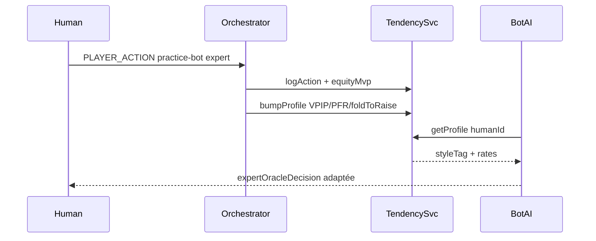
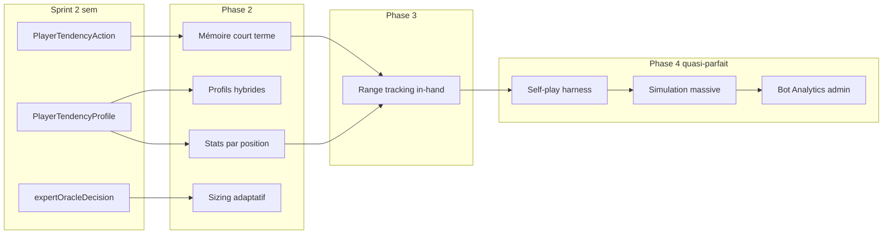
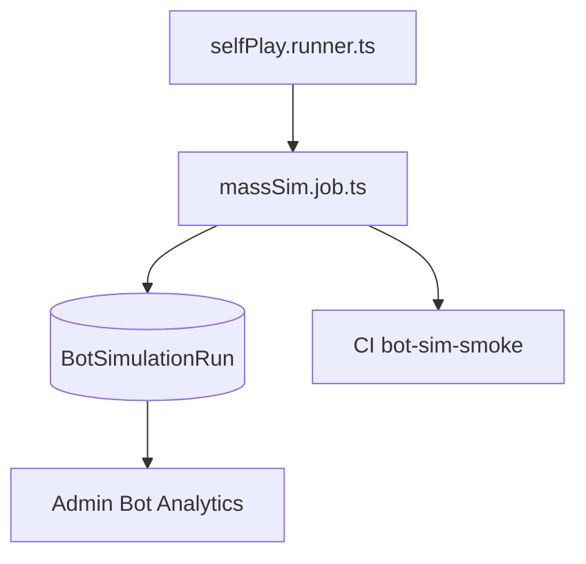

# Adaptive Expert AI — Profil comportemental pour IA adaptative

## Pitch produit

> **Adaptive Expert AI** : le bot expert apprend les tendances du joueur et ajuste sa stratégie en temps réel.

Pas « profil psychologique » (privacy / crédibilité) — **profil comportemental** dérivé d’actions observées en **practice bot expert uniquement**.

## Objectif final (2 semaines)

Quand un joueur affronte le bot expert via [`/api/game/bot/start`](server/src/routes/game.api.routes.ts) (`practice-bot-*`), le serveur :

1. Observe ses actions
2. Construit un profil de tendance (VPIP, PFR, bluff rate, fold to raise)
3. Le bot expert adapte automatiquement son style contre lui

**Fin semaine 1** : « Le système observe le joueur et calcule son profil comportemental. »

**Fin semaine 2** : « L’IA expert s’adapte au profil réel du joueur. »

## Scope unique (pas de fallback legacy)

- **Un seul chemin** : practice-bot serveur → [`applyPokerAction`](server/src/poker/services/pokerActionOrchestrator.service.ts)
- **Hors sprint** : `/api/bot/action` sans `gameId`, `POST /tendency/action`, auth optionnelle bot, client [`Game.tsx`](client/src/pages/Game.tsx) local, Python payload enrichi, UI joueur, ML, cash game réel, dashboard



## Must-have (sprint)

| Livrable | Détail |
|----------|--------|
| Prisma | `PlayerTendencyProfile` + journal minimal |
| Service | [`playerTendency.service.ts`](server/src/poker/services/playerTendency.service.ts) |
| Hooks | `applyPokerAction` (log + agrégats) |
| Bot adaptatif | `practiceBotTurns` → `ExpertAiContext` → `expertOracleDecision` |
| Debug API | `GET /api/game/tendency/me` |
| Tests | service + oracle avec profil |
| Privacy | purge journal 90j + suppression compte |

## Nice-to-have (hors sprint 2 semaines)

- Fallback client legacy / `POST /tendency/action`
- UI « ton profil détecté »
- Enrichissement payload Python
- Voir **roadmap post-sprint** ci-dessous (mémoire court terme, range, sizing, position, profils hybrides)

---

## Semaine 1 — Observer et profiler

### 1. Schéma Prisma

**`PlayerTendencyProfile`** (1:1 `User`) — agrégats uniquement :

- `handsObserved`
- `vpipOpportunities`, `vpipTaken`
- `pfrOpportunities`, `pfrTaken`
- `raisesFacing`, `foldsToRaise`
- `raisesMade`, `raiseEquitySamples`, `raiseEquitySumBp` (moyenne équité aux raises, basis points)
- `lowEquityRaises` (raises avec `equityBp < 3500` — proxy bluff MVP, sans label showdown complexe)
- `styleTag` : `UNKNOWN | AGGRESSIVE | CALLING_STATION | TIGHT | BALANCED`
- **Scores de style** (0–100, stockés dès v1 — pas encore utilisés par le bot) :
  - `styleScoreAggressive` (Int, default 0)
  - `styleScoreTight` (Int, default 0)
  - `styleScoreCallingStation` (Int, default 0)
  - Ex. `Aggressive=72, Tight=18, CallingStation=10` → `styleTag = AGGRESSIVE`
- `lastStyleEvaluationAt` (DateTime?) — horodatage du dernier recalcul style/scores (batch jobs, évolution joueur, sans migration future)
- `updatedAt`

**`PlayerTendencyAction`** — journal **minimal** (audit + debug, rétention 90j) :

- `playerId`, `gameId`, `handId`, `phase`, `action`, `amount?`, `equityBp`, `createdAt`
- Index `(playerId, createdAt)`
- **Phase 2** (migration légère) : `position?`, `potBefore?` — prépare sizing + stats positionnelles

Pas de `reachedShowdown`, `wonHand`, `labeledBluff` en v1 — le profil agrégé suffit. Phase 2b ajoute `PlayerTendencyHandSummary` pour mémoire court terme.

### 2. Service tendances (MVP fiable)

[`server/src/poker/services/playerTendency.service.ts`](server/src/poker/services/playerTendency.service.ts) :

| Fonction | Rôle |
|----------|------|
| `computeHeroEquityBp` | Réutilise [`heroShowdownEquity`](server/src/logic/botAI.ts) × 10000 — **practice bot only** |
| `logHumanTendencyAction` | Insert journal + MAJ compteurs profil |
| `getPlayerTendencyProfile` | Dérivés : `vpip`, `pfr`, `bluffRaiseRate`, `foldToRaiseRate`, `styleTag`, `confidence` |
| `evaluateStyleScores` | Calcule les 3 scores (0–100) à partir des rates ; met à jour `styleTag` + `lastStyleEvaluationAt` |
| `inferStyleTag` | `argmax(styleScore*)` parmi AGGRESSIVE / TIGHT / CALLING_STATION ; `BALANCED` si écart faible |
| `computeConfidence` | `LOW` / `MEDIUM` / `HIGH` selon volume observé |

**Équité MVP** — commentaire obligatoire dans le code :

```ts
// Expert practice bot only: bot hole cards are known server-side for adaptive training.
```

Pas de Monte Carlo custom : réutiliser `heroShowdownEquity` existant (déjà testé).

**Bluff rate MVP (simple)** :

- À chaque **raise** humain : si `equityBp < 3500` → incrémenter `lowEquityRaises`
- `bluffRaiseRate = lowEquityRaises / raisesMade` — pas de confirmation showdown en v1

**Compteurs action** :

- **VPIP** : call ou raise quand il y a un prix à payer (`callAmount > 0`) ou raise volontaire
- **PFR** : raise en `PREFLOP`
- **Fold to raise** : fold quand `callAmount > 0`

**Cold start strict** — évite sur-réaction après 2–3 mains :

```ts
type TendencyConfidence = 'LOW' | 'MEDIUM' | 'HIGH'

function computeConfidence(handsObserved: number): TendencyConfidence {
  if (handsObserved < 20) return 'LOW'
  if (handsObserved < 50) return 'MEDIUM'
  return 'HIGH'
}

function buildPublicProfile(raw: PlayerTendencyProfile): PlayerTendencyView {
  const confidence = computeConfidence(raw.handsObserved)
  if (raw.handsObserved < 20) {
    return {
      handsObserved: raw.handsObserved,
      vpip: ratio(raw.vpipTaken, raw.vpipOpportunities),
      pfr: ratio(raw.pfrTaken, raw.pfrOpportunities),
      bluffRaiseRate: ratio(raw.lowEquityRaises, raw.raisesMade),
      foldToRaiseRate: ratio(raw.foldsToRaise, raw.raisesFacing),
      styleTag: 'UNKNOWN',
      confidence: 'LOW',
    }
  }
  return {
    /* mêmes ratios */
    styleTag: inferStyleTag(raw),
    confidence,
  }
}
```

- Les **rates** restent calculés et exposés (debug utile) même en `LOW`
- Seul `styleTag`, les **scores** et les **ajustements bot** restent gelés tant que `confidence === 'LOW'` (scores à 0, pas de `lastStyleEvaluationAt`)

**Évaluation style (MVP)** — appelée à chaque fin de main (`handsObserved++`) si `handsObserved >= 20` :

```ts
// Heuristique simple — scores 0–100, normalisés pour sommer ~100
function evaluateStyleScores(raw): { aggressive, tight, callingStation, tag } {
  const vpip = ratio(raw.vpipTaken, raw.vpipOpportunities)
  const pfr = ratio(raw.pfrTaken, raw.pfrOpportunities)
  const bluff = ratio(raw.lowEquityRaises, raw.raisesMade)
  const foldToRaise = ratio(raw.foldsToRaise, raw.raisesFacing)

  const aggressive = clamp(0, 100, Math.round(pfr * 120 + bluff * 80))
  const callingStation = clamp(0, 100, Math.round(vpip * 100 - pfr * 60))
  const tight = clamp(0, 100, Math.round((1 - vpip) * 70 + foldToRaise * 50))
  // normaliser à 100 puis tag = max
  const tag = pickDominantTag(aggressive, tight, callingStation)
  return { aggressive, tight, callingStation, tag }
}
// Persister scores + styleTag + lastStyleEvaluationAt = now()
```

**Pourquoi stocker les scores maintenant** : UI future, analytics, évolution du profil, batch recalcul — **zéro migration** plus tard.

### 3. Hook serveur

Dans [`applyPokerAction`](server/src/poker/services/pokerActionOrchestrator.service.ts), après `target.apply` réussi :

```
if isPracticeBotGameId && difficulty === 'expert' && !playerId.startsWith('qb-bot-')
  → logHumanTendencyAction(game, playerId, action, amount)
```

**Fin de main** : incrémenter `handsObserved` ; si `>= 20`, appeler `evaluateStyleScores` (met à jour scores + `styleTag` + `lastStyleEvaluationAt`). Pas de labeling showdown en v1.

### 4. API debug

`GET /api/game/tendency/me` (auth) dans [`game.api.routes.ts`](server/src/routes/game.api.routes.ts) :

```json
{
  "handsObserved": 42,
  "vpip": 0.38,
  "pfr": 0.14,
  "bluffRaiseRate": 0.31,
  "foldToRaiseRate": 0.52,
  "styleTag": "AGGRESSIVE",
  "styleScores": {
    "aggressive": 72,
    "tight": 18,
    "callingStation": 10
  },
  "confidence": "MEDIUM",
  "lastStyleEvaluationAt": "2026-05-29T14:32:00.000Z"
}
```

Exemple cold start (`handsObserved: 5`) :

```json
{
  "handsObserved": 5,
  "vpip": 0.40,
  "pfr": 0.20,
  "bluffRaiseRate": 0.50,
  "foldToRaiseRate": 0.33,
  "styleTag": "UNKNOWN",
  "styleScores": { "aggressive": 0, "tight": 0, "callingStation": 0 },
  "confidence": "LOW",
  "lastStyleEvaluationAt": null
}
```

**Critère fin S1** : jouer 10 mains expert → profil non vide via GET (rates visibles, `confidence: LOW`, `styleTag: UNKNOWN`).

---

## Semaine 2 — Adapter le bot

### 5. Injection profil

[`practiceBotTurns.service.ts`](server/src/poker/services/practiceBotTurns.service.ts) — `buildExpertAiContext` :

- `humanUserId` = joueur non `qb-bot-*`
- `getPlayerTendencyProfile(humanUserId)` → `playerTendency` dans [`ExpertAiContext`](server/src/services/botAi.service.ts)

```ts
playerTendency?: {
  vpip: number
  pfr: number
  bluffRaiseRate: number
  foldToRaiseRate: number
  styleTag: string
  styleScores: { aggressive: number; tight: number; callingStation: number }
  confidence: 'LOW' | 'MEDIUM' | 'HIGH'
  lastStyleEvaluationAt: string | null
}
```

En v1 le bot n’utilise que `styleTag` + rates + `confidence` (règles discrètes). Les **scores hybrides** sont persistés dès S1 ; **Phase 2** les exploite pour des ajustements pondérés (ex. 70 % agressif + 30 % calling station) au lieu d’un tag unique.

### 6. Décision adaptative

[`expertOracleDecision`](server/src/logic/botAI.ts) + `applyTendencyAdjustments(winProb, req, profile)` :

**Règle d’or** — ajustements appliqués **uniquement** si `profile.confidence !== 'LOW'` :

```ts
if (!profile || profile.confidence === 'LOW') {
  return baseWinProbThreshold // 20 % — comportement oracle actuel
}
return applyTendencyAdjustments(baseWinProbThreshold, profile)
```

| Signal (si confidence MEDIUM/HIGH) | Ajustement |
|--------|------------|
| `bluffRaiseRate > 0.35` | Seuil fold abaissé (15 % au lieu de 20 %) → plus de call down |
| `foldToRaiseRate > 0.60` | Plus de raises quand `callAmount === 0` |
| `CALLING_STATION` | Value plus large, moins de bluffs |
| `TIGHT` | Plus de steals / pression en position |
| `styleTag === 'UNKNOWN'` | Pas d’ajustement (ne devrait pas arriver si confidence !== LOW) |

`confidence === 'HIGH'` (50+ mains) : ajustements à pleine intensité. `MEDIUM` : même règles à 50 % d’intensité (évite swing trop brutal).

Pas de changement Python en v1 — oracle TS couvre 100 % du practice expert.

### 7. Tests essentiels

- [`playerTendency.service.test.ts`](server/src/__tests__/playerTendency.service.test.ts) : VPIP/PFR/fold, bluff proxy, cold start, `evaluateStyleScores` (scores somment ~100, tag cohérent), `lastStyleEvaluationAt` mis à jour
- [`botAI.test.ts`](server/src/__tests__/botAI.test.ts) : profil `confidence: LOW` → pas d’ajustement ; profil bluffer `MEDIUM` → call plus large vs relance

### 8. Privacy

- [`cleanup.job.ts`](server/src/utils/cleanup.job.ts) : purge `PlayerTendencyAction` > 90 jours
- [`userDeletion.service.ts`](server/src/services/userDeletion.service.ts) : supprimer profil + journal

**Critère fin S2** : même joueur « bluffer » (raises low equity répétées) → bot call plus souvent vs relance.

---

## Fichiers touchés (sprint)

| Fichier | Semaine |
|---------|---------|
| [`server/prisma/schema.prisma`](server/prisma/schema.prisma) | S1 |
| `server/src/poker/services/playerTendency.service.ts` | S1 |
| [`server/src/poker/services/pokerActionOrchestrator.service.ts`](server/src/poker/services/pokerActionOrchestrator.service.ts) | S1 |
| [`server/src/routes/game.api.routes.ts`](server/src/routes/game.api.routes.ts) | S1 |
| [`server/src/poker/services/practiceBotTurns.service.ts`](server/src/poker/services/practiceBotTurns.service.ts) | S2 |
| [`server/src/services/botAi.service.ts`](server/src/services/botAi.service.ts) | S2 |
| [`server/src/logic/botAI.ts`](server/src/logic/botAI.ts) | S2 |
| Tests + cleanup + userDeletion | S2 |

**Explicitement hors sprint** : [`bot.routes.ts`](server/src/routes/bot.routes.ts), [`Game.tsx`](client/src/pages/Game.tsx)

---

## Risque assumé

L’équité avec trous bots connus est **volontairement limitée au mode practice expert** (oracle serveur). Documenté en commentaire + README interne court. Jamais activé en cash game / multi réel.

## Roadmap post-sprint — IA expert « niveau pro »

Le sprint pose les fondations (journal, agrégats, scores, hook oracle). Les briques ci-dessous s’empilent sans casser le schéma v1.



### Phase 2a — Profils hybrides (priorité haute, faible coût)

**Problème** : `styleTag = AGGRESSIVE` masque un joueur 70 % agressif / 30 % calling station.

**Déjà en place (S1)** : `styleScoreAggressive`, `styleScoreTight`, `styleScoreCallingStation`.

**Évolution bot** — remplacer les branches `if (styleTag === 'CALLING_STATION')` par un blend :

```ts
function applyHybridAdjustments(base: number, profile: PlayerTendencyView): number {
  const w = normalizeScores(profile.styleScores) // somme = 1
  return (
    w.aggressive * aggressiveAdjustment(base, profile) +
    w.tight * tightAdjustment(base, profile) +
    w.callingStation * callingStationAdjustment(base, profile)
  )
}
```

- `styleTag` reste exposé API / UI comme **label dominant** (lisibilité)
- Le bot utilise les **poids**, pas le tag seul
- Fichiers : [`botAI.ts`](server/src/logic/botAI.ts) `applyTendencyAdjustments`

### Phase 2b — Mémoire court terme (« a bluffé les 3 dernières mains »)

**Objectif** : détecter des **séquences récentes** (tilt, run de bluffs, fold streak) pour ajuster l’oracle **dans la session**, pas seulement le profil long terme.

**Données** — étendre le journal ou ajouter `PlayerTendencyHandSummary` (1 row / main / joueur) :

| Champ | Rôle |
|-------|------|
| `handId`, `gameId`, `playerId`, `endedAt` | clé |
| `vpip`, `pfr`, `raised`, `lowEquityRaises` | résumé main |
| `position` | BTN / CO / SB / BB / UTG… |
| `reachedShowdown`, `wonPot` | optionnel phase 2 |

**Requête session** : `getRecentHandSummaries(playerId, gameId, limit: 5)` → flags :

- `consecutiveBluffHands >= 3` → call-down plus large **cette session**
- `consecutiveFoldsToRaise >= 4` → plus de steals **main courante**

**Stockage** : journal `PlayerTendencyAction` suffit en dev ; summary table recommandée pour perf (évite agrégation lourde).

**Injection** : `ExpertAiContext.recentTendency?: { consecutiveBluffHands, consecutiveFoldStreak, lastHands: HandSummary[] }`

### Phase 2c — Exploitation de position (BTN, CO, SB, BB)

**Objectif** : VPIP/PFR/fold-to-raise **par position**, pas seulement globaux.

**Schéma** — compteurs positionnels sur `PlayerTendencyProfile` (ou JSON `positionStats`) :

```ts
positionStats: {
  BTN: { vpipOpp, vpipTaken, pfrOpp, pfrTaken, foldsToRaise, raisesFacing },
  CO: { ... },
  SB: { ... },
  BB: { ... },
}
```

**Hook** : à `logHumanTendencyAction`, résoudre la position du hero via état table ([`practiceBotTurns`](server/src/poker/services/practiceBotTurns.service.ts) / seat index) et incrémenter le bucket correspondant.

**Bot** : `applyTendencyAdjustments` lit `profile.positionStats[heroPosition]` en priorité ; fallback global si `handsObserved < seuil` par position.

### Phase 2d — Sizing adaptatif (au-delà fold/call/raise)

**Objectif** : choisir le **montant** optimal (min-raise, ½ pot, pot, overbet), pas seulement l’action binaire.

**Approche incrémentale** (sans ML) :

1. Oracle TS garde fold/call/raise ; si `raise` → `pickRaiseSize(context, profile)`
2. Buckets : `minRaise | thirdPot | halfPot | pot | overbet`
3. Heuristiques :
   - `foldToRaiseRate > 0.6` + position favorable → bucket plus petit (steal cheap) ou plus grand (fold equity) selon street
   - `CALLING_STATION` / score calling élevé → value bets plus larges (pot+)
   - `TIGHT` / score tight élevé → petits steals BTN/CO
4. Journal : stocker `amount` + `potBefore` dans `PlayerTendencyAction` pour calibrer les buckets adverses plus tard

**Fichiers** : [`botAI.ts`](server/src/logic/botAI.ts) `expertOracleDecision` + nouveau `pickAdaptiveRaiseSize`

### Phase 3 — Range tracking (estimation range adverse, street par street)

**Objectif** : maintenir une **range estimée** du joueur humain, affinée à chaque street (preflop → flop → turn → river).

**État éphémère in-hand** (pas en DB long terme) :

```ts
type OpponentRangeState = {
  preflopCombos: WeightedCombo[]  // ex. top 15% si PFR, top 40% si limp-call
  postflopCombos: WeightedCombo[] // filtré par board + actions
  lastUpdatedStreet: Street
}
```

**Pipeline** :

1. **Preflop** : seed depuis `positionStats` + `vpip`/`pfr` globaux ou hybrides
2. **Postflop** : à chaque action humaine, `narrowRange(action, sizing, equityBp, board)` — raise forte → retire air ; call → garde draws + paires
3. **Équité bot** : `heroShowdownEquity` contre `postflopCombos` (remplace équité vs main random)
4. **Décision** : fold/call/raise + sizing Phase 2d pilotés par équité vs range estimée

**Prérequis** : Phase 2b (historique main), 2c (position), journal avec `amount` ; complexité élevée — **hors sprint + Phase 2**.

**Fichier cible** : `server/src/poker/services/opponentRange.service.ts` (nouveau)

---

## Phase 4 — Moteur « quasi parfait » (robustesse & régression)

Objectif : passer d’un oracle **bon en session** à un moteur **validé statistiquement** — comme les gros moteurs poker (self-play + métriques + volume).

**Prérequis** : Phases 2–3 stables (sizing, range, profils hybrides). Le harness réutilise [`botAI.ts`](server/src/logic/botAI.ts) et [`decideBotActionWithExpertAi`](server/src/services/botAi.service.ts) **sans HTTP ni UI**.

### Phase 4a — Self-play (fondation)

**Objectif** : faire s’affronter des bots headless sur des dizaines de milliers de mains et mesurer la qualité du moteur.

**Matchups obligatoires** :

| Matchup | But |
|---------|-----|
| `EXPERT_VS_EXPERT` | baseline équilibre / sanity |
| `EXPERT_VS_ADAPTIVE` | l’adaptatif exploite-t-il un profil synthétique ? |
| `ADAPTIVE_VS_ADAPTIVE` | stabilité quand les deux profils évoluent |

**Harness** — nouveau `server/src/poker/simulation/selfPlay.runner.ts` :

- Table headless 2–6 max (HU suffit en v1)
- Boucle : deal → streets → `decideBotAction` / oracle → showdown → bankroll update
- Profils synthétiques pour Adaptive : presets `AGGRESSIVE`, `TIGHT`, `CALLING_STATION` (rates injectées, pas besoin d’humain)
- **Pas de Prisma** pendant la run (mémoire) ; export JSON à la fin

**Métriques par bot / matchup** :

- `winRate` (% mains gagnées)
- `evPerHand` / `bbPer100` (stack delta normalisé big blind)
- `vpip`, `pfr`, `foldToRaiseRate`
- `bluffFrequency` (raises avec `equityBp < 3500` / total raises)
- `callFrequency` (calls / opportunités de call)
- `showdownRate`, `avgPotWon`

**CLI dev** :

```bash
npm run bot:selfplay -- --matchup expert_vs_adaptive --hands 50000 --profile aggressive
```

**Critère** : 50k mains HU en < 5 min en local (headless, pas de socket).

### Phase 4b — Bot Analytics (page admin)

**Objectif** : détecter **immédiatement** les régressions après un changement oracle / adaptive.

**Backend** — `GET /api/admin/bot-analytics` (auth admin existante : `x-admin-token` / rôle admin) :

- Agrégats par `botType` : `EXPERT`, `ADAPTIVE`, `INTERMEDIATE`…
- Fenêtres : dernière run, 7j, 30j
- Champs affichés :
  - VPIP moyen, PFR moyen, Fold to Raise
  - EV, BB/100
  - Taux de victoire
  - Bluff / call frequency
  - Delta vs run de référence (régression flag si \|Δ BB/100\| > seuil)

**Persistance** — table `BotSimulationRun` :

| Champ | Rôle |
|-------|------|
| `id`, `matchup`, `handsPlayed`, `startedAt`, `completedAt` | run |
| `gitSha`, `engineVersion` | traçabilité |
| `metricsJson` | snapshot complet par bot |
| `isBaseline` | run de référence pour comparaison |

**Frontend** — page admin dédiée (ex. [`client/src/pages/AdminBotAnalytics.tsx`](client/src/pages/AdminBotAnalytics.tsx)) :

- Tableau matchups + sparklines BB/100
- Badge **REGRESSION** si métrique hors bande
- Lien vers artefact JSON / logs de la run

**Critère** : après modification de `expertOracleDecision`, l’admin voit le delta BB/100 vs baseline sans rejouer manuellement.

### Phase 4c — Simulation massive (robustesse)

**Objectif** : transformer un moteur « bon » en moteur **robuste** par volume régulier.

**Volumes cibles** (même harness 4a, mode batch) :

| Tier | Mains | Usage |
|------|-------|-------|
| CI rapide | 100 000 | chaque PR touchant `botAI` / tendency |
| Nightly | 500 000 | régression large |
| Hebdo / release | 1 000 000 | validation release |

**Orchestration** :

- Script `server/src/poker/simulation/massSim.job.ts` — parallélisable (workers par shard de mains)
- Stocke chaque run dans `BotSimulationRun`
- Seuils d’alerte configurables (`config/botSimThresholds.json`) :
  - Expert vs Expert : BB/100 ∈ [-5, +5] (symétrie)
  - Expert vs Adaptive (profil tight) : Adaptive BB/100 > Expert + X
- **CI** : job GitHub Actions `bot-sim-smoke` (100k) bloque merge si régression



**Lien avec Adaptive AI** : les runs `ADAPTIVE_VS_*` valident que `applyTendencyAdjustments` + range + sizing **améliorent** l’EV vs baseline Expert fixe — preuve quantitative du pitch produit.

**Fichiers cibles** :

| Fichier | Rôle |
|---------|------|
| `server/src/poker/simulation/selfPlay.runner.ts` | moteur headless |
| `server/src/poker/simulation/massSim.job.ts` | batch 100k–1M |
| `server/src/routes/admin.botAnalytics.routes.ts` | API admin |
| `client/src/pages/AdminBotAnalytics.tsx` | dashboard |
| `.github/workflows/bot-sim.yml` | CI régression |

---

## Hors scope (long terme)

- ML / réentraînement Python (self-play reste heuristique + oracle TS)
- Cash game multijoueur réel
- Profil « psychologique » complet avec showdown labeling
- Fallback legacy client

---

## Statut

**Sprint** : validé pour implémentation (2 semaines).

**Roadmap complète** : Sprint → Phase 2 (hybride, mémoire, position, sizing) → Phase 3 (range) → Phase 4 (self-play, analytics admin, simulation massive) = trajectoire vers moteur **quasi parfait** et anti-régression.

Feature vendable :

> **Adaptive Expert AI** — un bot expert qui apprend ton style et ajuste sa stratégie pendant les parties.

Pitch Phase 4 (interne / investisseur technique) :

> Moteur validé sur des millions de mains bot-vs-bot, avec dashboard de régression — même méthode que les engines poker professionnels.
