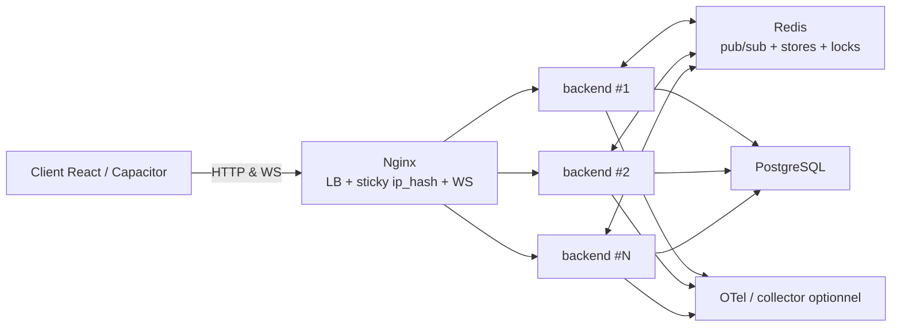

# Quantum Bluff — Mise à l’échelle horizontale (monolithe + Redis)

Ce document décrit l’**enveloppe scalable** du backend Node (Express + Socket.IO) : adaptation Redis pour Socket.IO, état partagé, rate-limit distribué, présence, locks tournoi, observabilité et arrêt gracieux. **Aucun découpage en microservices.**

## Vue logique



## Variables d’environnement principales

| Variable | Rôle |
|----------|------|
| `REDIS_URL` ou `REDIS_HOST` | Connexion Redis (obligatoire hors tests). |
| `INSTANCE_ID` | Identifiant d’instance (logs, métrique `tournament_leader_active`). Sinon : hostname. |
| `OTEL_EXPORTER_OTLP_ENDPOINT` / `OTEL_EXPORTER_OTLP_TRACES_ENDPOINT` | Base ou URL traces OTLP HTTP (`/v1/traces` ajouté si besoin). |
| `OTEL_SERVICE_NAME` | Nom du service dans les traces. |
| `SHUTDOWN_DRAIN_MS` | Temps max d’attente après fermeture HTTP avant `io.close()` (défaut `30000`). |
| `IDEMPOTENCY_TTL_SEC` | TTL des clés idempotency Redis (défaut `3600`). |
| `PRESENCE_REDIS_TTL_SEC` | TTL des ensembles de sockets par utilisateur (défaut `900`). |
| `POKER_STATE_STORE` / `BLACKJACK_STATE_STORE` | `memory` ou `redis` pour forcer ; sinon Redis si configuré (hors Jest/CI). |

## Docker Compose

**Prod simple** (un backend) :

```bash
docker compose -f docker-compose.prod.yml up -d
```

**VM sans build local** : la CI pousse le backend (`:latest`), le client (`:client-latest`) et l’IA (`:ai-latest`) vers le Container Registry GitLab. Sur la machine, définir `QUANTUM_REGISTRY_IMAGE` (identique à `CI_REGISTRY_IMAGE`), faire `docker login registry.gitlab.com`, puis :

```bash
docker compose -f docker-compose.prod.yml -f docker-compose.vm-registry.yml pull
docker compose -f docker-compose.prod.yml -f docker-compose.vm-registry.yml up -d
```

Détails dans les commentaires en tête de `docker-compose.vm-registry.yml`.

**Plusieurs réplicas backend** (sans `container_name` sur le service `backend`) :

```bash
docker compose -f docker-compose.prod.yml -f docker-compose.scaled.yml up -d --scale backend=3
```

- Le fichier `docker-compose.scaled.yml` ajoute des **healthchecks** et un service **`otel-collector`** optionnel (profil `otel`).
- Démarrer le collector :  
  `docker compose -f docker-compose.prod.yml -f docker-compose.scaled.yml --profile otel up -d`
- Config exemple : `server/observability/otel-collector.yaml`.
- Définir `OTEL_EXPORTER_OTLP_ENDPOINT=http://otel-collector:4318` sur le backend si vous utilisez le profil `otel`.

### Nginx sticky et plusieurs backends

- La conf par défaut (`nginx/conf.d/default.conf`) utilise un `upstream` avec **`ip_hash`** et `server backend:3000`.
- Avec `--scale backend=N`, le DNS interne Docker peut exposer plusieurs cibles derrière le même nom ; pour un **sticky strict** par réplica nommé, utilisez l’exemple `nginx/scaled/conf.d/default.conf` (`backend1`, `backend2`, `backend3`) et adaptez votre compose en conséquence.

**CGNAT / même IP publique** : `ip_hash` regroupe mal les clients. En alternative, documenter `hash $cookie_io consistent;` (cookie Socket.IO, ex. `io`) — à valider selon votre client.

## Comportement applicatif

- **Socket.IO** : `@socket.io/redis-adapter` + clients Redis dédiés (`socketIoRedis.ts`). Métrique **`redis_adapter_up`**.
- **Tournois** : une seule instance exécute le cron et le watcher grâce au verrou Redis `quantum:tournament:cron:leader`. Métrique **`tournament_leader_active{instance_id}`**.
- **Présence** : Redis `SADD` / `SREM` par `socketId` sous `quantum:presence:user:{userId}`.
- **Rate limit** : store Redis (`rate-limit-redis`) hors Jest.
- **Idempotency** : Redis `SET NX` avec TTL ; fallback mémoire si Redis indisponible.
- **JWT blacklist** : déjà Redis (`tokenBlacklist.ts`).
- **Locks poker** : Redis `SET NX` + libération Lua (`pokerTableLock.service.ts`).
- **Stores poker / blackjack** : Redis par défaut lorsque Redis est configuré (voir variables ci-dessus).

## Métriques Prometheus (extraits)

- `socket_io_connections_active`
- `redis_adapter_up`
- `tournament_leader_active{instance_id}`
- `redis_command_duration_seconds{command}`

## Runbooks

### Redis indisponible

- Symptômes : `redis_adapter_up` à 0, logs `redis_client_error`, rate-limit/idempotency en comportement dégradé (mémoire par process).
- Actions : restaurer Redis ; vérifier `REDIS_URL` / réseau Docker ; redémarrer les backends après retour de Redis.

### Verrou leader tournoi bloqué

- Clé : `quantum:tournament:cron:leader` (TTL court, normalement renouvelé toutes les ~5 s par l’instance leader).
- Si une instance a crashé sans libération : attendre l’expiration TTL ou `DEL quantum:tournament:cron:leader` depuis **redis-cli** (fenêtre de maintenance).

### Arrêt gracieux (Kubernetes / Docker)

- Sur `SIGTERM` / `SIGINT` : **draining** (`/api/health/ready` → 503), fermeture du serveur HTTP, fermeture Socket.IO, libération du verrou leader, arrêt OTel, fermeture des clients Redis adapter.

## Annexe — chemin Kubernetes (hors scope code)

- `Deployment` avec plusieurs replicas, `Service` ClusterIP, **Ingress** avec affinité cookie (`nginx.ingress.kubernetes.io/affinity: cookie`), Redis managé, readiness sur `/api/health/ready`, HPA CPU/RPS selon charge.
