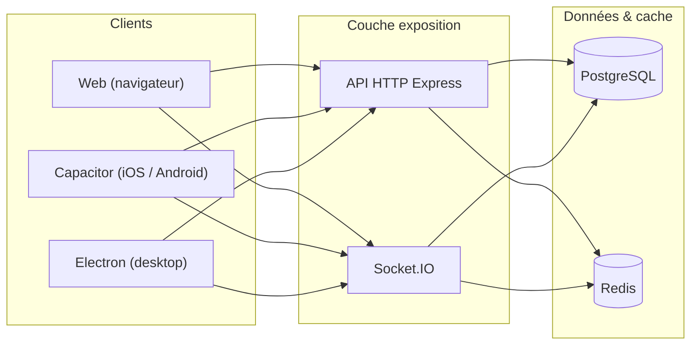
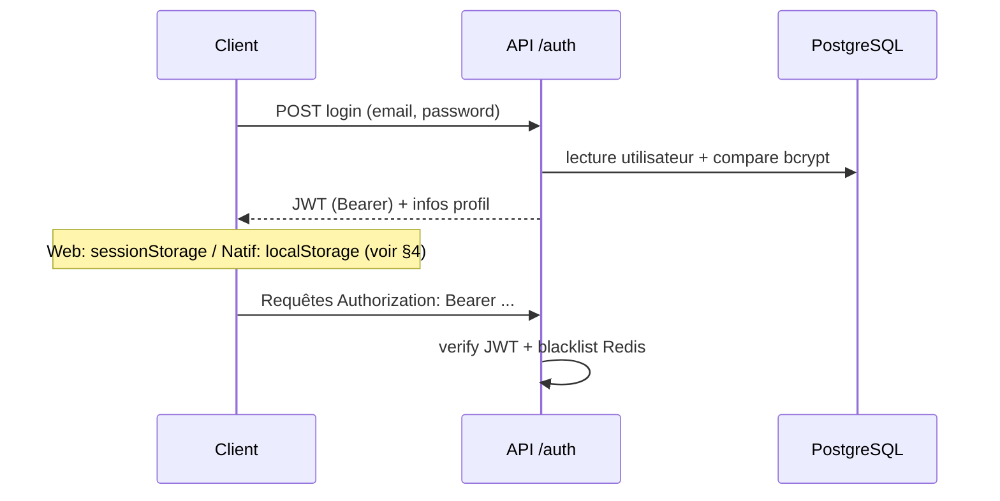
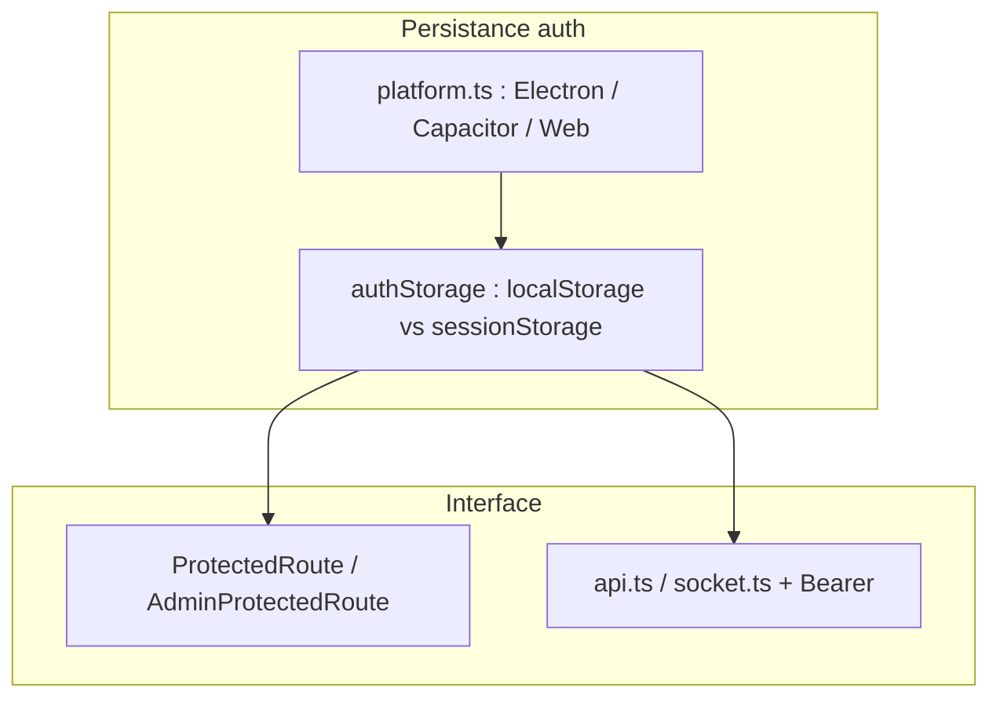
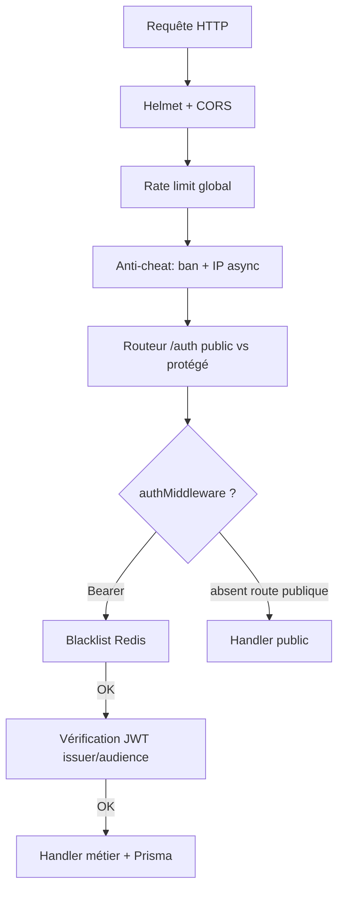

# Architecture de la sécurité — Quantum Bluff (vue d’ensemble)

Ce document décrit **de bout en bout** comment la sécurité est structurée dans le dépôt : navigateur / apps natives, API Node, temps réel, données et opérations sensibles. Il s’appuie sur le code actuel (`server/`, `client/`) et complète les audits plus ciblés dans `Docs/security/`.

---

## 1. Vue d’ensemble : qui parle à qui

- **HTTP** : routes REST sous `/api/...`, protégées ou publiques selon les routeurs.
- **WebSocket** : jeu poker, présence, notifications — authentification alignée sur le même type de jeton que l’HTTP.
- **PostgreSQL** : vérité métier (comptes, jetons, historiques, bans, etc.).
- **Redis** : liste noire de jetons (révocation), charge utile temps réel / jobs — selon modules.

---

## 2. Identité : inscription, connexion, jetons JWT

### 2.1 Mots de passe et comptes

- Les mots de passe sont stockés **hachés** avec **bcrypt** (cost ~10) côté serveur (`auth.routes.ts`).
- La récupération de mot de passe peut s’appuyer sur une **question secrète** dont la réponse est également hachée (bcrypt), pas stockée en clair.
- Les champs sensibles sont validés côté API (schémas Zod) avant toute écriture base.

### 2.2 JWT d’accès (joueur vs admin)

- Algorithme **HS256**, avec **émetteur (`issuer`)** et **audience** configurés via l’environnement (`jwt.service.ts`).
- Payload typique joueur : `userId`, `type: 'access'`, `sub` aligné sur `userId`.
- Un flux **séparé** émet un jeton **admin** (`role: 'admin'`) pour la console d’administration ; il ne doit pas être utilisé comme jeton « joueur » sur les routes métier.

### 2.3 Révocation des jetons (logout / compromission)

- À la déconnexion (ou révocation), le serveur peut enregistrer un **hash SHA-256** du jeton dans **Redis** avec TTL (`tokenBlacklist.ts`).
- `authMiddleware` et `socketAuth` consultent cette liste : jeton **blacklisté** → refus (401 côté HTTP, erreur côté socket).

> Si Redis est indisponible, la blacklist peut échouer en mode dégradé (consultation renvoie « non blacklisté ») ; la robustesse dépend alors surtout de l’expiration naturelle du JWT.

---

## 3. Garde-fous HTTP : de la requête au contrôleur

### 3.1 En-têtes et politique navigateur

- **Helmet** : CSP, durcissement des en-têtes ; **CORP** en `cross-origin` pour permettre au front (autre origine / port en dev) de charger des ressources API (ex. avatars).
- **CORS** : liste blanche d’**origines** (`env.corsOrigins`) ; requêtes non listées rejetées. Credentials autorisés pour les sessions qui en ont besoin.

### 3.2 Limitation de débit (rate limiting)

- Limiteur **global** sur l’application (fenêtre glissante, métriques possibles).
- **Limiteurs par domaine** pour les zones coûteuses ou abusables : bot, slot, roulette, blackjack, blackjack multi, etc. (`index.ts` + routeurs).
- Objectif : limiter le **brute-force**, le spam d’actions et la charge accidentelle ou malveillante.

### 3.3 Identification de requête et timeouts

- **Request ID** middleware pour corréler logs et incidents.
- Middlewares de **timeout** et parfois **idempotence** sur des chemins financiers sensibles (éviter doubles traitements) — voir aussi la doc ledger (`Docs/detail_logique/backend/11_idempotency_ledger.md`).

### 3.4 Middleware « anti-triche » (B4)

- Lecture optionnelle du JWT depuis `Authorization` (validation avec `JWT_SECRET` — à aligner idéalement sur la même source que `jwt.service` pour une seule vérité cryptographique).
- Si utilisateur identifié : contrôle `**bannedUntil`** en base ; si ban actif → **403**.
- Journalisation **IP** / détection multi-comptes en tâche de fond (`AntiCheatService`), sans bloquer la requête en cas d’erreur service.

---

## 4. Côté client : où vit le secret, et pour combien de temps

### 4.1 Stockage du jeton (politique par plateforme)

- **Web navigateur** : préférence pour `**sessionStorage`** pour les clés d’auth (session non persistante entre fermetures d’onglet/navigateur — comportement « re-login » sur nouvelle session).
- **Capacitor / Electron** : `**localStorage`** pour persister la connexion entre lancements d’app.
- Une **migration conservatrice** au démarrage déplace d’anciennes données « web » du `localStorage` vers `sessionStorage` **uniquement** quand le runtime est identifié comme **navigateur web**, avec garde-fous si un **indice Capacitor** est présent (éviter de purger la session mobile par erreur). Voir `authStorage.ts`, `platform.ts`, `scheduleMigrateLegacyAuthOnStartup()` dans `main.tsx`.

### 4.2 Routage et séparation des rôles côté UI

- `**ProtectedRoute`** : exige un `token` ; redirige vers `/auth` sinon ; si `role === admin`, redirection vers la console admin (éviter d’utiliser l’UI joueur avec un jeton admin).
- `**AdminProtectedRoute**` : chemins réservés à la console.
- Les appels **fetch** / **socket** injectent le **Bearer token** depuis le même adaptateur de stockage.

---

## 5. Temps réel : Socket.IO

- Le handshake transporte le jeton (`auth.token` ou en-tête) ; `**socketAuth**` extrait le Bearer, vérifie la **blacklist**, valide le JWT et attache `**userId`** au socket.
- Le gateway jeu applique des règles métier (locks de table, validation des actions, censure chat, etc.) en complément de l’auth.

---

## 6. Console administrateur

- Identifiants **distincts** des comptes joueurs : `ADMIN_CONSOLE_USERNAME` et `**ADMIN_CONSOLE_PASSWORD_HASH`** (bcrypt) dans l’environnement serveur.
- En cas de non-configuration, l’API renvoie une erreur explicite (pas de login fantôme).
- Le jeton admin est **refusé** sur les routes joueur protégées par `authMiddleware` standard (séparation des périmètres).

---

## 7. Données sensibles et intégrité métier (aperçu)

| Domaine                       | Mécanisme de sécurité / confiance                                                                                                                        |
| ----------------------------- | -------------------------------------------------------------------------------------------------------------------------------------------------------- |
| **Solde / casino**            | Mises à jour côté serveur, ledger, idempotence selon routes ; le client ne fait pas foi pour l’argent réel.                                              |
| **Paris cachés**              | Côtations et résolution serveur ; tickets liés à l’utilisateur avec contraintes d’unicité — voir `Docs/detail_logique/backend/07_hidden_bets_moteur.md`. |
| **Daily login**               | Réclamation **atomique** (compare-and-set) pour éviter double crédit sous concurrence.                                                                   |
| **Fichiers / avatars**        | Contrôle d’accès et validation côté API ; URLs sanitizées pour l’affichage public.                                                                       |
| **Signalements / modération** | Données persistées pour revue admin.                                                                                                                     |

---

## 8. Schéma récapitulatif « une requête authentifiée »

---

## 9. Bonnes pratiques opérationnelles

- Garder `**JWT_SECRET**`, `**DATABASE_URL**`, hashes admin et clés tierces **hors du dépôt** ; rotation du secret JWT invalide tous les jetons existants.
- En production : **HTTPS** partout, `**trust proxy`** cohérent avec l’infra pour IP et rate limit.
- Surveiller les logs structurés (request ID) et les métriques de rate limit pour détecter abus.

---

## 10. Poursuivre la lecture

- Audits : `Docs/security/Security_Audit.md`, `Docs/security/rapport_phase1_securite_quantum_bluff.md`, `Docs/security/rapport_phase2_securite_quantum_bluff.md`
- Idempotence / ledger : `Docs/detail_logique/backend/11_idempotency_ledger.md`
- Carte API HTTP : `Docs/detail_logique/network/01_http_api_map.md`
- Carte Socket : `Docs/detail_logique/network/02_socket_events_map.md`

---

*Document généré pour décrire l’architecture de sécurité telle qu’implémentée dans le code ; il ne remplace pas une analyse de menaces formelle ni un pentest.*