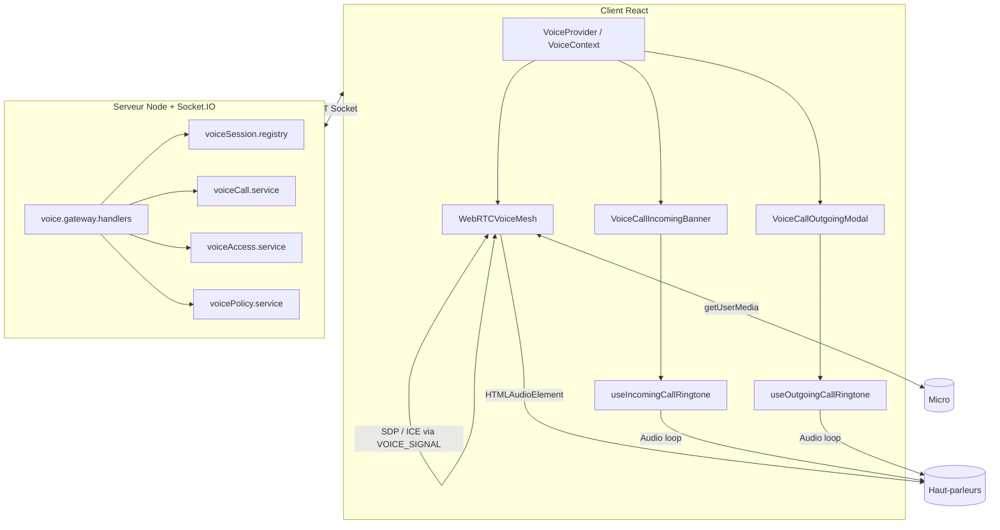
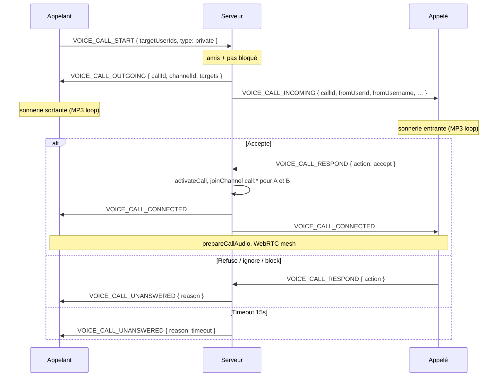

# Voix, appels privés/groupe et sonneries — documentation technique

Ce document décrit l’architecture **vocal temps réel** de Quantum Bluff : salons (waiting / table), **appels entre amis** (WebRTC), **signalisation Socket.IO**, **UI** et **fichiers audio** (sonneries). Il complète `SECURITE_A_TO_Z.md` (vue sécurité globale).

---

## 1. Vue d’ensemble



| Couche | Rôle |
|--------|------|
| **Socket.IO** | Présence dans un canal, roster, démarrage/réponse d’appel, relais WebRTC |
| **WebRTC (mesh)** | Audio bidirectionnel peer-to-peer (1 lien par paire dans le canal) |
| **Fichiers MP3** | Sonneries **locales** (pas sur le réseau) — appel entrant / composition sortante |
| **Prisma / Postgres** | Amitié, blocage ; **pas** de stockage d’appels |

---

## 2. Identifiants de canaux

Format : `{kind}:{id}` (voir `server/src/voice/voiceChannelId.ts`, `client/src/features/voice/voiceTypes.ts`).

| Kind | Exemple | Usage |
|------|---------|--------|
| `waiting` | `waiting:<roomId>` | Salon d’attente d’une partie |
| `table` | `table:<gameId>` | Table de jeu (poker, belote, blackjack…) |
| `call` | `call:<callId>` | Appel privé ou groupe (`callId` = UUID) |

Un utilisateur a **au plus un canal vocal principal** (`userPrimaryChannel` côté serveur). Rejoindre un appel peut déclencher `VOICE_CONFIRM_LEAVE` si déjà dans un autre canal.

---

## 3. Appels vocaux (signaling)

### 3.1 Machine à états côté client (`VoiceOutgoingCall`)

| `status` | Qui | Signification |
|----------|-----|----------------|
| `dialing` | Appelant | Composition : en attente de `VOICE_CALL_OUTGOING` / réponse |
| `dialing` | — | Appelé : non utilisé (bannière entrante à la place) |
| `connecting` | Appelé | A accepté ; panneau + join canal imminent |
| `connected` | Les deux | `VOICE_CALL_CONNECTED` ; WebRTC actif |
| `unanswered` | Appelant | Pas de réponse, refus, blocage, erreur |

Champ `isCallee: true` : panneau sortant affiché pour l’**appelé** après acceptation (même composant `VoiceCallOutgoingModal`).

Refs `outgoingCallRef` / `incomingCallRef` : éviter les courses entre handlers socket et actions UI (`hangUpCall`, `onConnected`).

### 3.2 Séquence appel privé



**Délai sonnerie** : `VOICE_CALL_RING_TIMEOUT_MS = 15_000` (`server/src/voice/voiceCall.service.ts`), planifié par `scheduleCallRingTimeout` à la création de l’appel.

**Appel groupe** : `type: 'group'`, plusieurs `targetUserIds` ; logique de fin partielle si un membre quitte (`memberIds` filtré).

### 3.3 Événements Socket.IO (appels)

| Émission client | Handler serveur | Effet |
|-----------------|-----------------|-------|
| `VOICE_CALL_START` | `voice.gateway.handlers` | Crée l’appel (`createCall`), notifie cibles |
| `VOICE_CALL_CANCEL` | idem | Annulation par le **créateur** en sonnerie |
| `VOICE_CALL_RESPOND` | idem | `accept` → join + `CONNECTED` ; sinon `UNANSWERED` |

| Émission serveur | Récepteur | Effet client |
|------------------|-----------|--------------|
| `VOICE_CALL_INCOMING` | Appelé | `incomingCall` + bannière |
| `VOICE_CALL_OUTGOING` | Appelant | Met à jour `callId` / `channelId`, `dialing` |
| `VOICE_CALL_CONNECTED` | Les deux | `connected`, join `call:*` |
| `VOICE_CALL_UNANSWERED` | Appelant (sauf si déjà connecting/connected) | `unanswered` + raison |
| `VOICE_CALL_END` | Client → serveur | Fin d’appel volontaire |
| `VOICE_CALL_ENDED` | Autres participants | `finishCallSession` local |
| `VOICE_ERROR` | Émetteur | `NOT_FRIENDS`, `BLOCKED`, etc. |

### 3.4 Accès au canal `call:*`

`mayJoinCallChannel` (`voiceAccess.service.ts`) : l’utilisateur doit être dans `call.memberIds` et le statut appel `ringing` ou `active`.

- **Acceptation** : `activateCall` passe le statut à `active`, `joinChannel` pour l’appelé puis pour les sockets de l’appelant.
- **Pas** d’`activateCall` au simple `VOICE_JOIN` sur un canal call (évite activation fantôme).

### 3.5 Points d’entrée UI

| Fichier | Action |
|---------|--------|
| `client/src/pages/Friends.tsx` | Appel privé / groupe |
| `client/src/pages/FriendProfile.tsx` | Appel privé |
| `client/src/components/FriendsList.tsx` | Appel privé |

API contexte : `startPrivateCall`, `startGroupCall`, `respondToCall`, `cancelOutgoingCall`, `hangUpCall`.

### 3.6 Rendu UI (portals)

Pour éviter le clipping `overflow-hidden` du `Layout` :

- `VoiceCallIncomingBanner` et `VoiceCallOutgoingModal` sont montés dans **`App.tsx`** sous `VoiceProvider`, via **`createPortal(..., document.body)`**.
- z-index : bannière `100040`, panneau `100050`.

Panneau sortant : draggable, compteur en `connected`, bouton raccrocher selon statut.

---

## 4. Sonneries et audio « hors WebRTC »

Les sonneries sont des **`<audio>` HTML locaux** (bundlés par Vite), indépendants du mesh WebRTC.

| Fichier | Hook | Actif quand | Boucle |
|---------|------|-------------|--------|
| `client/music/voicebosch-ringtone-bubbly-bubbles-188202.mp3` | `useIncomingCallRingtone` | `incomingCall != null` | Oui |
| `client/music/universfield-classic-telephone-signal-151918.mp3` | `useOutgoingCallRingtone` | `outgoingCall.status === 'dialing'` **et** `!isCallee` | Oui |

Implémentation commune : `new Audio(url)`, `loop = true`, `volume = 0.9`, `play().catch()` si autoplay bloqué, cleanup `pause` au démontage.

**Messages UI après timeout** (i18n `voice.outgoingUnavailable`, etc.) : clés dans `client/src/i18n/locales/*/translation.json`, fonction `unansweredMessage` dans `VoiceCallOutgoingModal.tsx`.

**Autoplay** : le navigateur peut exiger une interaction utilisateur avant `play()` ; comportement identique à la plupart des apps web.

---

## 5. WebRTC (`WebRTCVoiceMesh`)

Fichier : `client/src/features/voice/WebRTCVoiceMesh.ts`.

### 5.1 ICE / TURN

- Défaut : STUN Google (`stun.l.google.com`, `stun1.l.google.com`).
- Prod / NAT difficiles : `VITE_ICE_SERVERS` (JSON dans `client/.env.example`).

### 5.2 Signalisation

- Offres / réponses / ICE : événement `VOICE_SIGNAL` (serveur filtre amis, blocage, politiques `speakTo` / `listenTo` pour le **relai**).
- Côté client : file **`signalChains`** par pair (une promesse à la fois) + **rollback offer glare** (`ignoreOffer` / `makingOffer`) pour éviter les conflits SDP simultanés.

### 5.3 Politique audio : salon vs appel

| Contexte | Audible si |
|----------|------------|
| Salon (`waiting` / `table`) | `canHearParticipant` (audiences, mute micro distant, peer mutes, amis…) |
| **Appel** (`call:*`) | `isCallChannel()` : son **non** coupé par `remote.micMuted` roster ; seulement `soundMuted`, `peerMutes`, blocage |

À la connexion d’appel, `prepareCallAudio()` force micro ouvert (`micMuted: false`, `speakTo` / `listenTo` = `CHANNEL`) et `ensureMic(true)`.

### 5.4 Détection « speaking »

Analyseur fréquence sur le flux local → `VOICE_SPEAKING` toutes les 250 ms ; indicateurs dans le roster.

---

## 6. Vocal salon (hors appel)

Même `VoiceProvider` et mesh :

- `joinWaitingRoom` / `joinTable` (bloqués si déjà en `call:*`).
- `TableVoicePanel` + `useTableVoiceChat` : façade pour la table de poker.
- Migration waiting → table : `VOICE_SWITCH` mode `continue`, `voiceMigrateHintForGameStart` côté serveur.

Paramètres par défaut salon : `DEFAULT_VOICE_SETTINGS` (`micMuted: true` à l’arrivée). Appel : réinitialisation via `prepareCallAudio`.

---

## 7. Serveur — modules et performance

| Module | Fichier | Rôle |
|--------|---------|------|
| Sessions | `voiceSession.registry.ts` | Map canal → participants, debounce roster **80 ms**, cache meta canal 120 s |
| Cache social | `voiceSocialCache.ts` | `getFriendIdSet` / `getBlockedUserIds` TTL **60 s** (réduit charge Prisma) |
| Appels | `voiceCall.service.ts` | Map mémoire des appels actifs, timeouts sonnerie |
| Politique | `voicePolicy.service.ts` | Relais `VOICE_SIGNAL` |
| Accès | `voiceAccess.service.ts` | Amitié, blocage, droits canal |

Enregistrement handlers : `registerVoiceGatewayHandlers` depuis la stack Socket principale.

---

## 8. Variables d’environnement

| Variable | Où | Effet |
|----------|-----|--------|
| `VITE_ICE_SERVERS` | Build client | Serveurs ICE/TURN WebRTC |
| `DATABASE_URL` / `DIRECT_URL` | Serveur | Prisma ; migrations appels/RLS sans lien direct voix |
| JWT / Socket auth | Serveur | `socket.userId` requis pour tous les `VOICE_*` |

CORS / origines : voir déploiement API ; apps Capacitor (`capacitor://localhost`) gérées côté serveur.

**Redis / Upstash** : le vocal (appels, roster, signaling WebRTC) n’utilise **pas** Redis — état en mémoire serveur. Seul le transport Socket.IO peut passer par l’adaptateur Redis si `SOCKET_IO_REDIS_ADAPTER=true` (multi-instance). Voir [`REDIS_USAGE.md`](REDIS_USAGE.md).

---

## 9. Déploiement et exploitation

1. **Front** : rebuild pour inclure les MP3 et le panneau portal.
2. **Back** : redéploiement pour timeout 15 s et handlers appels.
3. **Prod audio uni-directionnel** : configurer **TURN** dans `VITE_ICE_SERVERS` (Vercel → Environment → Production). Exemple complet dans `env.production.example`. Rebuild client obligatoire ; en console prod, l’absence de TURN affiche `[voice] Pas de VITE_ICE_SERVERS` ou `sans TURN`. Si ICE échoue : `[voice] ICE failed — vérifier VITE_ICE_SERVERS (TURN)`.
4. **Checklist déploiement audio** : (1) `VITE_ICE_SERVERS` avec STUN+TURN sur Vercel Production, (2) redeploy client, (3) test appel lobby entre 2 réseaux, (4) console sans warning TURN et `iceConnectionState: completed`.
5. **502 / lenteur API** : indépendant du voix mais bloque le socket ; pool Postgres (voir conversations Supabase / `DATABASE_POOL_MAX`).
6. **RLS Supabase** : scripts `server/prisma/scripts/supabase-advisors-fix-all.sql` — pas d’accès Data API aux tables ; **n’affecte pas** Prisma ni les appels.

Script local (RLS, hors voix) :

```bash
cd server && npm run db:supabase-rls
```

Au démarrage Docker : `docker-entrypoint.sh` exécute `migrate deploy` puis le script RLS via **`DIRECT_URL`** (port session 5432).

---

## 10. Arborescence des fichiers clés

```
client/
  music/
    voicebosch-ringtone-bubbly-bubbles-188202.mp3   # entrant
    universfield-classic-telephone-signal-151918.mp3  # appelant (composition)
  src/
    contexts/VoiceContext.tsx
    components/VoiceCallIncomingBanner.tsx
    components/VoiceCallOutgoingModal.tsx
    features/voice/
      WebRTCVoiceMesh.ts
      voiceTypes.ts
      voicePolicy.ts
      useIncomingCallRingtone.ts
      useOutgoingCallRingtone.ts
      useTableVoiceChat.ts
      TableVoicePanel.tsx
    App.tsx                    # VoiceProvider + portals UI appel

server/src/
  sockets/voice.gateway.handlers.ts
  voice/
    voiceCall.service.ts
    voiceSession.registry.ts
    voiceAccess.service.ts
    voicePolicy.service.ts
    voiceSocialCache.ts
    voiceChannelId.ts
```

---

## 11. Dépannage rapide

| Symptôme | Piste |
|----------|--------|
| Pas de sonnerie | Autoplay ; vérifier que le statut est `dialing` (appelant) ou `incomingCall` (appelé) |
| « Non disponible » à 15 s | Normal si pas de réponse ; `VOICE_CALL_UNANSWERED` / timeout serveur |
| Panneau appelé invisible | Portal `document.body` + `App.tsx` ; rebuild front |
| Audio à sens unique | TURN / `VITE_ICE_SERVERS` ; pare-feu UDP |
| Pas d’appel possible | `NOT_FRIENDS` ou `BLOCKED` ; vérifier amitié Prisma |
| 502 au moment de l’appel | Santé API Render + pool DB, pas CORS « faux positif » |

---

## 12. Fin d’appel et nettoyage (V1)

| Événement | Rôle |
|-----------|------|
| `VOICE_CALL_END` (client → serveur) | Un participant raccroche ; le serveur quitte le canal et notifie les autres |
| `VOICE_CALL_ENDED` (serveur → clients) | Nettoyage UI + `teardownMesh` côté pair (`finishCallSession({ localOnly: true })`) |
| `VOICE_PEER_LEFT` | Nettoyage local si pair quitte le canal call (connecting **ou** connected) |

Appel privé : dès qu’un participant quitte le canal `call:*`, `endCall` est appelé côté serveur.

**Audio appel** : sur `call:*`, `shouldConnectTo` connecte toujours les pairs du roster ; `prepareCallAudio` = `ensureMic` + `bootstrapCallAudio` ; signalisation SDP en canal call sans filtre amis.

**UI appel** : panneau `VoiceCallOutgoingModal` — raccrocher + micro pour `connecting` / `connected` (appelant et appelé).

---

## 13. Évolutions possibles (non implémentées)
- Sonnerie groupe différente de l’appel privé.
- Enregistrement / transcription d’appels.
- Push mobile pour appel entrant (hors scope web actuel).

---

*Dernière mise à jour : alignée sur la branche `develop` (sonnerie sortante universfield téléphone classique, timeout 15 s, portals UI, index FK belote/blackjack/game invitation).*
