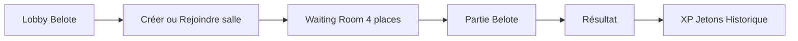
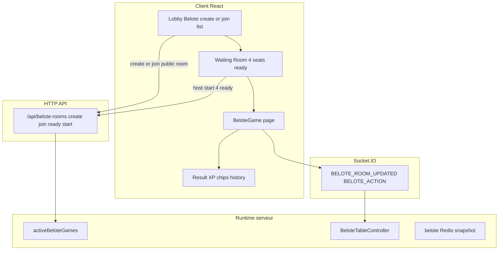
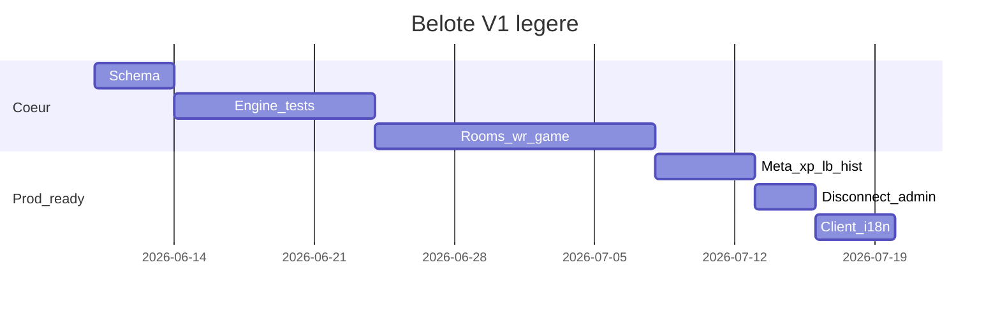

# Plan — Module Belote Quantum Bluff (V1 classique)

## Règle centrale (V1)

**Aucun matchmaking automatique en V1 : toutes les parties passent par une salle d’attente publique ou privée.**

À ne pas implémenter (anciennes specs §2.1 à corriger partout) :
- « Partie publique avec matchmaking »
- Recherche automatique de 3 joueurs
- File d’attente par niveau / ELO
- Création automatique de table quand 4 joueurs sont « trouvés »

**Comportement correct :**
- **Créer** une salle Belote, ou **rejoindre** une salle publique existante listée dans le lobby.
- **Salle publique** : visible par tous dans la liste ; n’importe qui peut rejoindre (mot de passe si défini).
- **Salle privée** : accessible par invitation ami, code ou lien partagé (pas dans la liste publique).

## Flux joueur (référence produit)

1. **Lobby → Belote** : créer une salle ou rejoindre une salle publique existante.
2. **Création** (si host) : choix **publique** / **privée**, **nom**, **mot de passe** (optionnel), **score cible** (ex. 1000).
3. **Waiting room Belote** : 4 places ; chaque joueur **Prêt** ; le **host** lance **uniquement** si **4 joueurs présents et prêts**.
4. **Partie** → **écran résultat** → **XP + jetons** + mise à jour stats + entrée **historique**.

## Objectif V1 (priorité produit)

**But** : avoir rapidement une **Belote jouable en production** sur Quantum Bluff — pas « la meilleure Belote du marché ».

Après mise en prod, mesurer avant d’investir plus :
- joueurs actifs Belote
- parties créées / jour
- rétention
- bugs remontés

## Périmètre V1 allégé

### Inclus (obligatoire)

| Feature |
|---------|
| Salle **publique** / **privée** |
| **Invitations** amis (+ lien / code privé) |
| **Waiting room** (4 places, tous prêts, start host) |
| **Belote classique** (moteur autoritaire) |
| **Historique** parties (résumé) |
| **XP** (constantes `XP_BELOTE_*`) |
| **Jetons** (récompense victoire / participation) |
| **Classement simple** (victoires, défaites, ratio — pas d’ELO) |
| **Déconnexion 60 s** + reconnexion |
| **Admin** force-close + liste salles/parties |

### Repoussé (V1.1+ après métriques prod)

| Feature | Raison |
|---------|--------|
| **ELO** / peak rating | Complexité + peu de valeur avant volume de parties |
| **Badges Belote** | Gamification secondaire |
| **Défis quotidiens Belote** | Idem |
| **BeloteSeason** / **BeloteSeasonRating** | Saisonnier = V2 |
| **Bots sophistiqués** de remplacement | V1 : **forfait** après 60 s (équipe perdante / main annulée) |
| **Mode bot solo** (1 humain + 3 bots) | Hors chemin critique 4 humains |
| Stats avancées profil (atouts favoris, séries…) | V1 : compteurs basiques uniquement |
| Spectateurs, chat signalement avancé | V1.1 |

---

## Contexte actuel

| Couche | État |
|--------|------|
| Client | Onglet Belote dans [`client/src/pages/Lobby.tsx`](client/src/pages/Lobby.tsx) : UI poker vide + toasts « bientôt » |
| Serveur | **Aucun** code Belote (pas de routes, Prisma, sockets) |
| Référence la plus proche | **Poker** : salle d’attente → start → partie ([`waitingRoom.routes.ts`](server/src/routes/waitingRoom.routes.ts), [`GameTable`/`CashGameController`](server/src/logic/)) |
| Référence secondaire | **Blackjack multi** : modèle `BlackjackRoom` + snapshot JSON ([`schema.prisma`](server/prisma/schema.prisma) L569+) |

**Décisions validées :**
- **Salles uniquement** : même logique que Texas Hold’em (pas de matchmaking).
- **Pas de spectateurs en V1** (V1.1).
- **Hors V1** (spec §15) : Coinche, Contrée, tournois, matchmaking classé, saisons actives, clubs, replays complets.

---

## Architecture cible

**Principe** : toute la règle du jeu vit dans `server/src/logic/belote/` ; le client n’envoie que des intentions (`playCard`, `bid`, `pass`, etc.) validées serveur.

---

## 1. Modèle de données (Prisma)

Nouveau namespace Belote (ne pas réutiliser `WaitingRoom` poker : blinds/turbo/max 5 joueurs inadaptés).

**Tables proposées** (dans [`server/prisma/schema.prisma`](server/prisma/schema.prisma)) :

| Modèle | Rôle |
|--------|------|
| `BeloteRoom` | Lobby : `name`, `hostId`, `visibility` (PUBLIC/PRIVATE), `status`, `joinCode?`, `passwordHash?`, `targetScore` (défaut 1000), `gameId?`, `maxPlayers=4` |
| `BeloteRoomSeat` | 4 sièges max, `position`, `isReady`, `team` (A/B assigné au `start`) |
| `BeloteRoomInvitation` | Miroir `BlackjackRoomInvitation` / `GameInvitation` |
| `BeloteGameSnapshot` | JSON état autoritaire (main, enchères, plis, scores manche) |
| `BeloteGameResult` | Fin de partie : équipes, scores, gagnants, durée, participants (→ **historique**) |
| `BelotePlayerStats` | **V1 minimal** : `gamesPlayed`, `wins`, `losses` (dénormalisé pour classement) |

**Hors schéma V1** (ajouter plus tard si métriques OK) : `BeloteRating`, `BeloteSeason`, `BeloteSeasonRating`, `peakRating`.

Extensions transverses V1 :
- `WalletLedgerEntry.gameType` : `belote`
- Leaderboard : catégorie `belote_wins` (réutiliser infra existante)

**Pas en V1** : badges Belote, `DailyChallengeCategory.BELOTE`.

Migration Prisma + seed minimal.

---

## 2. Moteur de jeu autoritaire (`server/src/logic/belote/`)

Modules suggérés :

| Fichier | Responsabilité |
|---------|----------------|
| `deck.ts` | Jeu 32 cartes, mélange RNG serveur |
| `bidding.ts` | Tour 1 (prendre/passer), tour 2 (couleur), redeal si tout passe |
| `trickPlay.ts` | Couleur demandée, fournir, couper, surcouper |
| `scoring.ts` | Points plis, belote/rebelote, dix de der, capot |
| `BeloteTableController.ts` | Orchestration manche/partie, `getSanitizedState(forUserId)` masque les mains adverses |
| `beloteAction.validation.ts` | Zod / guards actions |
| `types.ts` | Phases, équipes, cartes |

**Règles V1** : Belote classique française (8 cartes, 4 joueurs, contrat, 1000 pts configurable via `BeloteRoom.targetScore`).

**Tests unitaires** (Jest) : enchères, plis illégaux refusés, scoring, fin de manche/partie — **avant** branchement socket.

---

## 3. Runtime & persistance

Sur le modèle blackjack/poker :

- [`server/src/shared/activeBeloteGames.ts`](server/src/shared/activeBeloteGames.ts) — registre en mémoire
- [`server/src/belote/store/`](server/src/belote/store/) — Redis + fallback mémoire (comme [`blackjack/store`](server/src/blackjack/store/))
- [`server/src/belote/beloteTableLock.service.ts`](server/src/belote/beloteTableLock.service.ts) — verrou par `gameId`
- [`server/src/belote/recovery/beloteRecovery.service.ts`](server/src/belote/recovery/beloteRecovery.service.ts) — reprise au boot, prune salles orphelines
- Snapshot DB à chaque transition critique (fin pli, fin manche)

**Déconnexion** (spec §13, version allégée) :
- Timer **60 s** par joueur (`disconnectDeadline`) — reconnexion via même `gameId` + JWT
- Après timeout : **`forfeit`** — joueur marqué absent, partie continue ou fin de manche selon règles simplifiées (pas de bot IA en V1)
- Bots sophistiqués → **V1.1** uniquement si la rétention le justifie

---

## 4. API HTTP — salles d’attente Belote (équivalent Hold’em, pas de queue)

Nouveau routeur [`server/src/routes/beloteRoom.routes.ts`](server/src/routes/beloteRoom.routes.ts) monté sur `/api/belote-rooms` :

| Endpoint | Comportement |
|----------|----------------|
| `POST /create` | **Création manuelle** : `name`, `visibility` (PUBLIC = liste lobby ; PRIVATE = invitation/code/lien), `password?`, `targetScore` (défaut 1000) |
| `GET /` | **Salles publiques** ouvertes au join (+ salles privées où le user est déjà membre) |
| `GET /:id` | Détail waiting room : 4 sièges, état prêt par joueur |
| `POST /:id/join` | **Rejoindre** une salle existante (publique ou privée avec code) — pas d’appariement auto |
| `POST /:id/leave` | Quitter la waiting room |
| `POST /:id/ready` | Basculer **Prêt** |
| `POST /:id/start` | **Host uniquement** ; refus si &lt; 4 joueurs ou pas tous **prêts** ; puis `gameId`, équipes (0+2 vs 1+3), `BeloteTableController` |
| `POST /:id/request-join` | Salle **privée** : demande d’entrée (comme poker) |
| Invitations | Amis : `POST /invitations`, accept/reject — aligné [`invitation.routes.ts`](server/src/routes/invitation.routes.ts) |

**Pas d’endpoint** du type `/matchmaking`, `/queue`, `/find-game`.

**Lien partagé** : `https://quantum-bluff.com/lobby?tab=belote&beloteRoom=<id>` (+ `joinCode` si privé).

Enregistrer dans [`server/src/index.ts`](server/src/index.ts).

---

## 5. Socket.IO

Étendre [`server/src/sockets/game.gateway.ts`](server/src/sockets/game.gateway.ts) (fichier volumineux — extraire handlers Belote dans `belote.gateway.handlers.ts` pour lisibilité) :

| Event client → serveur | Event serveur → clients |
|----------------------|-------------------------|
| `JOIN_BELOTE_GAME` | `BELOTE_GAME_UPDATE` (état sanitized) |
| `BELOTE_ACTION` | `BELOTE_TRICK_END`, `BELOTE_DEAL_END`, `BELOTE_GAME_END` |
| `BELOTE_CHAT` | `BELOTE_CHAT` (réutiliser censure [`chatLinkCensor`](client/src/utils/chatLinkCensor.ts) côté client + filtre serveur) |
| `JOIN_BELOTE_ROOM` | `BELOTE_ROOM_UPDATED` |

Rooms Socket : `belote-room:{roomId}`, `belote-game:{gameId}`, `user:{userId}` pour invitations.

---

## 6. Meta-jeu V1 (léger)

**Fin de partie** (transaction Prisma unique) :

- **Jetons** : récompense victoire + petite participation (pas de buy-in complexe)
- **XP** : [`awardXpInTransaction`](server/src/logic/gamification.ts) — `XP_BELOTE_PLAY`, `XP_BELOTE_WIN` (2–3 constantes max)
- **`BelotePlayerStats`** : incrément `gamesPlayed`, `wins` / `losses`
- **`BeloteGameResult`** : persistance pour historique

**Classement simple** — [`leaderboard.routes.ts`](server/src/routes/leaderboard.routes.ts) + [`Leaderboard.tsx`](client/src/pages/Leaderboard.tsx) :

- Nouvelle catégorie **`belote_wins`** (et optionnel **`belote_games`** pour ratio)
- Filtre **amis** : même mécanisme que poker (graphe `Friendship`)
- **Pas de colonne ELO** en V1

**Profil** — bloc Belote minimal :

- Parties jouées, victoires, défaites, taux de victoire
- Lien « Historique Belote »
- Stats détaillées (atouts, belote/rebelote, séries) → **V1.1**

**Historique** — `GET /api/belote/history` + UI `Profil → Historique Belote` :

- Liste paginée : date, adversaires, score final, gagnant/perdant
- Pas de replay pli par pli en V1

---

## 7. Client React

### Lobby Belote
Remplacer le bloc poker partagé par [`client/src/components/LobbyBeloteSection.tsx`](client/src/components/LobbyBeloteSection.tsx) :

| Action lobby | Comportement |
|--------------|----------------|
| **Créer une salle** | Modal : publique / privée, nom, mot de passe optionnel, score cible → redirect waiting room |
| **Rejoindre** | Clic sur une salle **publique** de la liste → waiting room |
| **Privée** | Lien `?tab=belote&beloteRoom=`, code, ou invitation ami — pas de liste publique |
| **Bots** | **Hors V1** — parties 4 humains uniquement |

Retirer `isBeloteTab` / toasts « bientôt » dans [`Lobby.tsx`](client/src/pages/Lobby.tsx).

### Waiting room Belote
[`BeloteWaitingRoom.tsx`](client/src/pages/BeloteWaitingRoom.tsx) (sur [`WaitingRoom.tsx`](client/src/pages/WaitingRoom.tsx)) :

- **4 places** fixes, affichage prêt / pas prêt
- **Host** : bouton **Démarrer** actif seulement si `playerCount === 4` et `allReady`
- Invitations amis (privé), chat léger optionnel
- Socket `BELOTE_ROOM_UPDATED` pour sync temps réel

### Routes ([`client/src/App.tsx`](client/src/App.tsx))

| Route | Page |
|-------|------|
| `/belote/waiting-room?roomId=` | [`BeloteWaitingRoom.tsx`](client/src/pages/BeloteWaitingRoom.tsx) — étape obligatoire avant toute partie |
| `/belote/game?gameId=` | [`BeloteGame.tsx`](client/src/pages/BeloteGame.tsx) |

### UI table
[`client/src/features/belote/`](client/src/features/belote/) :

- `BeloteTable.tsx` — mains, pli central, enchères, scores manche
- `BeloteScoreboard.tsx` — fin de manche (spec §4)
- `BeloteEndScreen.tsx` — fin partie (XP, jetons, stats)
- `useBeloteSocket.ts` — join, actions, état

### Social
- Étendre `GameInvitationNotification.game` : `'belote'`
- [`useWaitingRoomInvitationAccept.ts`](client/src/hooks/useWaitingRoomInvitationAccept.ts) : accept → `/belote/waiting-room?roomId=`
- Chat table : composant dédié branché sur `BELOTE_CHAT`
- Signalement : réutiliser `PlayerReport` avec `gameType: 'belote'`

### i18n
Clés `belote.*` dans les 5 locales ([`client/src/i18n/locales/`](client/src/i18n/locales/)).

### Capacitor / Electron
Pas de changement d’architecture : mêmes URLs API/socket que le poker ([`apiBase.ts`](client/src/utils/apiBase.ts), [`socketConnect.ts`](client/src/utils/socketConnect.ts)).

---

## 8. Administration

Étendre [`server/src/routes/adminConsole.routes.ts`](server/src/routes/adminConsole.routes.ts) :

- Liste parties Belote actives + salles en attente
- `POST .../belote/force-close/:gameId`
- Logs : réutiliser pattern `GameAction` ou `BeloteActionLog` JSON
- Signalements : filtre `gameType=belote`

UI admin console client si elle existe pour blackjack — même panneau.

---

## 9. Phasage de livraison recommandé

| Jalon | Livrable testable |
|-------|-------------------|
| **M1** | Moteur Belote + tests Jest (règles complètes) |
| **M2** | Salles + WR + partie 4 humains bout-en-bout (privé puis public + invitations) |
| **M3** | XP, jetons, historique, classement `belote_wins`, profil minimal |
| **M4** | Déconnexion 60s + forfait, admin force-close, polish client/i18n |
| **→ Prod** | Déploiement, observation métriques 2–4 semaines |

**Estimation V1 allégée** : **~5–7 semaines** dev solo (vs 8–12 version complète) ; paralléliser moteur (backend) et UI table (frontend) après M1.

### Critères « jouable en prod »

- [ ] Créer / rejoindre salle publique ou privée
- [ ] 4 joueurs, partie jusqu’à 1000 pts (ou score configuré)
- [ ] Résultat + XP + jetons + historique consultable
- [ ] Classement Belote (victoires) + filtre amis
- [ ] Admin peut fermer une table bloquée
- [ ] Pas de crash bloquant sur déconnexion &lt; 60s

---

## 10. Risques et mitigations

| Risque | Mitigation |
|--------|------------|
| Complexité règles (belote/rebelote, annonces) | Tests unitaires exhaustifs ; V1 sans Coinche |
| `game.gateway.ts` monolithique | Handlers Belote dans module séparé |
| Scope creep (ELO, badges…) | Périmètre V1 figé ; V1.1 après métriques prod |
| Multi-instance (VM scaled) | Redis store + lock obligatoires dès M2 |
| Front Vercel / API VM | Belote = sockets vers backend VM (comme poker aujourd’hui) |
| Confusion spec « matchmaking » | Règle centrale en tête de plan ; revue i18n/docs si specs PDF/HTML existent |

---

## 11. V1.1 / V2 (après métriques prod)

**V1.1** (si adoption positive) : ELO Belote, badges, défis quotidiens, bots remplacement, stats profil avancées, mode bot solo.

**V2** : Coinche, Contrée, tournois, `BeloteSeason`, spectateurs, replays détaillés, championnats, guildes, matchmaking classé.
