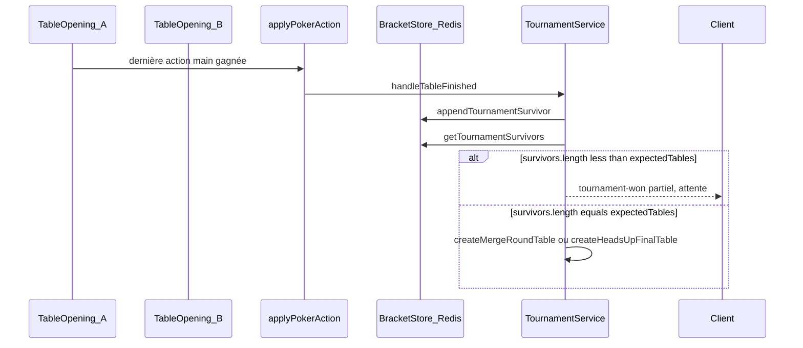

# Analyse : tournois bloqués et spectate

## Flux bracket (résumé)

La progression vers la **table de fusion** ou la **finale HU** ne se fait qu’après `handleTableFinished` ([`server/src/services/tournament.service.ts`](server/src/services/tournament.service.ts)), déclenché depuis la fin de main dans [`server/src/poker/services/pokerActionOrchestrator.service.ts`](server/src/poker/services/pokerActionOrchestrator.service.ts) (`handleHandCompleteIfNeeded`, uniquement si `handRuntimePhase === "HAND_COMPLETE"`).

---

## Causes probables du blocage (sans 2e match)

### 1. Incohérence Redis vs mémoire pour les survivants (très probable en multi‑instance)

[`appendTournamentSurvivor`](server/src/services/tournamentBracketStore.service.ts) écrit **toujours** en mémoire locale, puis tente `redis.rpush`. [`getTournamentSurvivors`](server/src/services/tournamentBracketStore.service.ts) préfère la liste Redis si elle est plus longue que la mémoire locale, sinon retourne **uniquement** la mémoire du processus courant.

Conséquence : si **Redis est indisponible, lent ou mal partagé** entre pods, chaque nœud ne voit que **ses** survivants ajoutés localement. Alors `survivors.length` reste **&lt;** `expectedTables` : le code reste dans la branche « attente » ([`handleTableFinished`](server/src/services/tournament.service.ts) ~L940–954) et **ne crée jamais** la table suivante.

### 2. Tables sur un pod, requêtes / logique sur un autre (probable en K8s)

[`activeGames.get`](server/src/shared/activeGames.ts) (utilisé par l’orchestrateur) renvoie une partie **seulement si elle est chargée sur ce nœud** — sinon erreur `TABLE_NOT_LOADED_LOCALLY` ([`pokerActionOrchestrator.service.ts`](server/src/poker/services/pokerActionOrchestrator.service.ts)). La **fin de main** et donc `handleTableFinished` ne s’exécutent que sur le nœud qui traite les actions. Si une table « vit » sur A mais que des actions critiques partent vers B, la partie peut ne pas avancer correctement (ou les joueurs voient des erreurs).

### 3. `expectedTables` incohérent avec la réalité

`expectedTables` vient de `openingRoundTableCount` en base ou de [`getTournamentExpectedTables`](server/src/services/tournamentBracketStore.service.ts) (Redis + fallback mémoire). Si la valeur persistée est **fausse** (bug, migration, échec partiel au démarrage), la condition `survivors.length < expectedTables` peut **ne jamais** être satisfaite ou être satisfaite trop tôt.

### 4. La main ne passe jamais à `HAND_COMPLETE`

Tout le bracket dépend du chemin `applyPokerAction` → `handleHandCompleteIfNeeded`. Si la table reste bloquée (tour, timer, déconnexion, état incohérent côté [`GameTable`](server/src/logic/GameTable.ts)), **`handleTableFinished` n’est jamais appelé**.

### 5. Cas merge / map en mémoire processus

[`mergeRoundGameToTournament`](server/src/services/tournament.service.ts) est une `Map` **statique en mémoire**. Un redémarrage de processus entre la création de la table `game_tournoi_merge_*` et sa fin peut faire échouer silencieusement [`handleMergeRoundComplete`](server/src/services/tournament.service.ts) (`tournament_merge_unknown_game`).

---

## Causes probables du spectate « qui ne marche pas »

### 1. État 100 % local au processus (très probable)

- [`spectateTablesByTournament`](server/src/services/tournament.service.ts) : cache en mémoire.
- [`getSpectateTablesPayload`](server/src/services/tournament.service.ts) marque `live` via [`activeGames.get(t.roomId)`](server/src/shared/activeGames.ts) — **local au pod**.

Si l’API **`GET .../spectate-tables`** est servie par un **autre** pod que celui qui héberge la `GameTable`, résultat typique : **liste vide**, ou tables affichées mais **`live: false`** → boutons désactivés dans [`TournamentLobby.tsx`](client/src/pages/TournamentLobby.tsx) (`disabled={!tab.live}`).

### 2. Événement socket `tournament-spectate` réservé aux éliminés

Le serveur émet `tournament-spectate` surtout vers les joueurs dans `eliminationOrder` (ex. après création finale / merge). Un spectateur qui n’a **jamais été joueur** dans ce tournoi ne reçoit pas cet événement ; il dépend entièrement de l’API + navigation [`/game?...&spectate=1`](client/src/pages/TournamentLobby.tsx), donc du problème (1).

### 3. Délai artificiel côté client

[`handleSpectate`](client/src/App.tsx) attend **5 s** avant `navigate` — peut donner l’impression que « rien ne se passe » si l’utilisateur ne attend pas.

---

## Autres risques de bugs futurs (à anticiper)

| Risque | Détail |
|--------|--------|
| **Pas d’idempotence sur `appendTournamentSurvivor`** | Double fin de main / retry pourrait pousser deux fois le même gagnant et fausser le décompte. |
| **Concours deux tables qui finissent en même temps** | Deux appels concurrents à `handleTableFinished` ; dépend de la sémantique Redis `RPUSH` + lectures (ordre / doublons). |
| **Multi‑instance sans Redis fiable** | Le commentaire dans [`startTournamentWatcher`](server/src/services/tournament.service.ts) mentionne déjà le verrou leader Redis ; le **bracket** a le même type de dépendance. |
| **`tournament-started` en `io.emit` global** | Comportement acceptable pour découverte, mais en multi‑instances seuls les clients connectés à **ce** nœud reçoivent l’événement (d’où l’API de secours `getMyTournamentTable`). |
| **Redis / process restart** | Perte des `Map` statiques (`mergeRoundGameToTournament`, `spectateTablesByTournament`, `eliminationOrder`) alors que la BDD dit encore `ACTIVE`. |

---

## Pistes de correction (priorisées, pour une phase implémentation ultérieure)

1. **Bracket** : source de vérité unique et partagée (Redis obligatoire pour `survivors` + `expected`, ou tout en Prisma avec transactions) ; ne pas se fier à la mémoire seule pour agréger les tables ouvertes.
2. **Affinité** : sticky sessions ou en-tête/route vers le même pod pour **socket + API** du même `gameId`, ou synchronisation des `activeGames` (complexe).
3. **Spectate** : persister `roomId` + `tournamentId` consultables depuis **n’importe quel** pod (DB ou Redis), et/ou proxy interne vers le pod qui détient la table ; ou documenter « un seul réplica API » pour les parties temps réel.
4. **Observabilité** : logs métier quand `survivors.length < expectedTables` trop longtemps, métrique « bracket stale », alerte si Redis bracket échoue.

Aucune modification de code n’a été faite dans cette phase (mode plan uniquement).
