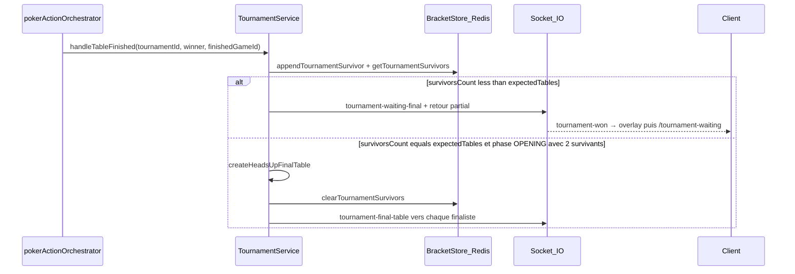

# Révision transition tournoi (semi → attente → finale)

## Flux réel (résumé)

Fichiers centraux :

- Bracket / attente : [`server/src/services/tournament.service.ts`](server/src/services/tournament.service.ts) (`handleTableFinished`, `createHeadsUpFinalTable`, `processVictory`)
- Persistance liste de survivants : [`server/src/services/tournamentBracketStore.service.ts`](server/src/services/tournamentBracketStore.service.ts)
- Déclencheur fin de main : [`server/src/poker/services/pokerActionOrchestrator.service.ts`](server/src/poker/services/pokerActionOrchestrator.service.ts) (`handleHandCompleteIfNeeded`, branche `survivors.length === 1` hors merge)
- Client : [`client/src/App.tsx`](client/src/App.tsx) (`tournament-won`, `tournament-final-table`, `tournament-result`), [`client/src/pages/TournamentWaiting.tsx`](client/src/pages/TournamentWaiting.tsx) (écoute + polling `getMyTournamentTable`)

---

## Pourquoi ça peut donner « A attend, B est 1er et retourne au lobby »

Interprétation la plus cohérente avec le code : **la finale HU est créée et va jusqu’à `processVictory`** (événement `tournament-result` → navigation vers `/tournaments` après ~12 s dans [`App.tsx`](client/src/App.tsx)), **alors que A ne s’est jamais retrouvé sur la partie `game_tournoi_final_*`** (ou l’a quittée / erreur `GAME_NOT_FOUND`). B côté serveur peut alors **gagner la table finale** (adversaire déconnecté, blindés, ou état table dégénéré) et déclencher la clôture tournoi comme pour une finale normale.

### Causes probables (par ordre de vraisemblance opérationnelle)

1. **Récupération de table « par pod » + partie seulement sur un nœud**  
   - [`findActiveTournamentTableForUser`](server/src/services/tournament.service.ts) ne parcourt que [`activeGames.getAll()`](server/src/shared/activeGames.ts) **du processus courant**.  
   - Le polling dans [`TournamentWaiting.tsx`](client/src/pages/TournamentWaiting.tsx) appelle [`GET /api/tournaments/my-table`](server/src/routes/tournament.routes.ts) : si la requête HTTP tombe sur un **autre** pod que celui qui détient la `GameTable` finale, `gameId` reste `null` → **A reste sur `/tournament-waiting`** indéfiniment.  
   - **Important** : le serveur monte bien un adaptateur Redis pour Socket.IO ([`server/src/index.ts`](server/src/index.ts)), donc `io.to('user:…').emit('tournament-final-table', …)` peut être OK en multi-instances **si** Redis adapter et Redis bracket sont sains ; en revanche **l’API de secours ne compense pas** le décalage de pod pour `activeGames`.

2. **Événement socket manqué côté A** (même en mono-instance)  
   - Déconnexion / reconnexion au mauvais moment, onglet en arrière-plan, ou **room `user:${userId}`** incohérente (ex. flux `JOIN_USER_ROOM` qui **leave** les rooms `user:` puis rejoint un autre id — voir [`game.gateway.ts`](server/src/sockets/game.gateway.ts) ~L216–226).  
   - Sans `tournament-final-table`, A ne navigue pas ; le polling ne le sauve que si **son** pod voit la table (lié au point 1 en multi-pods).

3. **Bracket Redis dégradé (`memoryOnly`, erreurs partielles)**  
   - Documenté dans [`Docs/Architecture/tournois_prob.md`](Docs/Architecture/tournois_prob.md) : si `appendTournamentSurvivor` tombe en repli mémoire sur un nœud alors que `getTournamentSurvivors` lit Redis ailleurs, la liste agrégée peut être **incomplète ou incohérente** → comportements étranges (attente prolongée, merge/final non créé, ou scénarios limites après retries).  
   - Les logs `tournament_survivor_recorded_memory_only` / métriques bracket dans [`tournamentBracketStore.service.ts`](server/src/services/tournamentBracketStore.service.ts) sont le signal à surveiller.

4. **Branche « d’urgence » dans l’orchestrateur : `tp` null → `processVictory` mono-joueur**  
   - Dans [`pokerActionOrchestrator.service.ts`](server/src/poker/services/pokerActionOrchestrator.service.ts), si `prisma.tournamentPlayer.findFirst({ userId, tournament: { status: 'ACTIVE' } })` **échoue** alors qu’un tournoi actif existe encore pour ce joueur (incohérence `TournamentPlayer`, statut tournoi, ou id utilisateur ≠ id joueur en table), le code appelle **`processVictory([survivors[0].id])`** — **prix entier au « gagnant » courant**, sans bracket.  
   - Ça colle exactement avec « B est classé 1er tout seul » si ce chemin se déclenche pour B à la fin de **sa** demi-finale (à confirmer via logs serveur au moment du bug).

5. **Client : erreur `GAME_NOT_FOUND` sur la demi-finale pendant la téléportation finale**  
   - [`Game.tsx`](client/src/pages/Game.tsx) redirige vers `/lobby` sur `GAME_NOT_FOUND` sauf fenêtre `__pendingTournamentNavAt` (~4 s) posée par [`App.tsx`](client/src/App.tsx) lors de `tournament-final-table`.  
   - Si le 404 arrive **hors** cette fenêtre (latence, double navigation), A peut **sortir du flux tournoi** alors que le serveur garde A dans la finale → B joue seul jusqu’à la clôture.

6. **Détail UX / cohérence compteur d’attente**  
   - `tournament-waiting-final` met à jour `survivorsCount` dans [`TournamentWaiting.tsx`](client/src/pages/TournamentWaiting.tsx), mais le handler global dans [`App.tsx`](client/src/App.tsx) ne fait qu’un `console.log` : pas bloquant pour le bug « 1er / lobby », mais à aligner si vous centralisez l’état.

---

## Pistes d’investigation avant de coder

- **Logs serveur au moment du bug** : `tournament_bracket_waiting_more_tables`, `tournament_final_table_created`, `tournament_final_requires_two`, `tournament_survivor_recorded_memory_only`, et toute trace autour de `handleTableFinished` / `processVictory`.  
- **Contexte déploiement** : un seul replica API ou plusieurs ; **REDIS_URL** joignable depuis tous les pods ; pas d’erreurs Redis sur le bracket au moment des fins de table.  
- **Côté client (A)** : au moment où B « gagne tout », vérifier si A a reçu `tournament-final-table`, s’il est resté sur `/tournament-waiting`, ou s’il a eu `GAME_NOT_FOUND` / redirection.

---

## Direction de correctifs (quand vous passerez en mode implémentation)

- **Rendre la résolution de table tournoi indépendante du pod** : persister le `gameId` courant (ou « phase + roomId ») en **DB ou Redis** pour `GET /my-table`, ou router les requêtes game vers le pod qui détient la table (même problème que le spectate documenté dans [`tournois_prob.md`](Docs/Architecture/tournois_prob.md)).  
- **Durcir le bracket** : refuser le repli « mémoire seule » pour les survivants en prod, ou fusionner explicitement mémoire + Redis avec règle de vérité unique.  
- **Supprimer ou restreindre le fallback `processVictory` mono-joueur** dans l’orchestrateur : logger en erreur, ne pas clôturer le tournoi sans passer par `handleTableFinished` / règles bracket.  
- **Optionnel client** : sur `/tournament-waiting`, renforcer la récupération (délai, backoff, ou endpoint dédié « prochaine table tournoi » lisant Redis/DB).

Ce plan ne modifie pas le code ; il cible les zones à auditer et les scénarios les plus plausibles compte tenu de l’implémentation actuelle.
