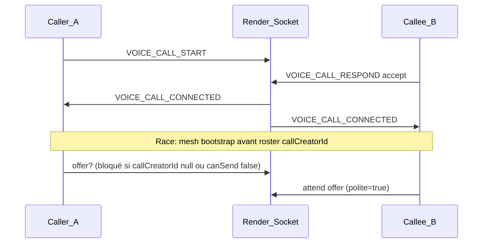
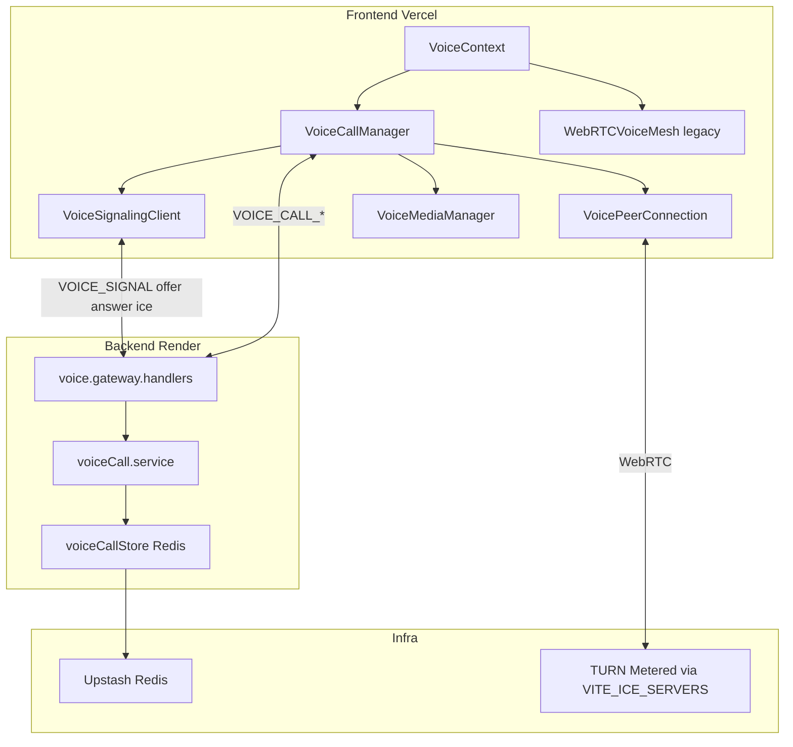
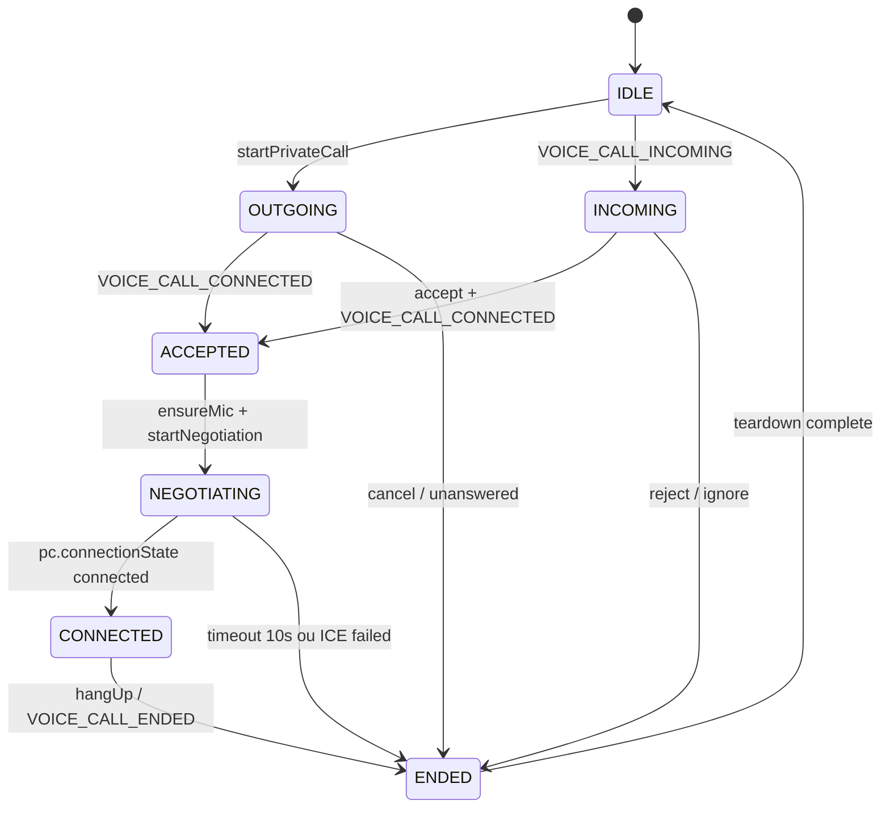

# Refonte appels vocaux 1v1 (architecture clean)

## Verdict / pourquoi cette direction

| Approche | Fiabilité estimée | Raison |
|----------|-------------------|--------|
| Patchs sur `WebRTCVoiceMesh` | ~70 % | Corrige des cas mais garde la complexité mesh + politique amis + polite/impolite |
| **Nouvelle architecture dédiée** | **~95–98 %** | Séparation call/mesh, états stricts, caller-offer, mute sans SDP, Redis, negotiationId — plus de patchs sur le mesh pour les appels |

**Décision :** ne plus patcher `WebRTCVoiceMesh` pour les appels privés ; implémenter directement cette refonte 1v1.

**Séparation des responsabilités (règle produit) :**

```
call:*       → VoiceCallManager   (1 PC, caller-offer, états stricts)
waiting:*    → WebRTCVoiceMesh    (legacy v1)
table:*      → WebRTCVoiceMesh    (legacy v1)
```

---

## Diagnostic des bugs actuels

Les symptômes rapportés (A entend B, B n’entend pas A ; mute de A qui se réactive) viennent de l’architecture actuelle, pas seulement du déploiement TURN.



**Causes identifiées dans le code actuel :**

1. **Race `callCreatorId`** — [`WebRTCVoiceMesh.ensurePeer`](client/src/features/voice/WebRTCVoiceMesh.ts) peut lancer la négociation via `onConnected` / `bootstrapCallAudio` **avant** que `applyRoster` n’injecte `callCreatorId`. Si `callCreatorId` est null, `shouldInitiateOffer` retourne `false` pour les deux côtés → **aucune offer**.

2. **Offer conditionnée au mute** — `shouldInitiateOffer` exige `canSend`, et [`shouldSendToRemote`](client/src/features/voice/voicePolicy.ts) retourne `false` si `micMuted`. En appel, le caller doit **toujours** négocier avec une piste audio attachée (`enabled=false` si mute), pas conditionner l’offer au mute.

3. **Mute réinitialisé** — [`prepareCallAudio`](client/src/contexts/VoiceContext.tsx) force `micMuted: false` au premier prepare par canal. Si le mesh est recréé (`teardownMesh` remet `voicePreparedChannelRef` à null), un nouveau `prepareCallAudio` **réactive le micro** côté A.

4. **Mesh générique** — [`WebRTCVoiceMesh`](client/src/features/voice/WebRTCVoiceMesh.ts) mélange appels 1v1, waiting room, table, politique amis, polite/impolite, renegotiation auto sur `connectionState=failed`, et `syncPeers` sur chaque changement de settings → complexité et effets de bord.

5. **État appel en mémoire process** — [`voiceCall.service.ts`](server/src/voice/voiceCall.service.ts) utilise un `Map` local. Sur Render multi-instance ou redémarrage, l’état d’appel / timeout / lock anti double-call ne sont pas fiables. Aujourd’hui le vocal n’utilise **aucun Redis** ([`voice.noRedis.test.ts`](server/src/__tests__/voice.noRedis.test.ts)).

**Périmètre validé :** appels 1v1 uniquement en v1 ; waiting/table gardent l’ancien mesh ; historique Supabase plus tard.

---

## Architecture cible (v1)



### Règle absolue : Caller = Offerer

```
callerId === myUserId  →  createOffer()  (une fois, micro prêt)
callerId !== myUserId  →  attendre offer → createAnswer()
```

**Interdit pour les appels :** négociation par UUID, polite/impolite, gestion de collision SDP.

`callerId` arrive **explicitement** dans `VOICE_CALL_CONNECTED` — pas via `VOICE_ROSTER` :

```json
{
  "callId": "...",
  "channelId": "call:...",
  "callerId": "..."
}
```

→ La négociation démarre **immédiatement** à la réception, sans race roster.

### Mute sans SDP (règle absolue)

```ts
audioTrack.enabled = false;  // mute
audioTrack.enabled = true;   // unmute
```

**Interdit en appel :** `replaceTrack(null)`, `syncPeers`, renegotiation SDP, influence de `shouldSend` sur la négociation initiale.

Le caller attache toujours sa piste avant `createOffer`, même si `enabled = false`.

---

## Machine à états stricte (`VoiceCallManager`)

Fichier central : [`VoiceCallManager.ts`](client/src/features/voice/call/VoiceCallManager.ts)

### Enum `CallState`

```ts
enum CallState {
  IDLE,
  OUTGOING,      // A a lancé l'appel, sonnerie sortante
  INCOMING,      // B reçoit l'invitation
  ACCEPTED,      // B a accepté, VOICE_CALL_CONNECTED reçu
  NEGOTIATING,   // offer/answer/ICE en cours
  CONNECTED,     // pc.connectionState === 'connected'
  ENDED,
}
```

### Transitions explicites (seules autorisées)



**Implémentation :** méthode `transition(to: CallState)` qui valide la transition depuis l’état courant ; transition invalide → log + ignore (pas de mutation silencieuse).

| Transition | Action déclenchée |
|------------|-------------------|
| `ACCEPTED → NEGOTIATING` | `ensureMic()` ; si `callerId === myUserId` → `createOffer()` ; sinon attendre offer |
| `NEGOTIATING → CONNECTED` | Arrêter timer ; UI status `connected` |
| `NEGOTIATING → ENDED` | `teardown()` complet (PC, stream, timers) ; UI erreur « Connexion échouée » |
| `* → ENDED` | `pc.close()`, libérer media, reset état |

### Timeout négociation (10 s)

Dès l’entrée en `NEGOTIATING`, démarrer un timer `NEGOTIATION_TIMEOUT_MS = 10_000`.

Si à l’expiration `pc.connectionState !== 'connected'` :
- `transition(ENDED)`
- `teardown()` complet
- Notifier UI (`outgoingCall.status = 'failed'` ou équivalent)
- **Pas** de retry automatique en v1

---

## `VoicePeerConnection` — buffer ICE obligatoire

Fichier : [`VoicePeerConnection.ts`](client/src/features/voice/call/VoicePeerConnection.ts)

**Problème classique :** `addIceCandidate()` appelé avant `setRemoteDescription()` → échec silencieux.

**Solution :**

```ts
private pendingCandidates: RTCIceCandidateInit[] = []

async addIceCandidate(candidate: RTCIceCandidateInit): Promise<void> {
  if (!this.pc.remoteDescription) {
    this.pendingCandidates.push(candidate)
    return
  }
  await this.pc.addIceCandidate(candidate)
}

private async flushPendingCandidates(): Promise<void> {
  const queue = [...this.pendingCandidates]
  this.pendingCandidates = []
  for (const c of queue) {
    await this.pc.addIceCandidate(c)
  }
}
```

Appeler `flushPendingCandidates()` **après chaque** `setRemoteDescription` (offer ou answer).

Pas de polite/impolite — un seul offer initial du caller, une seule answer du callee.

### `negotiationId` — protection anti-mélange SDP/ICE

Inclus en **v1** (coût faible, robustesse élevée). Empêche qu’une offer/answer/candidate **ancienne** ne corrompe une négociation en cours.

**Génération :** UUID créé côté serveur à l’acceptation (`VOICE_CALL_RESPOND accept`), stocké dans Redis avec l’appel, renvoyé dans `VOICE_CALL_CONNECTED`.

**Payload signal appel (client → serveur → client) :**

```json
{
  "callId": "...",
  "channelId": "call:...",
  "negotiationId": "...",
  "toUserId": "...",
  "signal": { "type": "offer" | "answer" | "ice", "sdp": "...", "candidate": "..." }
}
```

**Règles côté `VoiceCallManager` / `VoicePeerConnection` :**

- Conserver `currentNegotiationId` reçu à `VOICE_CALL_CONNECTED`
- Ignorer silencieusement tout message dont `negotiationId !== currentNegotiationId`
- Au `ENDED` ou timeout : invalider l’id (plus aucun signal traité)
- Pas de re-négociation en v1 → un seul `negotiationId` par appel

**Serveur :** [`voice.gateway.handlers.ts`](server/src/sockets/voice.gateway.handlers.ts) relaie `negotiationId` tel quel ; optionnellement rejette les signaux dont l’id ne correspond pas à l’appel Redis (défense en profondeur).

---

## Facteurs hors contrôle (pas 100 % garanti)

| Facteur | Impact | Mitigation ops |
|---------|--------|----------------|
| **TURN** | Réseaux NAT stricts (box ↔ 4G) échouent sans relay | `VITE_ICE_SERVERS` avec TURN Metered sur Vercel + redeploy |
| **Permissions navigateur** | Micro refusé, autoplay bloqué, iOS/Android suspend l’audio | `ensureMic` au geste utilisateur, `unlockPageAudio`, UI `micDenied` |
| **Réseau utilisateur** | UDP bloqué, VPN, pare-feu entreprise | TURN ports 80/443/TLS dans `VITE_ICE_SERVERS` |

Aucune architecture ne garantit 100 % en WebRTC. Avec TURN correct + cette refonte + mesh **non utilisé** pour `call:*`, objectif réaliste **95–98 %** (niveau apps WebRTC prod).

---

## Nouveaux modules client

Créer `client/src/features/voice/call/` :

| Fichier | Responsabilité |
|---------|----------------|
| [`VoiceCallManager.ts`](client/src/features/voice/call/VoiceCallManager.ts) | Machine à états `CallState` ; transitions validées ; timeout 10s ; orchestre signaling + PC + media |
| [`VoiceSignalingClient.ts`](client/src/features/voice/call/VoiceSignalingClient.ts) | `emit/on` Socket.IO : `VOICE_SIGNAL`, encapsulation offer/answer/ice |
| [`VoicePeerConnection.ts`](client/src/features/voice/call/VoicePeerConnection.ts) | Un seul `RTCPeerConnection` ; buffer ICE ; `createOffer` / `handleOffer` / `handleAnswer` |
| [`VoiceMediaManager.ts`](client/src/features/voice/call/VoiceMediaManager.ts) | `prefetchMic`, `ensureMic`, `setMicMuted` (track.enabled only) |
| [`voiceCallTypes.ts`](client/src/features/voice/call/voiceCallTypes.ts) | `CallState`, transitions, payloads, constantes timeout |
| [`iceConfig.ts`](client/src/features/voice/shared/iceConfig.ts) | Extraire `resolveIceConfiguration` depuis WebRTCVoiceMesh |

**Séquence négociation (après `VOICE_CALL_CONNECTED`) :**

1. `transition(ACCEPTED)` puis `transition(NEGOTIATING)` + démarrer timer 10s
2. `VoiceMediaManager.ensureMic()` (stream live, piste attachée au PC)
3. Si `callerId === myUserId` : `addTrack` → `createOffer` → emit offer
4. Sinon : attendre offer → `setRemoteDescription` → `flushPendingCandidates` → `createAnswer` → emit answer
5. ICE : buffer jusqu’à remoteDescription, puis flush
6. `onconnectionstatechange === 'connected'` → `transition(CONNECTED)`, clear timer

---

## Refactor [`VoiceContext.tsx`](client/src/contexts/VoiceContext.tsx)

**Délégation par type de canal :**

- `channelId.startsWith('call:')` → `callManagerRef` (nouveau)
- `waiting:` / `table:` → `meshRef` (ancien `WebRTCVoiceMesh`, inchangé en v1)

**Changements clés :**

- Supprimer `prepareCallAudio` pour les appels (plus de force `micMuted: false`)
- `toggleMic` en appel → `callManager.setMicMuted()` uniquement
- `onConnected` : `callManager.onCallConnected({ callId, channelId, callerId })` **immédiatement**
- `onSignal` : router vers `callManager` si canal call, sinon mesh
- `VoiceContext` expose l’état UI dérivé de `CallState` (pas de logique WebRTC inline)

**UI inchangée :** [`VoiceCallOutgoingModal`](client/src/components/VoiceCallOutgoingModal.tsx), [`VoiceCallIncomingBanner`](client/src/components/VoiceCallIncomingBanner.tsx), sonneries existantes.

---

## Backend Render

### 1. `voiceCallStore` (Redis Upstash)

Nouveau [`server/src/voice/voiceCallStore.ts`](server/src/voice/voiceCallStore.ts) :

| Clé Redis | Contenu | TTL |
|-----------|---------|-----|
| `voice:call:{callId}` | `{ callId, channelId, callerId, calleeIds, status, negotiationId, createdAt }` | 24h |
| `voice:call:active:{userId}` | `callId` (lock anti double-call) | aligné sur appel |

Refactor [`voiceCall.service.ts`](server/src/voice/voiceCall.service.ts) pour déléguer au store.

Mettre à jour [`voice.noRedis.test.ts`](server/src/__tests__/voice.noRedis.test.ts) : autoriser Redis **uniquement** via `voiceCallStore.ts`.

### 2. Enrichir payloads signaling

Dans [`voice.gateway.handlers.ts`](server/src/sockets/voice.gateway.handlers.ts) :

- `VOICE_CALL_CONNECTED` inclut **`callerId`** + **`negotiationId`** (généré à l’accept)
- `VOICE_CALL_OUTGOING` inclut **`callerId`**
- `VOICE_SIGNAL` sur `call:*` : relayer / valider **`negotiationId`**
- Lock : refuser `VOICE_CALL_START` si `voice:call:active:{userId}` existe
- `VOICE_SIGNAL` sur `call:*` : vérifier via Redis que l’appel est `active` et membres valides

### 3. Roster

Garder `callCreatorId` dans le roster pour l’UI participants — **le client appel n’en dépend plus pour négocier**.

---

## À supprimer / isoler (appels uniquement)

| Élément | Action v1 |
|---------|-----------|
| `WebRTCVoiceMesh` pour `call:*` | Ne plus l’utiliser |
| `voiceNegotiationPolicy` pour call | Retirer du chemin appel |
| `prepareCallAudio` force unmute | Supprimer pour appels |
| `renegotiate` auto (appels) | Remplacer par timeout → ENDED |
| `syncPeers` sur mute (appels) | Supprimer |
| polite / impolite / UUID ordering (appels) | Supprimer |

---

## Tests

**Client (Vitest) :**

- `VoiceCallManager` : transitions valides/invalides ; OUTGOING→ACCEPTED→NEGOTIATING→CONNECTED
- Caller crée offer ; callee ne crée jamais offer
- Timeout 10s → ENDED + teardown
- `VoicePeerConnection` : ICE buffer + flush ; signal avec `negotiationId` obsolète ignoré
- `VoiceMediaManager` : mute ne déclenche pas SDP
- Mute stable après `VOICE_ROSTER` tardif

**Serveur (Jest) :**

- `voiceCallStore` : create/get/end, lock double-call
- `VOICE_CALL_CONNECTED` payload contient `callerId`

---

## Déploiement

- **Vercel** : `VITE_ICE_SERVERS` avec TURN → redeploy client
- **Render** : redeploy après merge ; Redis Upstash requis
- **Pas de TURN sur Render**

Checklist post-deploy : appel 1v1 entre 2 réseaux ; mute stable des deux côtés ; échec propre si négociation > 10s.

---

## Hors scope v1

- Historique appels Supabase / Prisma
- Appels de groupe (N × `VoicePeerConnection`, caller-offer vers chaque pair)
- Refonte waiting room / table
- Endpoint backend creds TURN dynamiques Metered
- Retry automatique après échec négociation
