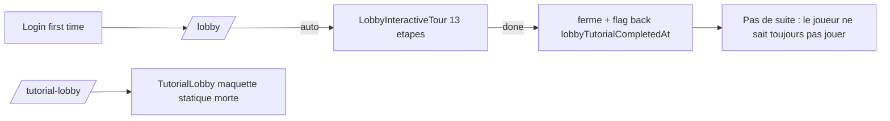
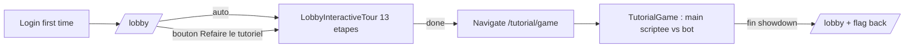

## Vue d'ensemble

Aujourd'hui :



Cible :



## Fichiers

- A creer : [`client/src/pages/TutorialGame.tsx`](client/src/pages/TutorialGame.tsx) — page autonome, simule une main Hold'em deterministe en local. Reutilise `PokerCard`, `ChipIcon`, `SpotlightRects` (extrait en module partage). Aucun socket ni appel jeu. Sortie : `navigate('/lobby')` + appel `/api/auth/lobby-tutorial/complete` si pas deja marque.
- A creer : [`client/src/components/tutorial/TutorialSpotlight.tsx`](client/src/components/tutorial/TutorialSpotlight.tsx) — extrait reutilisable du `SpotlightRects` deja duplique entre `LobbyInteractiveTour` et `GameInteractiveTour`. Evite la triple duplication.
- A creer : [`client/src/features/tutorial/tutorialHandScript.ts`](client/src/features/tutorial/tutorialHandScript.ts) — script deterministe de la main (cartes, actions bot, etapes pedago, cles i18n).
- A modifier : [`client/src/components/LobbyInteractiveTour.tsx`](client/src/components/LobbyInteractiveTour.tsx) — bouton final "Suivant : ta premiere main" qui appelle `navigate('/tutorial/game')` au lieu de fermer.
- A modifier : [`client/src/App.tsx`](client/src/App.tsx) — ajouter route `/tutorial/game` -> `TutorialGame` (sous `ProtectedRoute`). Supprimer la route `/tutorial-lobby` morte.
- A supprimer : [`client/src/pages/TutorialLobby.tsx`](client/src/pages/TutorialLobby.tsx) (maquette orpheline). Sinon la garder mais ne plus l'importer.
- A modifier : [`client/src/pages/Lobby.tsx`](client/src/pages/Lobby.tsx) — ajouter un bouton "Refaire le tutoriel" qui force `setLobbyTourOpen(true)` puis enchaine sur `/tutorial/game` a la fin (a placer pres du bouton "Jouer contre Bot" pour rester decouvert).
- A modifier : `client/src/i18n/locales/{fr,en,es,ar,uk}/translation.json` — ajout du namespace `tutorial.game.*` (titres, corps, classements de mains, etiquettes positions).
- A modifier : [`client/src/components/Layout.tsx`](client/src/components/Layout.tsx) ligne 723 — etendre la regle `path === "/lobby" || path === "/tutorial-lobby"` pour inclure `/tutorial/game` (sinon la Layout chrome se comporte differemment).
- A creer (optionnel mais utile) : `client/src/__tests__/tutorialGame.smoke.test.tsx` — render + check que l'overlay s'ouvre + que cliquer "Suivant" passe a l'etape 2.

## Architecture de `TutorialGame`

Etat React :

```ts
type Phase = "intro" | "seats" | "blinds" | "deal" | "preflop" | "flop" | "turn" | "river" | "showdown" | "outro"
type StepState = {
  stepIndex: number
  phase: Phase
  pot: number
  heroChips: number
  botChips: number
  heroBet: number
  botBet: number
  board: PokerCardValue[]
  showHero: boolean
  showBot: boolean
  highlight: "table" | "pot" | "board" | "hero-cards" | "bot-cards" | "actions" | "blinds" | "dealer" | null
  expectedAction: "click-next" | "fold" | "call" | "check" | "raise" | "bet"
  raiseTo?: number
}
```

Le `tutorialHandScript.ts` exporte un tableau `STEPS: StepState[]` couvrant exactement cette progression deterministe (cartes choisies pour faire passer tous les concepts) :

- 0. Intro : "Le but du Hold'em est de faire la meilleure main de 5 cartes parmi 2 privees + 5 communes."
- 1. Sieges + bouton dealer : on est siege 0, bot siege 1. Bouton sur le bot -> tu es BB (agit en dernier preflop).
- 2. Blindes : bot pose SB=10, hero pose BB=20. Pot=30.
- 3. Distribution mains : Hero=Ah Kh (suited connectors hauts). Bot ne montre pas.
- 4. Preflop : bot complete (call BB) pour 10 chips. Pot=40. Hero a le choix check ou raise. Force `raise to 80` (sur action).
- 5. Bot call. Pot=200.
- 6. Flop : 2h 7h Kc. Explique flop. Hero touche : top paire de K + tirage couleur (4 coeurs avec 2 hole). Spotlight sur le board.
- 7. Bot bet 100. Pedago : "le bot tente de chasser ton tirage". Action attendue : `call` (le tutoriel explique pourquoi). Pot=400.
- 8. Turn : Jh. Hero complete sa couleur (flush). Spotlight pedagogique : "Tu viens de faire une couleur As-K-J-7-2 de coeur".
- 9. Hero turn d'action : force `raise to 250`. Bot call. Pot=900.
- 10. River : 3s (carte inutile, pedagogique : "le river change parfois rien").
- 11. Hero action : `bet 400`. Bot call.
- 12. Showdown : reveler bot = Ks Qs (KK + Q kicker -> paire de Rois). Hero couleur l'emporte. Animer hero chip stack +800. Afficher la table des classements (paire, deux paires, brelan, quinte, couleur, full, carre, quinte flush, quinte flush royale) avec le rang du hero surligne.
- 13. Outro : "Bravo, tu connais maintenant les bases. Tu peux jouer contre les bots dans le lobby." -> bouton `Retour au lobby`.

UI : 2 sieges (hero en bas, bot en haut), board central horizontal, pot au milieu, badge dealer + SB/BB sur les sieges, panneau d'actions en bas. Bulle pedagogique en spotlight (TutorialSpotlight) qui s'ancre sur l'element pertinent suivant `step.highlight`.

Aucun appel reseau. Le bot "joue" en effet visuel : on anime juste la mise du bot sur la prochaine etape.

## Suivi backend

- Aucune table SQL nouvelle. Le flag `lobbyTutorialCompletedAt` existant est marque a la fin de `LobbyInteractiveTour`. On garde ce comportement.
- A la fin de `TutorialGame`, on POST `/api/auth/lobby-tutorial/complete` (idempotent cote serveur : `lobbyTutorialCompletedAt` already set ne change rien). Cela permet de retourner sur l'etat coherent si l'utilisateur saute le tour lobby mais finit le match.

## i18n

Ajouter sous `tutorial.game` :

- `intro.title/body`, `seats.title/body`, `blinds.title/body`, `deal.title/body`, `preflop.title/body`, `flop.title/body`, `turn.title/body`, `river.title/body`, `showdown.title/body`, `outro.title/body`
- `position.dealer/sb/bb/utg/utgPlus1`
- `rankings.highCard/pair/twoPair/threeKind/straight/flush/fullHouse/fourKind/straightFlush/royalFlush`
- `actions.fold/check/call/raise/bet/allin/next/finish/skip`
- `panel.pot/yourHand/opponent/board`

Cle i18n a faire dans 5 locales (fr,en,es,ar,uk). FR canonique, les autres copient FR le temps que la trad humaine arrive.

## Points d'attention

- Le RTL arabe : tester que la bulle se positionne bien quand `dir="rtl"`.
- Mobile : prevoir 2 layouts (vertical mobile / horizontal desktop) en se basant sur les patterns deja appliques dans `Game.tsx`.
- Skip : a chaque etape il y a un bouton "Passer le tutoriel" qui POST `/api/auth/lobby-tutorial/complete` et navigate `/lobby`.
- Ne JAMAIS toucher au solde reel (aucun POST jouant des chips).
- Pas de regression sur `LobbyInteractiveTour` : la seule modif c'est le comportement du bouton "Terminer" qui navigate au lieu de fermer.

## Validation

- `cd client && npx tsc --noEmit` : 0 erreur nouvelle.
- ReadLints sur les fichiers touches.
- Test smoke Jest sur `TutorialGame` : render + step++ + dernier step bouton "Retour au lobby".
- Manuel : flow complet (signup -> auto tour lobby -> match scripte -> retour lobby -> bouton "Refaire" rejoue tout).