# Base de données — Quantum Bluff

Documentation complète du modèle de données du projet **Quantum Bluff** : schéma PostgreSQL, diagrammes **MEA** (Modèle Entité-Association, méthode Merise) et **UML**, relations, contraintes et historique des migrations.

> **Source de vérité :** [`server/prisma/schema.prisma`](../server/prisma/schema.prisma)  
> **Migrations :** [`server/prisma/migrations/`](../server/prisma/migrations/) (47 fichiers SQL)  
> **Dernière mise à jour doc :** 24 mai 2026

---

## Table des matières

1. [Vue d'ensemble](#1-vue-densemble)
2. [Diagramme MEA global](#2-diagramme-mea-global)
3. [Diagrammes MEA par domaine](#3-diagrammes-mea-par-domaine)
4. [Diagrammes UML](#4-diagrammes-uml)
5. [Catalogue des entités (42 tables)](#5-catalogue-des-entités-42-tables)
6. [Référence des énumérations (20 enums)](#6-référence-des-énumérations-20-enums)
7. [Cardinalités et contraintes d'intégrité](#7-cardinalités-et-contraintes-dintégrité)
8. [Index et performances](#8-index-et-performances)
9. [Flux transactionnels métier](#9-flux-transactionnels-métier)
10. [Historique des migrations](#10-historique-des-migrations)
11. [Maintenance et nettoyage](#11-maintenance-et-nettoyage)
12. [Stockage auxiliaire (Redis)](#12-stockage-auxiliaire-redis)
13. [Fichiers de référence](#13-fichiers-de-référence)

---

## 1. Vue d'ensemble

### Stack technique

| Composant | Détail |
|-----------|--------|
| **SGBD** | PostgreSQL 16 |
| **ORM** | Prisma 6 |
| **Client généré** | `server/src/generated/prisma/` |
| **Connexion** | `DATABASE_URL` (voir `server/.env.example`) |
| **Pool** | `pg.Pool` + `@prisma/adapter-pg` ([`server/src/config/database.ts`](../server/src/config/database.ts)) |
| **Docker local** | [`database/docker-compose.yml`](../database/docker-compose.yml) — base `quantum_bluff` |
| **Tables** | **42** modèles Prisma |
| **Enums PostgreSQL** | **20** |
| **Triggers / procédures stockées** | **Aucun** — toute la logique est applicative (TypeScript) |

### Convention de nommage

| Cas | Exemple Prisma | Table PostgreSQL |
|-----|----------------|------------------|
| Sans `@@map` | `User`, `GameHistory` | `"User"`, `"GameHistory"` (PascalCase, guillemets) |
| Avec `@@map("snake_case")` | `CasinoStats` | `casino_stats` |
| Clé primaire composite | `HiddenBetHandResolution` | `(gameId, handId)` |

### Entité centrale

**`User`** est le hub relationnel du projet : compte joueur, économie (chips), social, poker, blackjack, casino, tournois, prêts, paris cachés, modération. Presque toutes les tables y aboutissent via une clé étrangère.

### Schéma logique (domaines fonctionnels)

```
┌─────────────────────────────────────────────────────────────────────────┐
│                              UTILISATEUR                                │
│  User · UserStats · PlayerStats · CasinoStats · UserBadge · FreeRecharge│
│  EmailRegistrationAgeBlocklist · GameRating · PlayerReport                │
└─────────────────────────────────────────────────────────────────────────┘
         │                    │                    │                │
         ▼                    ▼                    ▼                ▼
┌──────────────┐    ┌─────────────────┐   ┌──────────────┐  ┌─────────────┐
│   SOCIAL     │    │  POKER CASH     │   │  BLACKJACK   │  │   CASINO    │
│ FriendRequest│    │ WaitingRoom     │   │ BlackjackRoom│  │ WalletLedger│
│ Friendship   │    │ RoomPlayer      │   │ BjRoomSeat   │  │ GiftCode    │
│ UserBlock    │    │ JoinRequest     │   │ BjSnapshot   │  │ DailyChall. │
│ FriendMessage│    │ GameInvitation  │   │ BjInvitation │  │ HiddenBet   │
│ Loan*        │    │ GameHistory     │   └──────────────┘  └─────────────┘
└──────────────┘    │ GameAction      │
                    │ GameResult      │         ┌─────────────────────────┐
                    │ HiddenBet*      │         │      TOURNOIS           │
                    └─────────────────┘         │ Tournament · Player     │
                                                │ Round · Table · Reward  │
                                                │ RoundReady · WinnerBet  │
                                                └─────────────────────────┘
```

---

## 2. Diagramme MEA global

Le **Modèle Entité-Association (MEA)** Merise représente les entités (rectangles), leurs attributs et les associations avec cardinalités `(min, max)`.

### 2.1 MEA — Vue macro (toutes entités)

```mermaid
erDiagram
    UTILISATEUR ||--o| STATS_UTILISATEUR : "possède (0,1)"
    UTILISATEUR ||--o| STATS_JOUEUR : "possède (0,1)"
    UTILISATEUR ||--o| STATS_CASINO : "possède (0,1)"
    UTILISATEUR ||--o| RECHARGE_GRATUITE : "possède (0,1)"
    UTILISATEUR ||--o{ HISTORIQUE_PARTIE : "gagne (0,n)"
    UTILISATEUR ||--o{ ACTION_PARTIE : "effectue (0,n)"
    UTILISATEUR ||--o{ RESULTAT_PARTIE : "gagne (0,n)"
    UTILISATEUR ||--o{ BADGE : "débloque (0,n)"
    UTILISATEUR ||--o{ ENTREE_LEDGER : "a (0,n)"
    UTILISATEUR ||--o{ DEFI_QUOTIDIEN : "progresse (0,n)"
    UTILISATEUR ||--o{ TICKET_PARI_CACHE : "place (0,n)"
    UTILISATEUR ||--o{ AVIS_JEU : "donne (0,n)"
    UTILISATEUR ||--o{ SIGNALEMENT : "signale/reçoit (0,n)"
    UTILISATEUR ||--o{ USAGE_CODE_CADEAU : "utilise (0,n)"

    UTILISATEUR ||--o{ DEMANDE_AMITIE : "envoie/reçoit (0,n)"
    UTILISATEUR ||--o{ AMITIE : "lié (0,n)"
    UTILISATEUR ||--o{ BLOCAGE : "bloque/est bloqué (0,n)"
    UTILISATEUR ||--o{ MESSAGE_AMI : "envoie/reçoit (0,n)"

    UTILISATEUR ||--o{ DEMANDE_PRET : "emprunte/prête (0,n)"
    UTILISATEUR ||--o{ PRET : "emprunte/prête (0,n)"

    SALLE_ATTENTE ||--o{ JOUEUR_SALLE : "contient (0,n)"
    SALLE_ATTENTE ||--o{ DEMANDE_REJOINDRE : "a (0,n)"
    SALLE_ATTENTE ||--o{ INVITATION_PARTIE : "a (0,n)"
    UTILISATEUR ||--o{ JOUEUR_SALLE : "occupe (0,n)"
    UTILISATEUR ||--o{ DEMANDE_REJOINDRE : "demande (0,n)"
    UTILISATEUR ||--o{ INVITATION_PARTIE : "invite/reçoit (0,n)"

    SALLE_BLACKJACK ||--o| SNAPSHOT_BJ : "snapshot (0,1)"
    SALLE_BLACKJACK ||--o{ SIEGE_BJ : "a (0,n)"
    SALLE_BLACKJACK ||--o{ INVITATION_BJ : "a (0,n)"
    UTILISATEUR ||--o{ SALLE_BLACKJACK : "héberge (0,n)"
    UTILISATEUR ||--o{ SIEGE_BJ : "occupe (0,n)"

    DEMANDE_PRET ||--o| PRET : "devient (0,1)"
    PRET ||--o{ REMBOURSEMENT : "a (0,n)"
    PRET ||--o{ EVENT_LEDGER_PRET : "trace (0,n)"

    TICKET_PARI_CACHE ||--o{ SELECTION_PARI : "contient (1,n)"

    TOURNOI ||--o{ JOUEUR_TOURNOI : "inscrit (0,n)"
    TOURNOI ||--o{ MANCHE_TOURNOI : "a (0,n)"
    TOURNOI ||--o{ REWARD_TOURNOI : "récompense (0,n)"
    TOURNOI ||--o{ PRET_MANCHE : "ready-check (0,n)"
    TOURNOI ||--o{ PARI_VAINQUEUR : "a (0,n)"
    MANCHE_TOURNOI ||--o{ TABLE_TOURNOI : "contient (0,n)"
    UTILISATEUR ||--o{ TOURNOI : "organise (0,n)"
    UTILISATEUR ||--o{ JOUEUR_TOURNOI : "participe (0,n)"
    UTILISATEUR ||--o{ PARI_VAINQUEUR : "parie/prédit (0,n)"

    CODE_CADEAU ||--o{ USAGE_CODE_CADEAU : "consommé par (0,n)"
```

### 2.2 Légende Merise — Cardinalités

| Notation | Signification |
|----------|---------------|
| `(1,1)` | Obligatoire et unique |
| `(0,1)` | Optionnel, au plus un |
| `(1,n)` | Obligatoire, un ou plusieurs |
| `(0,n)` | Optionnel, zéro ou plusieurs |

Exemple : `UTILISATEUR (0,n) — possède — STATS_UTILISATEUR (0,1)`  
→ Un utilisateur possède **au plus une** fiche stats ; une fiche stats appartient à **exactement un** utilisateur.

---

## 3. Diagrammes MEA par domaine

### 3.1 Compte utilisateur & profil

```mermaid
erDiagram
    User {
        uuid id PK
        string username UK
        string email UK
        string password
        int chips
        int level
        int experience
        datetime dateOfBirth
        string avatarUrl
        bytes avatarImage
        boolean avatarHasBinary
        int loginStreakCount
        datetime createdAt
        datetime updatedAt
    }

    UserStats {
        uuid id PK
        uuid userId FK_UK
        int wins
        int totalGames
        int biggestPot
    }

    PlayerStats {
        uuid id PK
        uuid playerId FK_UK
        int totalGames
        int totalWins
        int totalLosses
        int totalHands
        int biggestPot
        int totalChipsWon
        int totalChipsLost
    }

    CasinoStats {
        uuid id PK
        uuid userId FK_UK
        int slotSpins
        int rouletteSpins
        int blackjackHandsPlayed
        int slotBiggestWin
    }

    UserBadge {
        uuid id PK
        uuid userId FK
        string badgeId
        datetime unlockedAt
    }

    FreeRecharge {
        uuid id PK
        uuid userId FK_UK
        datetime lastRechargeAt
        datetime nextRechargeAfter
    }

    GameRating {
        uuid id PK
        uuid userId FK
        int stars
        string message
        datetime createdAt
    }

    EmailRegistrationAgeBlocklist {
        string email PK
        datetime unblockAt
    }

    User ||--o| UserStats : possède
    User ||--o| PlayerStats : possède
    User ||--o| CasinoStats : possède
    User ||--o| FreeRecharge : possède
    User ||--o{ UserBadge : débloque
    User ||--o{ GameRating : évalue
```

**Attributs sensibles / sécurité sur `User` :**

| Attribut | Rôle |
|----------|------|
| `secretQuestionId`, `secretAnswerHash` | Récupération mot de passe |
| `totpSecret` | 2FA TOTP optionnel |
| `lastIp`, `antiCheatAlerts`, `bannedUntil` | Anti-triche & modération |
| `lobbyTutorialCompletedAt` | Onboarding lobby (une fois) |
| `friendsInboxSeenAt` | Compteurs inbox amis côté serveur |

---

### 3.2 Social — amis, messages, blocages

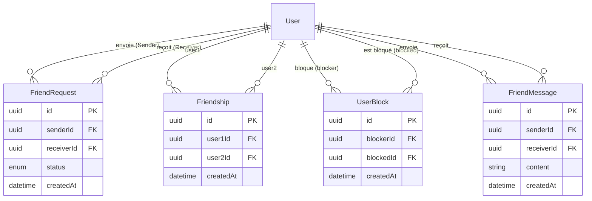

**Contraintes uniques :**

| Table | Contrainte | Effet |
|-------|------------|-------|
| `FriendRequest` | `(senderId, receiverId)` | Une seule demande par paire |
| `Friendship` | `(user1Id, user2Id)` | Une seule amitié par paire |
| `UserBlock` | `(blockerId, blockedId)` | Un seul blocage par paire |

---

### 3.3 Prêts entre amis

```mermaid
erDiagram
    User ||--o{ LoanRequest : emprunte
    User ||--o{ LoanRequest : prête
    LoanRequest ||--o| Loan : "acceptée →"
    Loan ||--o{ LoanRepayment : rembourse
    Loan ||--o{ LoanLedgerEvent : audit
    LoanRequest ||--o{ LoanLedgerEvent : audit

    LoanRequest {
        uuid id PK
        uuid borrowerId FK
        uuid lenderId FK
        int amount
        int repaymentRate
        int interestRate
        int totalDue
        enum status
        datetime expiresAt
    }

    Loan {
        uuid id PK
        uuid requestId FK_UK
        uuid borrowerId FK
        uuid lenderId FK
        int principalAmount
        int repaidAmount
        int remainingAmount
        enum status
    }

    LoanRepayment {
        uuid id PK
        uuid loanId FK
        enum sourceGameType
        string sourceReferenceId
        int grossWinAmount
        int repaymentAmount
        int borrowerNetReceived
    }

    LoanLedgerEvent {
        uuid id PK
        uuid loanId FK
        uuid requestId FK
        enum type
        int amount
        json metadataJson
    }
```

**Cycle de vie :**

```
LoanRequest (PENDING)
    → ACCEPTED → Loan (ACTIVE) → LoanRepayment(s) → Loan (COMPLETED)
    → REJECTED / CANCELLED / EXPIRED
```

**Règle FK notable :** `Loan.requestId` → `LoanRequest.id` avec `onDelete: Restrict` (impossible de supprimer une demande acceptée tant qu'un prêt existe).

---

### 3.4 Poker cash — salles d'attente & historique

```mermaid
erDiagram
    WaitingRoom ||--o{ RoomPlayer : contient
    WaitingRoom ||--o{ JoinRequest : demandes
    WaitingRoom ||--o{ GameInvitation : invitations
    User ||--o{ RoomPlayer : rejoint
    User ||--o{ JoinRequest : demande
    User ||--o{ GameInvitation : invite/reçoit
    User ||--o{ GameHistory : gagne
    User ||--o{ GameAction : joue
    User ||--o{ GameResult : gagne

    WaitingRoom {
        uuid id PK
        string name
        string hostId
        int maxPlayers
        enum visibility
        enum status
        int smallBlind
        int bigBlind
        int minBalance
        boolean turbo
        string gameId
    }

    RoomPlayer {
        uuid id PK
        uuid roomId FK
        uuid userId FK
        boolean isReady
        int position
        string avatarUrl
    }

    JoinRequest {
        uuid id PK
        uuid roomId FK
        uuid userId FK
        enum status
    }

    GameInvitation {
        uuid id PK
        uuid roomId FK
        uuid senderId FK
        uuid receiverId FK
        enum status
    }

    GameHistory {
        uuid id PK
        string tableId
        string gameId
        string_array board
        int pot
        uuid winnerId FK
    }

    GameAction {
        uuid id PK
        string gameId
        uuid playerId FK
        string action
        int amount
        string phase
        int round
    }

    GameResult {
        uuid id PK
        string gameId UK
        uuid winnerId FK
        int pot
        json hands
    }
```

**Note :** `WaitingRoom.hostId` n'a **pas** de contrainte FK Prisma vers `User` (référence logique uniquement).

**Enums salles poker :**

| Enum | Valeurs |
|------|---------|
| `RoomVisibility` | PUBLIC, PRIVATE |
| `RoomStatus` | WAITING, STARTING, IN_GAME |
| `RequestStatus` | PENDING, ACCEPTED, REJECTED |
| `InvitationStatus` | PENDING, ACCEPTED, REJECTED |

---

### 3.5 Blackjack multijoueur

```mermaid
erDiagram
    User ||--o{ BlackjackRoom : héberge
    BlackjackRoom ||--o| BlackjackRoomSnapshot : persiste
    BlackjackRoom ||--o{ BlackjackRoomSeat : sièges
    BlackjackRoom ||--o{ BlackjackRoomInvitation : invitations
    User ||--o{ BlackjackRoomSeat : occupe
    User ||--o{ BlackjackRoomInvitation : invite/reçoit

    BlackjackRoom {
        uuid id PK
        string name
        uuid hostId FK
        int maxSeats
        enum visibility
        enum status
        string gameId
        int minBet
    }

    BlackjackRoomSnapshot {
        uuid id PK
        uuid roomId FK_UK
        json snapshot
        int version
    }

    BlackjackRoomSeat {
        uuid id PK
        uuid roomId FK
        uuid userId FK
        int position
        boolean isReady
    }

    BlackjackRoomInvitation {
        uuid id PK
        uuid blackjackRoomId FK
        uuid senderId FK
        uuid receiverId FK
        enum status
    }
```

**Contraintes sièges :**

- `(roomId, userId)` unique — un joueur par salle
- `(roomId, position)` unique — une position par salle

Le **snapshot JSON** sert à la reprise après crash (`RECOVERING` côté moteur).

---

### 3.6 Casino, économie & promotions

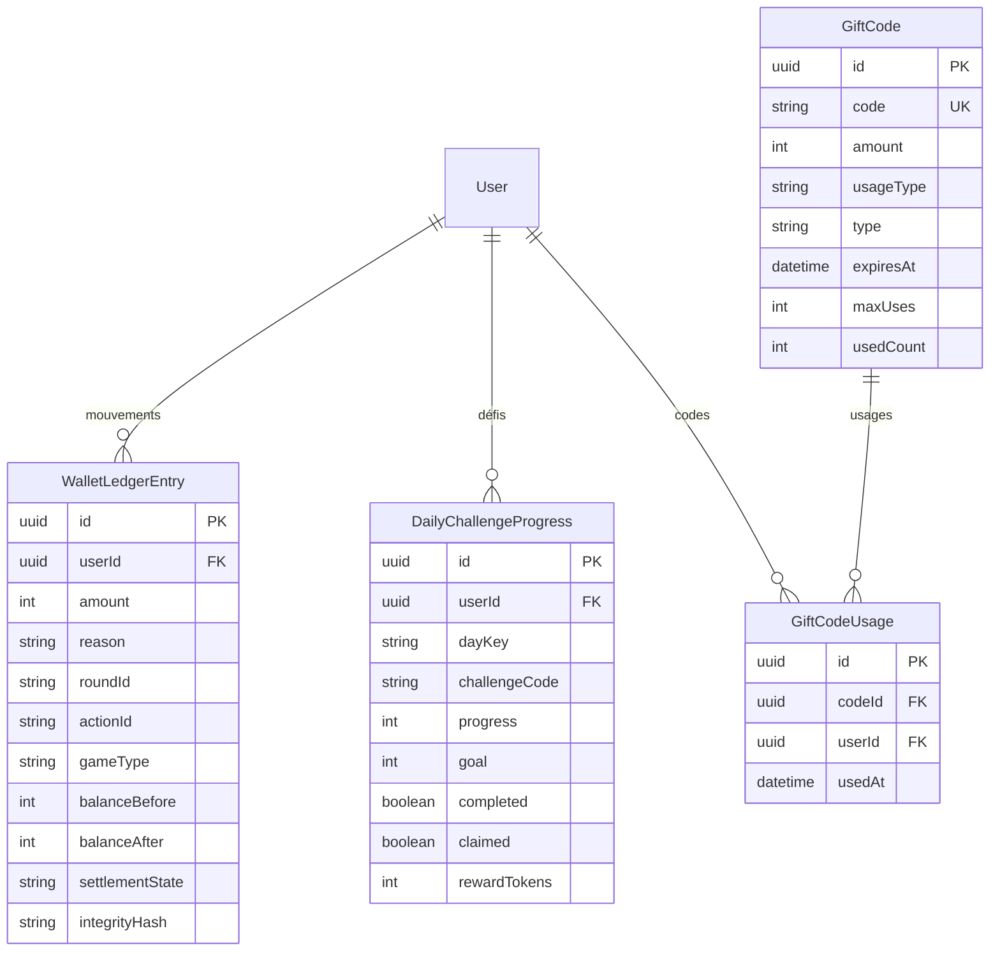

**`WalletLedgerEntry`** est le journal comptable immuable de tous les mouvements de jetons (casino, défis, tournois, etc.). Champs d'audit moteur : `engineVersion`, `rngVersion`, `integrityHash`.

**Types de code cadeau (`usageType`) :** `TOKENS`, `FIXED_DISCOUNT`, `PERCENTAGE_DISCOUNT`.

---

### 3.7 Paris cachés poker (Hidden Bets)

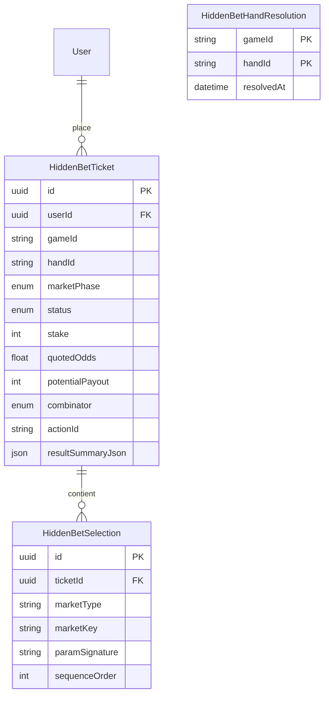

**Verrou idempotence :** `HiddenBetHandResolution` garantit **une seule résolution** par couple `(gameId, handId)`.

**Statuts ticket :** PENDING → SETTLING → WON | LOST | VOID | CANCELED

**Phases marché :** PRE_HAND, LIVE_FLOP, LIVE_TURN, LIVE_RIVER

---

### 3.8 Tournois Texas Hold'em

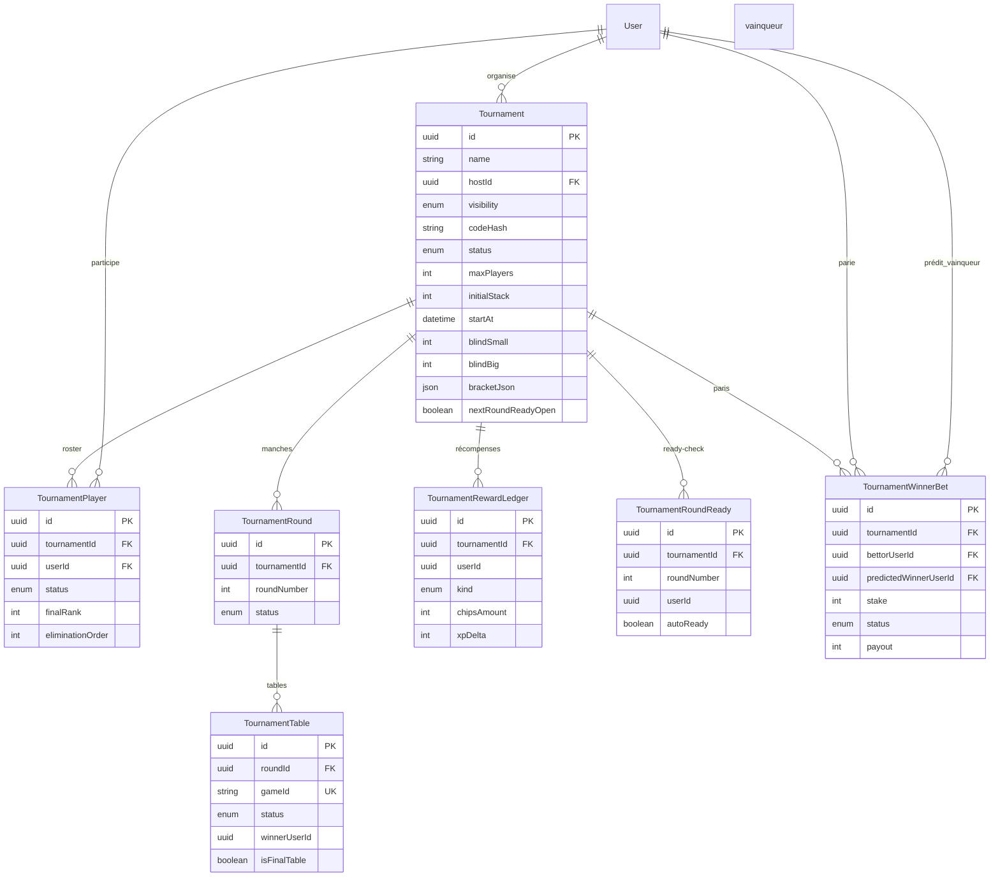

**Machine à états tournoi (`TournamentStatus`) :**

```
REGISTRATION_OPEN → STARTING → ROUND_IN_PROGRESS
    ⇄ WAITING_FOR_TABLES / WAITING_READY_CHECK
    → COMPLETED | CANCELLED
```

---

### 3.9 Modération

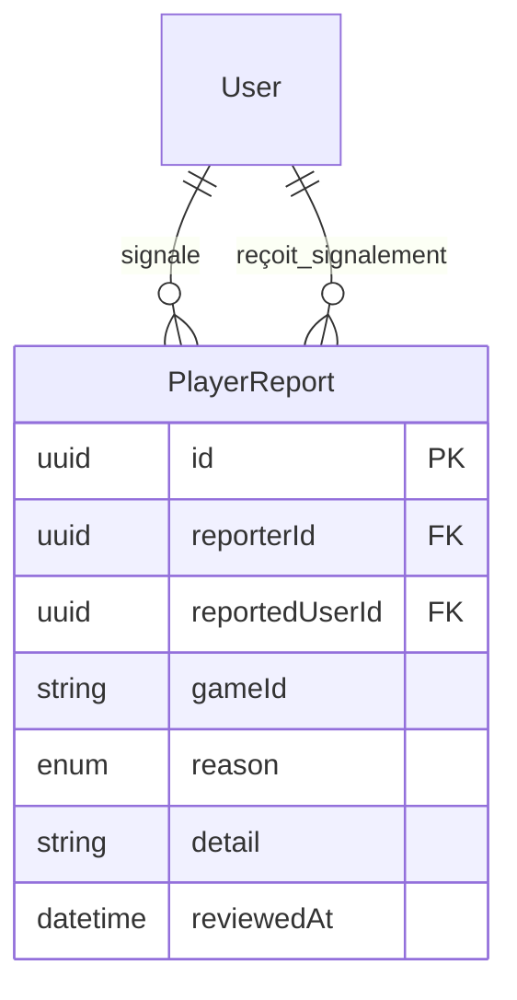

**Raisons (`PlayerReportReason`) :** INAPPROPRIATE_LANGUAGE, CHEATING, HARASSMENT, SPAM, OTHER

---

## 4. Diagrammes UML

### 4.1 Diagramme de classes UML — Vue globale

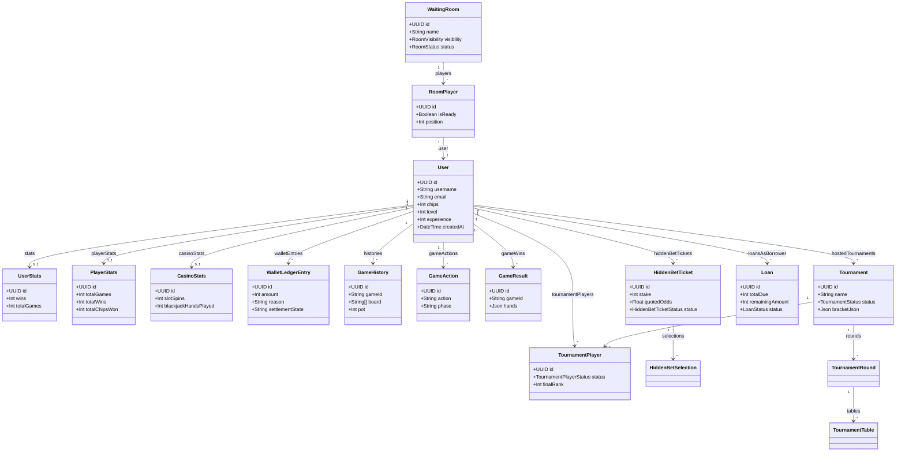

### 4.2 UML — Package Social & Prêts

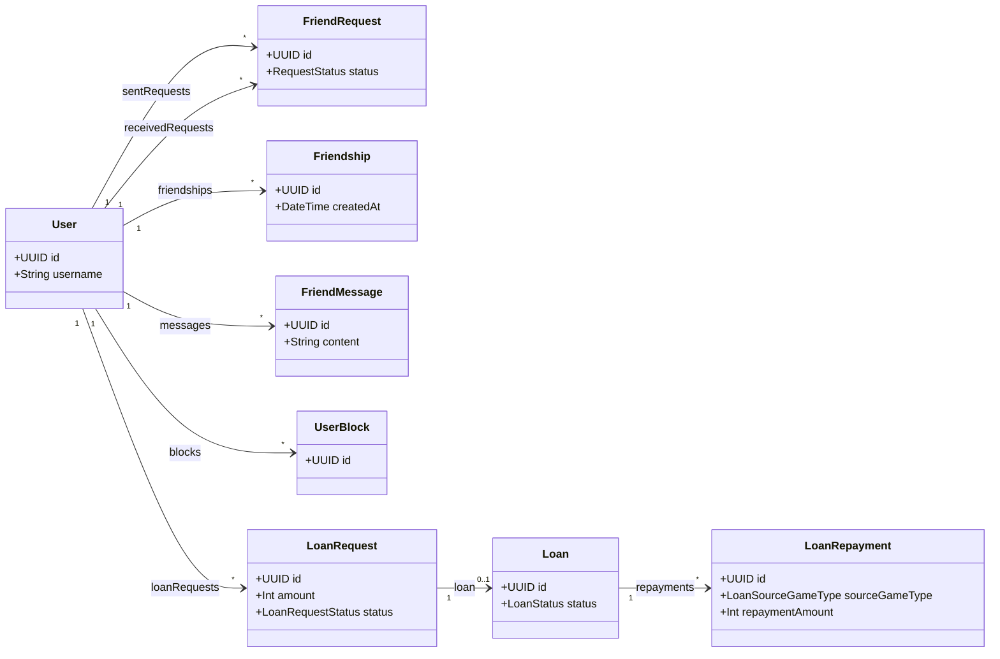

### 4.3 UML — Package Blackjack

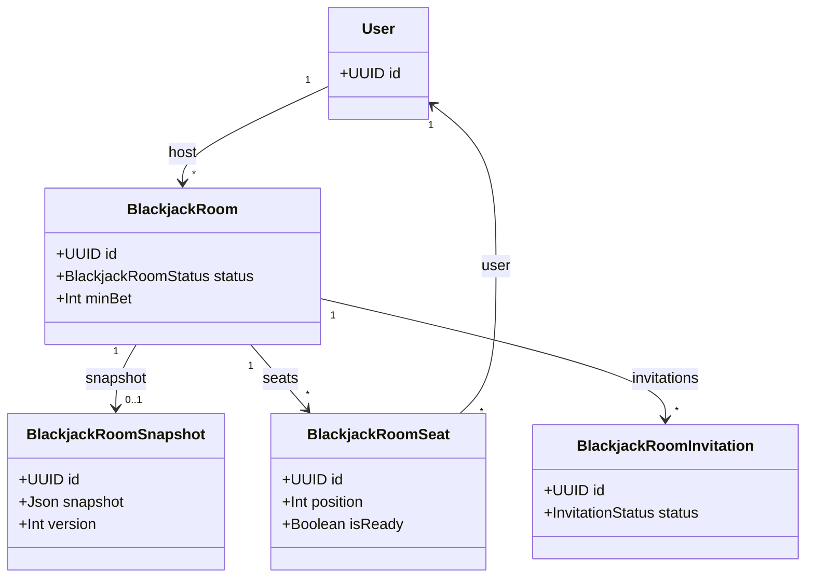

### 4.4 UML — Séquence : placement pari caché (Hidden Bet)

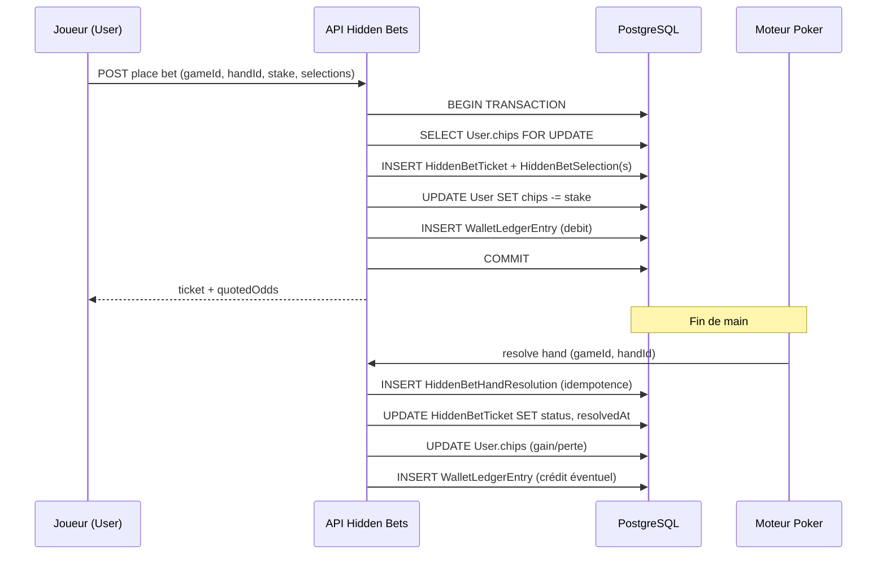

### 4.5 UML — Diagramme d'états : `LoanRequest`

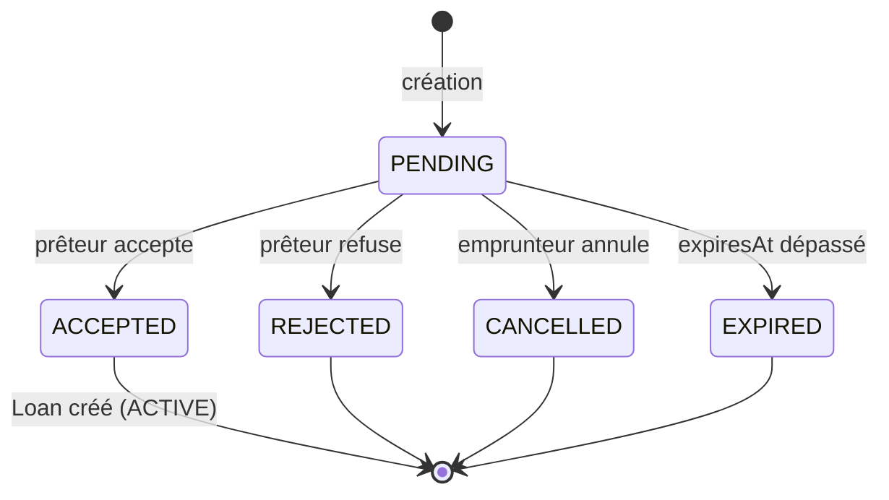

### 4.6 UML — Diagramme d'états : `Tournament`

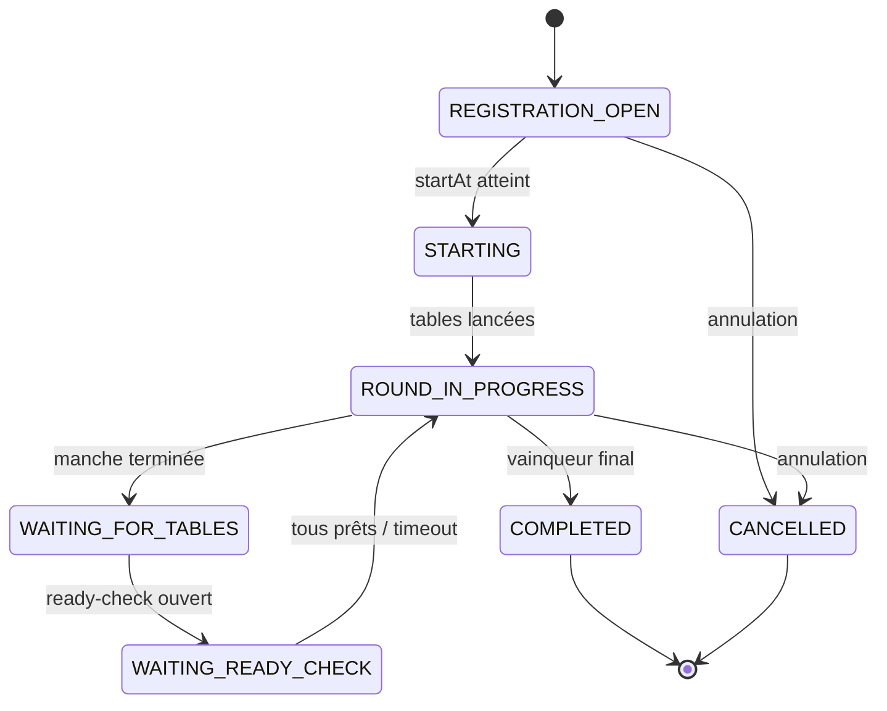

---

## 5. Catalogue des entités (42 tables)

### 5.1 Table de correspondance Prisma ↔ PostgreSQL

| # | Modèle Prisma | Table PostgreSQL | Domaine |
|---|---------------|------------------|---------|
| 1 | `User` | `"User"` | Compte |
| 2 | `EmailRegistrationAgeBlocklist` | `"EmailRegistrationAgeBlocklist"` | Conformité |
| 3 | `UserStats` | `"UserStats"` | Stats |
| 4 | `PlayerStats` | `"PlayerStats"` | Stats poker |
| 5 | `CasinoStats` | `casino_stats` | Stats casino |
| 6 | `UserBadge` | `user_badges` | Gamification |
| 7 | `FreeRecharge` | `free_recharges` | Économie |
| 8 | `GameRating` | `"GameRating"` | Feedback |
| 9 | `PlayerReport` | `player_reports` | Modération |
| 10 | `FriendRequest` | `"FriendRequest"` | Social |
| 11 | `Friendship` | `"Friendship"` | Social |
| 12 | `UserBlock` | `user_blocks` | Social |
| 13 | `FriendMessage` | `"FriendMessage"` | Social |
| 14 | `LoanRequest` | `loan_requests` | Prêts |
| 15 | `Loan` | `loans` | Prêts |
| 16 | `LoanRepayment` | `loan_repayments` | Prêts |
| 17 | `LoanLedgerEvent` | `loan_ledger_events` | Prêts |
| 18 | `WaitingRoom` | `waiting_rooms` | Poker lobby |
| 19 | `JoinRequest` | `join_requests` | Poker lobby |
| 20 | `RoomPlayer` | `room_players` | Poker lobby |
| 21 | `GameInvitation` | `"GameInvitation"` | Poker lobby |
| 22 | `GameHistory` | `"GameHistory"` | Historique |
| 23 | `GameAction` | `"GameAction"` | Historique |
| 24 | `GameResult` | `"GameResult"` | Historique |
| 25 | `BlackjackRoom` | `blackjack_rooms` | Blackjack |
| 26 | `BlackjackRoomSnapshot` | `blackjack_room_snapshots` | Blackjack |
| 27 | `BlackjackRoomSeat` | `blackjack_room_seats` | Blackjack |
| 28 | `BlackjackRoomInvitation` | `blackjack_room_invitations` | Blackjack |
| 29 | `WalletLedgerEntry` | `wallet_ledger_entries` | Comptabilité |
| 30 | `GiftCode` | `gift_codes` | Promotions |
| 31 | `GiftCodeUsage` | `gift_code_usages` | Promotions |
| 32 | `DailyChallengeProgress` | `daily_challenge_progress` | Défis |
| 33 | `HiddenBetTicket` | `hidden_bet_tickets` | Paris cachés |
| 34 | `HiddenBetSelection` | `hidden_bet_selections` | Paris cachés |
| 35 | `HiddenBetHandResolution` | `hidden_bet_hand_resolutions` | Paris cachés |
| 36 | `Tournament` | `tournaments` | Tournois |
| 37 | `TournamentPlayer` | `tournament_players` | Tournois |
| 38 | `TournamentRound` | `tournament_rounds` | Tournois |
| 39 | `TournamentTable` | `tournament_tables` | Tournois |
| 40 | `TournamentRewardLedger` | `tournament_reward_ledger` | Tournois |
| 41 | `TournamentRoundReady` | `tournament_round_ready` | Tournois |
| 42 | `TournamentWinnerBet` | `tournament_winner_bets` | Tournois |

---

### 5.2 Détail complet — `User`

| Colonne | Type SQL | Contraintes | Description |
|---------|----------|-------------|-------------|
| `id` | `TEXT` (UUID) | PK, DEFAULT uuid | Identifiant unique |
| `username` | `TEXT` | UNIQUE, NOT NULL | Pseudo public |
| `email` | `TEXT` | UNIQUE, NOT NULL | E-mail de connexion |
| `password` | `TEXT` | NOT NULL | Hash mot de passe |
| `secretQuestionId` | `INTEGER` | NULL | Index question secrète (1–10) |
| `secretAnswerHash` | `TEXT` | NULL | Hash réponse secrète |
| `chips` | `INTEGER` | DEFAULT 1000 | Solde jetons |
| `level` | `INTEGER` | DEFAULT 1 | Niveau calculé |
| `experience` | `INTEGER` | DEFAULT 0 | XP cumulée |
| `totpSecret` | `TEXT` | NULL | Secret 2FA |
| `lastIp` | `TEXT` | NULL | Dernière IP |
| `antiCheatAlerts` | `INTEGER` | DEFAULT 0 | Compteur alertes |
| `bannedUntil` | `TIMESTAMP` | NULL | Fin de ban temporaire |
| `dateOfBirth` | `TIMESTAMP` | NULL | Date naissance (UTC minuit) |
| `lobbyTutorialCompletedAt` | `TIMESTAMP` | NULL | Tutoriel lobby terminé |
| `friendsInboxSeenAt` | `TIMESTAMP` | NULL | Dernière visite inbox amis |
| `avatarUrl` | `TEXT` | NULL | URL avatar publique |
| `avatarImage` | `BYTEA` | NULL | Binaire avatar |
| `avatarMime` | `TEXT` | NULL | MIME type avatar |
| `avatarHasBinary` | `BOOLEAN` | DEFAULT false | Flag présence binaire |
| `loginStreakCount` | `INTEGER` | DEFAULT 0 | Série connexion (1–7) |
| `lastLoginRewardDayKey` | `TEXT` | NULL | Dernier jour récompense (YYYY-MM-DD) |
| `lastLoginRewardAt` | `TIMESTAMP` | NULL | Horodatage dernière réclamation |
| `createdAt` | `TIMESTAMP` | DEFAULT now() | Création compte |
| `updatedAt` | `TIMESTAMP` | AUTO | Dernière modification |

**Index :** `username`, `email`, `createdAt`, `chips`, `experience`, `lastLoginRewardDayKey`

---

### 5.3 Détail — Entités 1:1 avec `User`

#### `UserStats` → `"UserStats"`

| Colonne | Type | Contraintes |
|---------|------|-------------|
| id | UUID | PK |
| userId | UUID | FK → User, UNIQUE |
| wins | INT | DEFAULT 0 |
| totalGames | INT | DEFAULT 0 |
| biggestPot | INT | DEFAULT 0 |

#### `PlayerStats` → `"PlayerStats"`

| Colonne | Type | Contraintes |
|---------|------|-------------|
| id | UUID | PK |
| playerId | UUID | FK → User, UNIQUE |
| totalGames, totalWins, totalLosses, totalHands | INT | DEFAULT 0 |
| totalRaises, totalCalls, totalFolds, totalChecks | INT | DEFAULT 0 |
| biggestPot, biggestWin, totalChipsWon, totalChipsLost | INT | DEFAULT 0 |
| updatedAt | TIMESTAMP | DEFAULT now() |

#### `CasinoStats` → `casino_stats`

| Colonne | Type | Contraintes |
|---------|------|-------------|
| id | UUID | PK |
| userId | UUID | FK → User (CASCADE), UNIQUE |
| slotSpins, rouletteSpins, blackjackHandsPlayed | INT | DEFAULT 0 |
| slotBiggestWin, rouletteBiggestWin, blackjackBiggestWin | INT | DEFAULT 0 |
| updatedAt | TIMESTAMP | AUTO |

#### `FreeRecharge` → `free_recharges`

| Colonne | Type | Contraintes |
|---------|------|-------------|
| id | UUID | PK |
| userId | UUID | FK → User (CASCADE), UNIQUE |
| lastRechargeAt | TIMESTAMP | NULL |
| nextRechargeAfter | TIMESTAMP | NULL |
| createdAt, updatedAt | TIMESTAMP | |

---

### 5.4 Détail — Historique poker

#### `GameHistory` → `"GameHistory"`

| Colonne | Type | Description |
|---------|------|-------------|
| id | UUID | PK |
| tableId | TEXT | ID table |
| gameId | TEXT | ID partie |
| board | TEXT[] | Cartes communes |
| pot | INT | Pot final |
| winnerId | UUID | FK → User (nullable) |
| createdAt | TIMESTAMP | |

**Rétention :** supprimé après **30 jours** (job cleanup).

#### `GameAction` → `"GameAction"`

| Colonne | Type | Description |
|---------|------|-------------|
| action | TEXT | FOLD, CALL, RAISE, CHECK, BET |
| phase | TEXT | PREFLOP, FLOP, TURN, RIVER |
| amount | INT | NULL sauf RAISE/BET |
| round | INT | Tour de mise (default 1) |

#### `GameResult` → `"GameResult"`

| Colonne | Type | Description |
|---------|------|-------------|
| gameId | TEXT | UNIQUE — une ligne par partie |
| hands | JSONB | Mains des joueurs |
| startedAt, endedAt | TIMESTAMP | Durée partie |

---

### 5.5 Détail — Wallet & promotions

#### `WalletLedgerEntry` → `wallet_ledger_entries`

Journal append-only des mouvements de jetons.

| Colonne | Type | Description |
|---------|------|-------------|
| amount | INT | Delta (+ crédit, − débit) |
| reason | TEXT | Code métier (ex. `SLOT_WIN`, `DAILY_CHALLENGE_REWARD`) |
| game | TEXT | Legacy compat |
| roundId | TEXT | ID round casino/poker |
| actionId | TEXT | Idempotence action |
| gameType | TEXT | slot, roulette, blackjack, poker… |
| balanceBefore, balanceAfter | INT | Snapshot solde |
| settlementState | TEXT | DEFAULT `SETTLED` |
| engineVersion, rulesVersion, payoutTableVersion, rngVersion | TEXT | Versions moteur |
| integrityHash | TEXT | Hash d'intégrité |

#### `GiftCode` → `gift_codes`

| Colonne | Type | Description |
|---------|------|-------------|
| code | TEXT | UNIQUE |
| amount | INT | Valeur (jetons ou remise) |
| usageType | TEXT | TOKENS \| FIXED_DISCOUNT \| PERCENTAGE_DISCOUNT |
| type | TEXT | ACHIEVEMENT \| EVENT \| SEASONAL \| SPECIAL |
| maxUses | INT | -1 = illimité |
| usedCount | INT | Compteur usages |

---

### 5.6 Détail — Tournois (colonnes clés)

#### `Tournament` → `tournaments`

| Colonne | Type | Description |
|---------|------|-------------|
| visibility | ENUM | PUBLIC / PRIVATE |
| codeHash | TEXT | bcrypt du code (PRIVATE) |
| maxPlayers | INT | 4–20 |
| initialStack | INT | Stack de départ |
| blindSmall, blindBig | INT | Blinds |
| currentRoundNumber | INT | Manche courante |
| bracketJson | JSONB | Arbre élimination |
| finalTablePlayerIds | JSONB | Snapshot table finale |
| nextRoundReadyOpen | BOOLEAN | Fenêtre ready-check |
| nextRoundReadyDeadline | TIMESTAMP | Auto-ready T+30s |
| nextRoundReadyNumber | INT | Numéro manche à venir |

#### `TournamentWinnerBet` → `tournament_winner_bets`

Paris parimutuel sur le vainqueur final. Résolution : `(stake / poolGagnant) * poolTotal`.

---

## 6. Référence des énumérations (20 enums)

| Enum | Valeurs |
|------|---------|
| `PlayerReportReason` | INAPPROPRIATE_LANGUAGE, CHEATING, HARASSMENT, SPAM, OTHER |
| `LoanRequestStatus` | PENDING, ACCEPTED, REJECTED, CANCELLED, EXPIRED |
| `LoanStatus` | ACTIVE, COMPLETED, DEFAULTED, CANCELLED |
| `LoanLedgerEventType` | REQUEST_CREATED, REQUEST_ACCEPTED, REQUEST_REJECTED, REQUEST_CANCELLED, FUNDED, REPAYMENT_APPLIED, COMPLETED |
| `LoanSourceGameType` | SLOT, ROULETTE, BLACKJACK_SOLO, BLACKJACK_MULTI, POKER_CASH |
| `RequestStatus` | PENDING, ACCEPTED, REJECTED |
| `InvitationStatus` | PENDING, ACCEPTED, REJECTED |
| `RoomVisibility` | PUBLIC, PRIVATE |
| `RoomStatus` | WAITING, STARTING, IN_GAME |
| `BlackjackRoomStatus` | WAITING, PLAYING |
| `HiddenBetTicketStatus` | PENDING, SETTLING, WON, LOST, VOID, CANCELED |
| `HiddenBetCombinator` | SINGLE, AND |
| `HiddenBetMarketPhase` | PRE_HAND, LIVE_FLOP, LIVE_TURN, LIVE_RIVER |
| `TournamentVisibility` | PUBLIC, PRIVATE |
| `TournamentStatus` | REGISTRATION_OPEN, STARTING, ROUND_IN_PROGRESS, WAITING_FOR_TABLES, WAITING_READY_CHECK, COMPLETED, CANCELLED |
| `TournamentPlayerStatus` | REGISTERED, ACTIVE, WAITING_NEXT_ROUND, ELIMINATED, WINNER |
| `TournamentRoundStatus` | PENDING, IN_PROGRESS, COMPLETED |
| `TournamentTableStatus` | PENDING, IN_PROGRESS, COMPLETED, CANCELLED, RECOVERING |
| `TournamentRewardLedgerKind` | CHIPS_WINNER, XP_PLACEMENT |
| `TournamentWinnerBetStatus` | PENDING, WON, LOST, REFUNDED |

---

## 7. Cardinalités et contraintes d'intégrité

### 7.1 Matrice des relations principales

| Entité A | Relation | Entité B | Cardinalité | onDelete |
|----------|----------|----------|-------------|----------|
| User | possède | UserStats | 1:0..1 | RESTRICT (default) |
| User | possède | PlayerStats | 1:0..1 | RESTRICT |
| User | possède | CasinoStats | 1:0..1 | CASCADE |
| User | possède | FreeRecharge | 1:0..1 | CASCADE |
| User | gagne | GameHistory | 1:0..* | SET NULL (winnerId) |
| User | effectue | GameAction | 1:0..* | RESTRICT |
| User | gagne | GameResult | 1:0..* | RESTRICT |
| User | a | WalletLedgerEntry | 1:0..* | CASCADE |
| User | place | HiddenBetTicket | 1:0..* | CASCADE |
| LoanRequest | crée | Loan | 1:0..1 | RESTRICT (request) |
| Loan | a | LoanRepayment | 1:0..* | CASCADE |
| WaitingRoom | contient | RoomPlayer | 1:0..* | CASCADE |
| BlackjackRoom | a | BlackjackRoomSnapshot | 1:0..1 | CASCADE |
| HiddenBetTicket | contient | HiddenBetSelection | 1:1..* | CASCADE |
| Tournament | a | TournamentRound | 1:0..* | CASCADE |
| TournamentRound | a | TournamentTable | 1:0..* | CASCADE |
| GiftCode | utilisé par | GiftCodeUsage | 1:0..* | CASCADE |

### 7.2 Contraintes UNIQUE métier

| Table | Colonnes | Règle métier |
|-------|----------|--------------|
| User | username, email | Un compte par pseudo et e-mail |
| FriendRequest | (senderId, receiverId) | Pas de doublon de demande |
| Friendship | (user1Id, user2Id) | Amitié unique |
| UserBlock | (blockerId, blockedId) | Blocage unique |
| RoomPlayer | (roomId, userId) | Un joueur une fois par salle |
| JoinRequest | (roomId, userId) | Une demande par salle |
| GameInvitation | (roomId, receiverId) | Une invitation par destinataire/salle |
| BlackjackRoomSeat | (roomId, userId), (roomId, position) | Siège unique |
| Loan | requestId | Un prêt par demande acceptée |
| HiddenBetTicket | (userId, actionId) | Idempotence placement |
| HiddenBetHandResolution | (gameId, handId) | Idempotence résolution |
| DailyChallengeProgress | (userId, dayKey, challengeCode) | Un progrès par défi/jour |
| GiftCodeUsage | (codeId, userId) | Un usage par joueur/code |
| TournamentPlayer | (tournamentId, userId) | Inscription unique |
| TournamentRound | (tournamentId, roundNumber) | Numéro manche unique |
| TournamentTable | gameId | Une table par gameId |
| TournamentRewardLedger | (tournamentId, userId, kind) | Une récompense par type |
| TournamentRoundReady | (tournamentId, roundNumber, userId) | Un ready par manche/joueur |
| GameResult | gameId | Un résultat par partie |

### 7.3 Absence de FK explicite

| Colonne | Table | Note |
|---------|-------|------|
| `hostId` | `waiting_rooms` | Référence logique User, pas de FK Prisma |
| `winnerUserId` | `tournament_tables` | Référence logique User |
| `userId` | `tournament_reward_ledger` | Référence logique User |
| `userId` | `tournament_round_ready` | Référence logique User |
| `borrowerId`, `lenderId` | `loan_repayments` | Redondance dénormalisée (pas de FK User) |

---

## 8. Index et performances

### 8.1 Index par table (synthèse)

Les index Prisma `@@index` sont matérialisés en B-tree PostgreSQL. Principaux axes de requête :

| Table | Index | Cas d'usage |
|-------|-------|-------------|
| User | chips, experience | Classements |
| GameHistory | createdAt, gameId, winnerId | Historique & cleanup |
| GameAction | gameId, playerId, timestamp | Replay & stats |
| GameResult | endedAt, winnerId | Classements récents |
| waiting_rooms | — | Lobby (peu d'index dédiés) |
| blackjack_rooms | (visibility, status) | Liste lobby BJ |
| wallet_ledger_entries | userId, createdAt, roundId | Relevé compte |
| hidden_bet_tickets | (gameId, handId, status) | Résolution batch |
| tournaments | (status, startAt) | Planning tournois |
| tournament_players | (tournamentId, status) | Roster actif |
| loan_requests | (borrowerId, status), (lenderId, status) | Inbox prêts |
| player_reports | createdAt, reviewedAt | Console admin |

### 8.2 Recommandations d'exploration

```sql
-- Lister les index d'une table
SELECT indexname, indexdef
FROM pg_indexes
WHERE tablename = 'wallet_ledger_entries';

-- Taille des tables
SELECT relname, pg_size_pretty(pg_total_relation_size(relid))
FROM pg_catalog.pg_statio_user_tables
ORDER BY pg_total_relation_size(relid) DESC;
```

---

## 9. Flux transactionnels métier

### 9.1 Spin / main casino

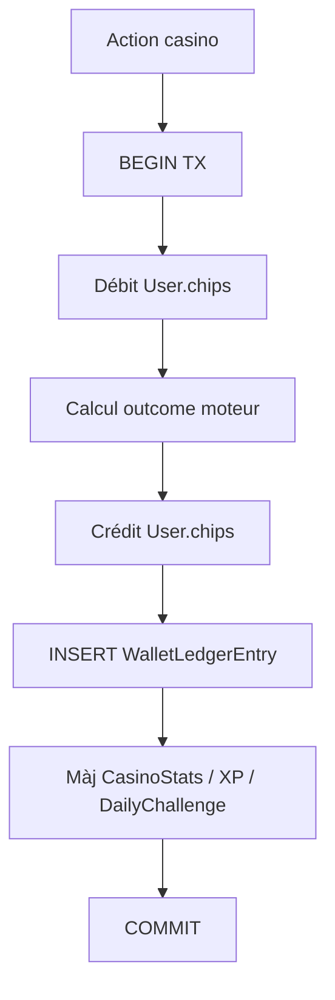

### 9.2 Réclamation défi quotidien

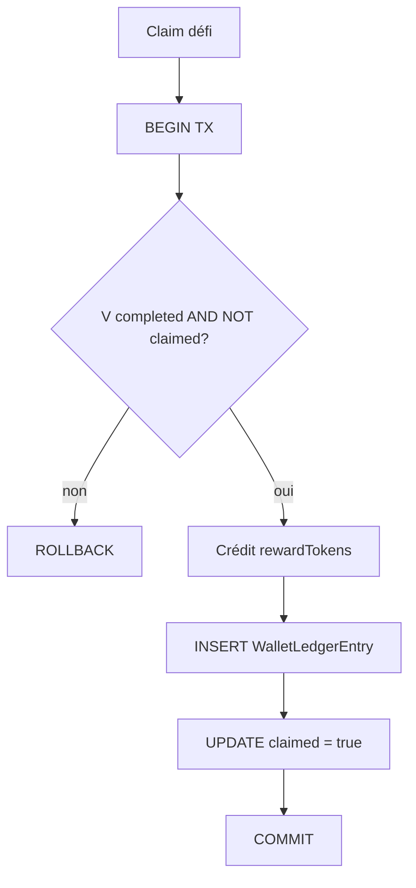

### 9.3 Remboursement prêt automatique

Lors d'un gain casino/poker, le moteur de prêts peut prélever un pourcentage (`repaymentRate`) :

```
Gain brut → calcul repaymentAmount → crédit emprunteur (net) + crédit prêteur
→ INSERT LoanRepayment → UPDATE Loan.remainingAmount → LoanLedgerEvent
```

---

## 10. Historique des migrations

47 migrations chronologiques dans `server/prisma/migrations/`.

| Date (prefix) | Migration | Contenu principal |
|---------------|-----------|-------------------|
| 2026-03-08 | `init` | User, UserStats, GameHistory |
| 2026-03-12 | `add_friends` | FriendRequest, Friendship |
| 2026-03-12 | `add_waiting_rooms` | WaitingRoom, RoomPlayer |
| 2026-03-12 | `add_game_history` | Extensions historique |
| 2026-03-12 | `add_indexes_for_optimization` | Index perf |
| 2026-03-12 | `add_game_history_tables` | GameAction, GameResult, PlayerStats |
| 2026-03-15 | `add_secret_recovery` | Questions secrètes |
| 2026-03-15 | `add_room_visibility_and_join_requests` | Salles privées |
| 2026-03-15 | `add_game_invitations` | GameInvitation |
| 2026-03-16 | `add_friend_messages` | FriendMessage |
| 2026-03-17 | `add_room_game_params` | Blinds, minBalance |
| 2026-03-18 | `add_google_oauth` | totpSecret (placeholder OAuth) |
| 2026-03-24 | `gamification_xp_badges_casino` | XP, badges, casino |
| 2026-03-24 | `add_blackjack_casino_stats` | Stats BJ |
| 2026-03-24 | `blackjack_multi_rooms` | Salles BJ multi |
| 2026-03-24 | `blackjack_room_invitations` | Invitations BJ |
| 2026-03-25 | `waiting_room_turbo` | Mode turbo poker |
| 2026-03-27 | `blackjack_room_snapshots` | Recovery snapshots |
| 2026-03-27 | `wallet_ledger_entries` | Ledger comptable |
| 2026-03-28 | `user_anticheat_columns` | Anti-triche |
| 2026-03-28 | `wallet_ledger_entries_align_prisma` | Alignement ledger |
| 2026-03-28 | `hidden_bet_tickets` | Paris cachés v1 |
| 2026-03-29 | `hidden_bet_market_phase` | Phases live |
| 2026-03-30 | `room_player_avatar_url` | Avatar en salle |
| 2026-03-30 | `friend_loans_v1` | Système prêts |
| 2026-03-31 | `add_tournaments` | Tournois v1 |
| 2026-03-31 | `daily_challenges_v2` | Défis quotidiens |
| 2026-04-19 | `add_game_rating` | GameRating |
| 2026-04-19 | `user_lobby_tutorial` | Tutoriel lobby |
| 2026-04-21 | `player_reports` | Signalements |
| 2026-04-21 | `user_profile_avatar_url` | Avatar URL |
| 2026-04-27 | `user_avatar_image_bytes` | Avatar binaire |
| 2026-05-08 | `add_daily_login_streak` | Série connexion |
| 2026-05-08 | `add_free_recharge` | Recharge gratuite |
| 2026-05-08 | `tournament_bracket_columns` | Bracket JSON |
| 2026-05-09 | `add_gift_codes` | Codes cadeaux |
| 2026-05-09 | `add_usage_type_to_gift_codes` | Types remise |
| 2026-05-10 | `tournament_visibility_join_requests` | Tournois privés |
| 2026-05-10 | `user_friends_inbox_seen_at` | Inbox amis |
| 2026-05-11 | `remove_tournaments` | Suppression v1 |
| 2026-05-11 | `tournament_system_v2` | Rebuild tournois |
| 2026-05-12 | `tournament_round_ready_check` | Ready-check |
| 2026-05-14 | `tournament_winner_bets` | Paris vainqueur |
| 2026-05-14 | `user_blocks` | Blocages |
| 2026-05-15 | `user_date_of_birth` | Date naissance |
| 2026-05-15 | `email_registration_age_blocklist` | Blocklist âge |
| 2025-03-15 | `add_google_id` | Placeholder (no-op) |

### Commandes Prisma utiles

```bash
# Appliquer les migrations
cd server && npx prisma migrate deploy

# Regénérer le client
cd server && npx prisma generate

# Inspecter le schéma en local
cd server && npx prisma studio
```

---

## 11. Maintenance et nettoyage

### 11.1 Job de purge (`server/src/utils/cleanup.job.ts`)

| Cible | Règle |
|-------|-------|
| `GameHistory` | Suppression > **30 jours** |
| `GameAction` | Suppression > **30 jours** |
| `GameResult` | Suppression > **30 jours** |
| État runtime poker/BJ | Nettoyage orphelins |

Les données économiques (`WalletLedgerEntry`, `User.chips`) et sociales ne sont **pas** purgées automatiquement.

### 11.2 DDL dev-only

En développement (non prod/test), `database.ts` exécute un garde-fou `ALTER TABLE wallet_ledger_entries ADD COLUMN IF NOT EXISTS` pour aligner les colonnes ledger sans migration manuelle.

### 11.3 Fichier legacy à ignorer

[`database/init.sql`](../database/init.sql) crée un schéma `quantumdb.users` obsolète (SERIAL PK). **Ne pas utiliser** — référencer uniquement Prisma.

---

## 12. Stockage auxiliaire (Redis)

Redis **n'est pas** partie du modèle relationnel documenté ici. Usages :

| Usage | Description |
|-------|-------------|
| Rate limiting | Protection API |
| Idempotency keys | Actions dupliquées |
| Socket.IO adapter | Scaling temps réel multi-instances |
| Cache éphémère | État session (non persisté en PG) |

L'état de partie poker/blackjack en cours vit principalement en **mémoire serveur** + snapshots BJ en PostgreSQL.

---

## 13. Fichiers de référence

| Fichier | Rôle |
|---------|------|
| [`server/prisma/schema.prisma`](../server/prisma/schema.prisma) | Schéma complet |
| [`server/prisma/migrations/`](../server/prisma/migrations/) | Migrations SQL |
| [`server/src/config/database.ts`](../server/src/config/database.ts) | Connexion Prisma + pool |
| [`server/.env.example`](../server/.env.example) | `DATABASE_URL` |
| [`database/docker-compose.yml`](../database/docker-compose.yml) | Postgres local |
| [`database/Quantum_Bluff_README.md`](../database/Quantum_Bluff_README.md) | Ops DB (backup, monitoring) |
| [`Docs/detail_logique/db/01_modele_prisma_global.md`](detail_logique/db/01_modele_prisma_global.md) | ERD simplifié |
| [`Docs/detail_logique/db/02_flux_transactions.md`](detail_logique/db/02_flux_transactions.md) | Flux transactions |
| [`Docs/detail_logique/backend/11_idempotency_ledger.md`](detail_logique/backend/11_idempotency_ledger.md) | Idempotence ledger |
| [`Docs/ARCHITECTURE.md`](ARCHITECTURE.md) | Architecture globale |

---

## Annexe — Statistiques du modèle

| Métrique | Valeur |
|----------|--------|
| Tables | 42 |
| Enums | 20 |
| Relations FK explicites (Prisma) | ~80 |
| Tables avec clé composite | 1 (`hidden_bet_hand_resolutions`) |
| Tables journal / audit | 3 (`wallet_ledger_entries`, `loan_ledger_events`, `tournament_reward_ledger`) |
| Tables idempotence | 2 (`hidden_bet_hand_resolutions`, contraintes `actionId` / `gameId`) |
| Triggers PostgreSQL | 0 |
| Vues matérialisées | 0 |
| Procédures stockées | 0 |
