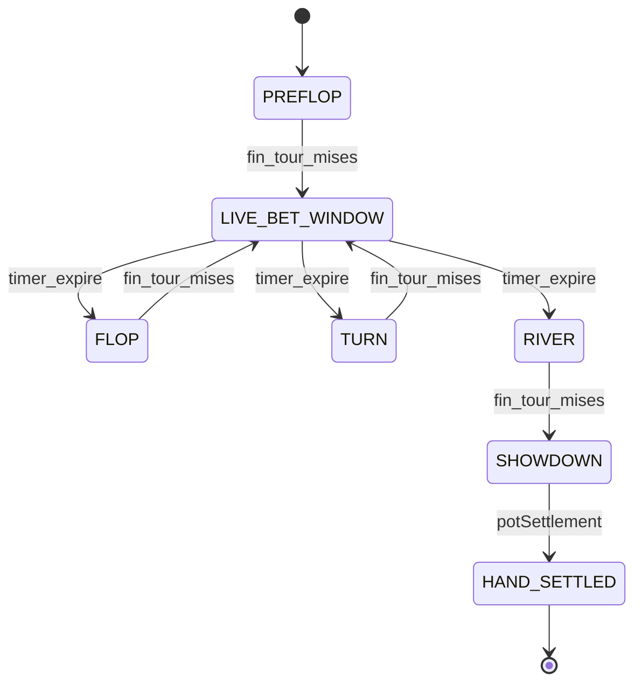
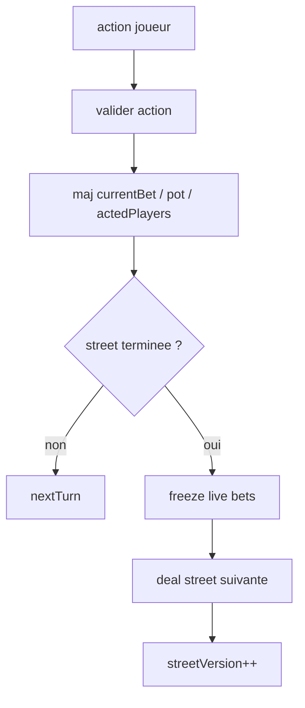
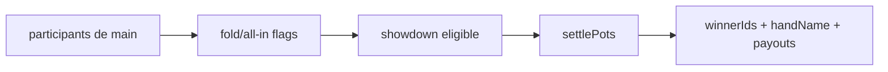

# Poker moteur (`GameTable`)

```mermaid
stateDiagram-v2
  [*] --> PREFLOP
  PREFLOP --> LIVE_BET_WINDOW: fin_tour_mises
  LIVE_BET_WINDOW --> FLOP: timer_expire
  FLOP --> LIVE_BET_WINDOW: fin_tour_mises
  LIVE_BET_WINDOW --> TURN: timer_expire
  TURN --> LIVE_BET_WINDOW: fin_tour_mises
  LIVE_BET_WINDOW --> RIVER: timer_expire
  RIVER --> SHOWDOWN: fin_tour_mises
  SHOWDOWN --> HAND_SETTLED: potSettlement
  HAND_SETTLED --> [*]
```

```mermaid
flowchart TD
  A[action joueur] --> B[valider action]
  B --> C[maj currentBet / pot / actedPlayers]
  C --> D{street terminee ?}
  D -- non --> E[nextTurn]
  D -- oui --> F[freeze live bets]
  F --> G[deal street suivante]
  G --> H[streetVersion++]
```

```mermaid
flowchart LR
  P1[participants de main] --> P2[fold/all-in flags]
  P2 --> P3[showdown eligible]
  P3 --> P4[settlePots]
  P4 --> P5[winnerIds + handName + payouts]
```
