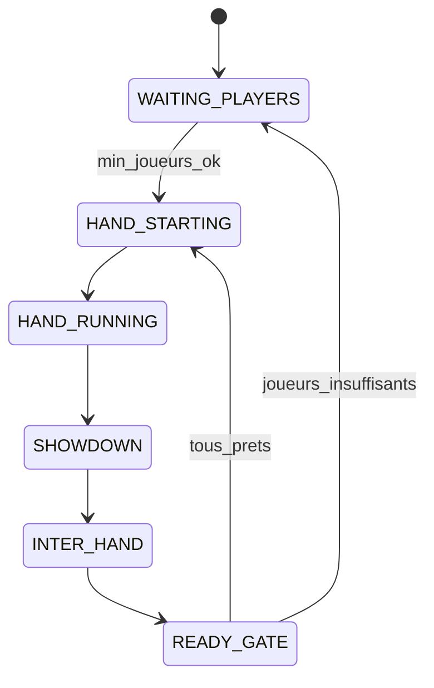
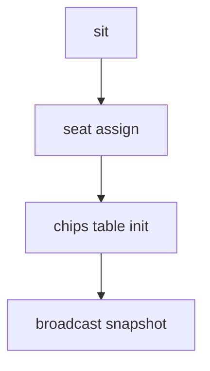
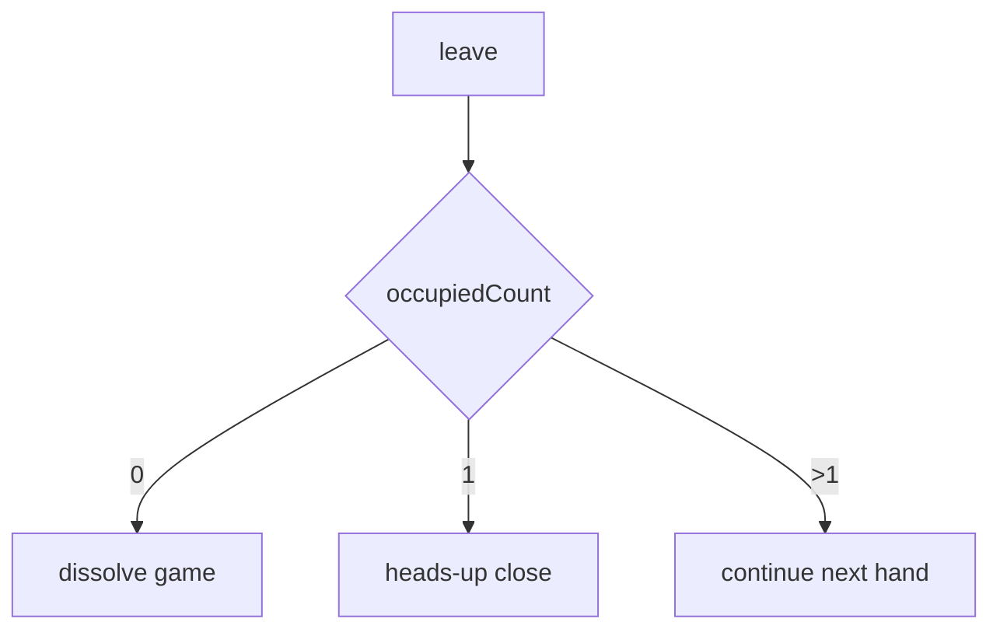

# Cash game controller (`CashGameController`)

```mermaid
stateDiagram-v2
  [*] --> WAITING_PLAYERS
  WAITING_PLAYERS --> HAND_STARTING: min_joueurs_ok
  HAND_STARTING --> HAND_RUNNING
  HAND_RUNNING --> SHOWDOWN
  SHOWDOWN --> INTER_HAND
  INTER_HAND --> READY_GATE
  READY_GATE --> HAND_STARTING: tous_prets
  READY_GATE --> WAITING_PLAYERS: joueurs_insuffisants
```

```mermaid
flowchart TD
  A[sit] --> B[seat assign]
  B --> C[chips table init]
  C --> D[broadcast snapshot]
```

```mermaid
flowchart TD
  L[leave] --> M{occupiedCount}
  M -- 0 --> N[dissolve game]
  M -- 1 --> O[heads-up close]
  M -- >1 --> P[continue next hand]
```
