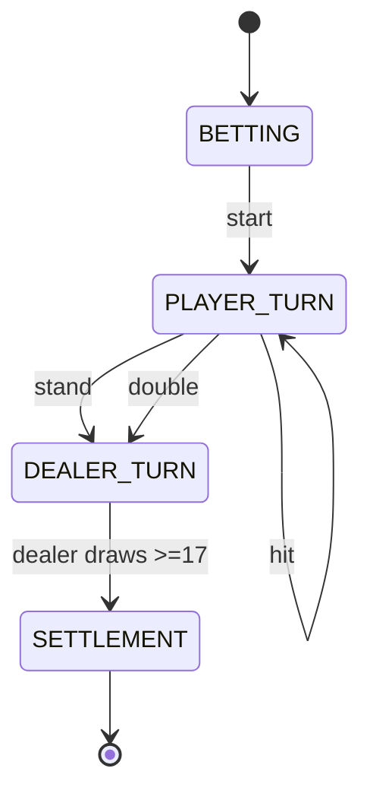
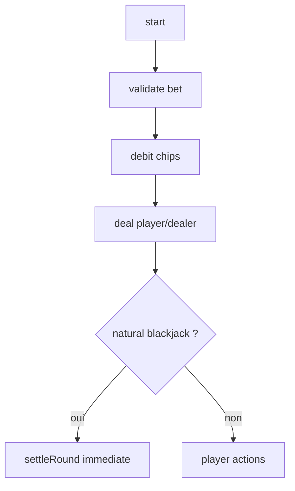
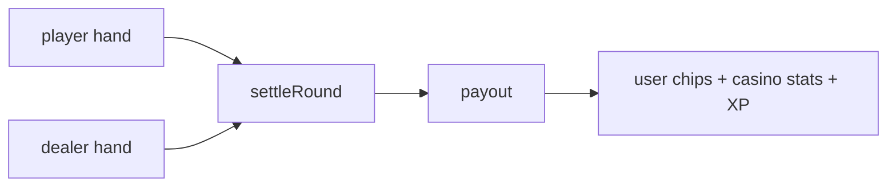

# Blackjack solo moteur (`blackjack.ts` + routes)

```mermaid
stateDiagram-v2
  [*] --> BETTING
  BETTING --> PLAYER_TURN: start
  PLAYER_TURN --> PLAYER_TURN: hit
  PLAYER_TURN --> DEALER_TURN: stand
  PLAYER_TURN --> DEALER_TURN: double
  DEALER_TURN --> SETTLEMENT: dealer draws >=17
  SETTLEMENT --> [*]
```

```mermaid
flowchart TD
  A[start] --> B[validate bet]
  B --> C[debit chips]
  C --> D[deal player/dealer]
  D --> E{natural blackjack ?}
  E -- oui --> F[settleRound immediate]
  E -- non --> G[player actions]
```

```mermaid
flowchart LR
  X[player hand] --> Y[settleRound]
  Z[dealer hand] --> Y
  Y --> P[payout]
  P --> Q[user chips + casino stats + XP]
```
