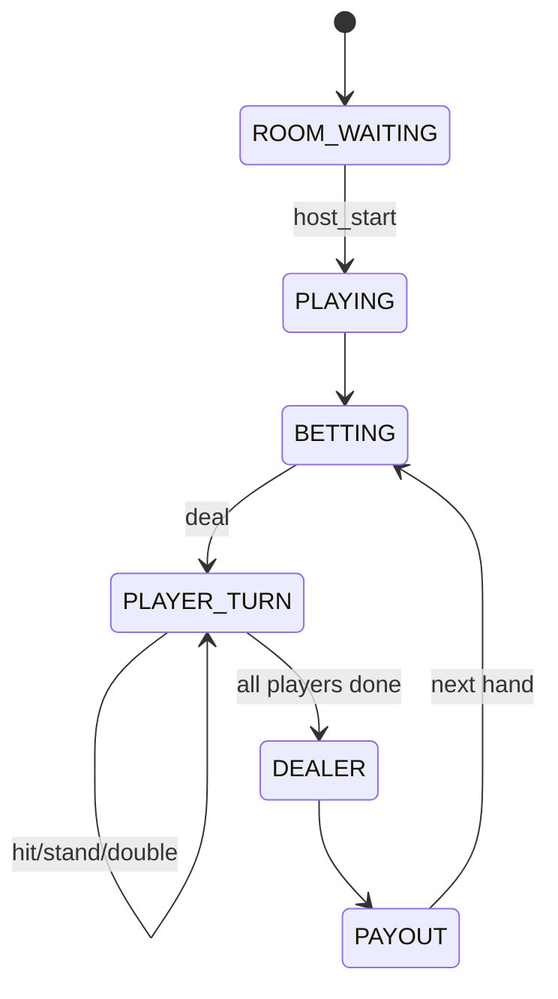
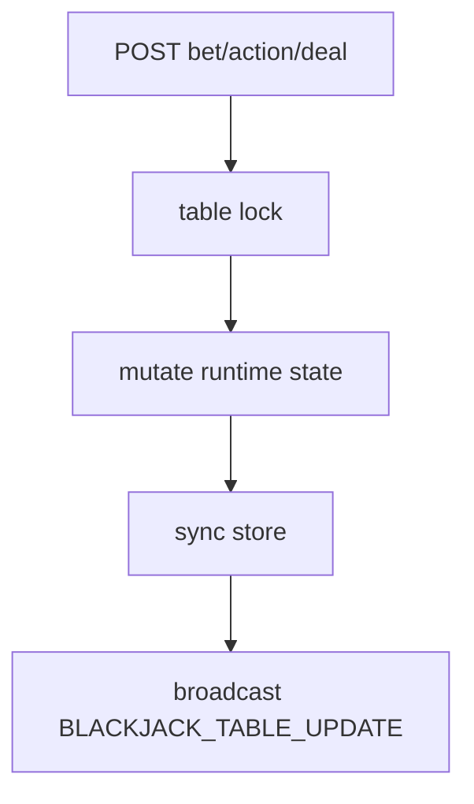
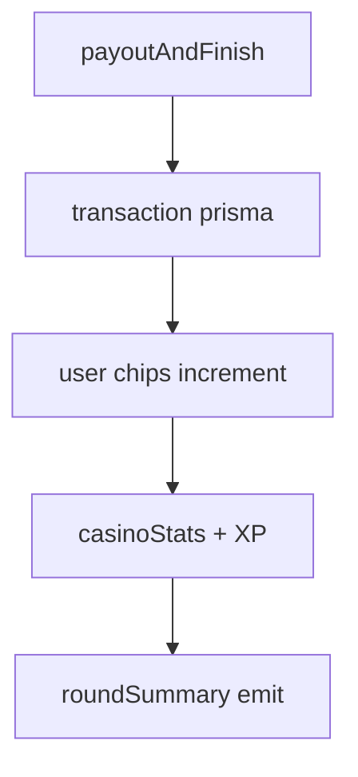

# Blackjack multijoueur (`BlackjackTableController`)

```mermaid
stateDiagram-v2
  [*] --> ROOM_WAITING
  ROOM_WAITING --> PLAYING: host_start
  PLAYING --> BETTING
  BETTING --> PLAYER_TURN: deal
  PLAYER_TURN --> PLAYER_TURN: hit/stand/double
  PLAYER_TURN --> DEALER: all players done
  DEALER --> PAYOUT
  PAYOUT --> BETTING: next hand
```

```mermaid
flowchart TD
  A[POST bet/action/deal] --> B[table lock]
  B --> C[mutate runtime state]
  C --> D[sync store]
  D --> E[broadcast BLACKJACK_TABLE_UPDATE]
```

```mermaid
flowchart TD
  R[payoutAndFinish] --> S[transaction prisma]
  S --> T[user chips increment]
  T --> U[casinoStats + XP]
  U --> V[roundSummary emit]
```
