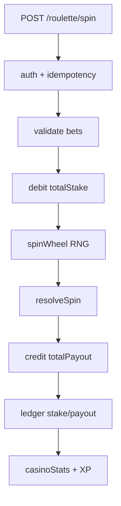
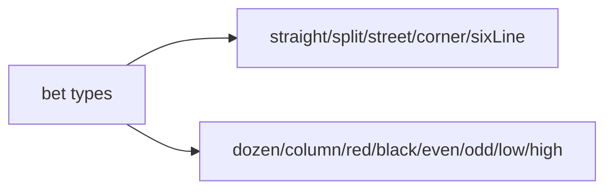
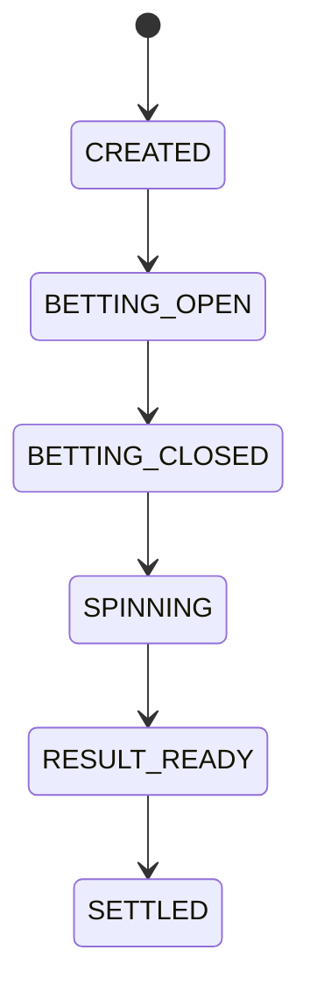

# Roulette moteur (`roulette.ts` + route spin)

```mermaid
flowchart TD
  A[POST /roulette/spin] --> B[auth + idempotency]
  B --> C[validate bets]
  C --> D[debit totalStake]
  D --> E[spinWheel RNG]
  E --> F[resolveSpin]
  F --> G[credit totalPayout]
  G --> H[ledger stake/payout]
  H --> I[casinoStats + XP]
```

```mermaid
flowchart LR
  B1[bet types] --> B2[straight/split/street/corner/sixLine]
  B1 --> B3[dozen/column/red/black/even/odd/low/high]
```

```mermaid
stateDiagram-v2
  [*] --> CREATED
  CREATED --> BETTING_OPEN
  BETTING_OPEN --> BETTING_CLOSED
  BETTING_CLOSED --> SPINNING
  SPINNING --> RESULT_READY
  RESULT_READY --> SETTLED
```
