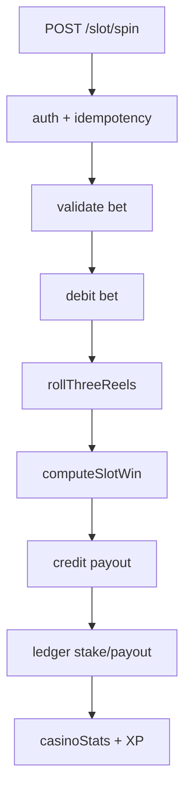
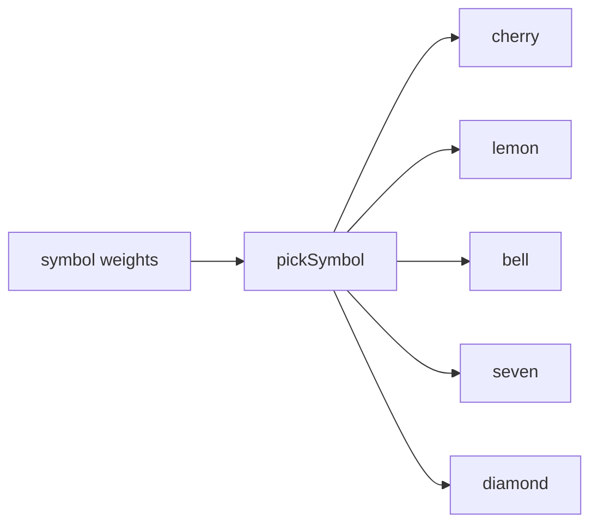
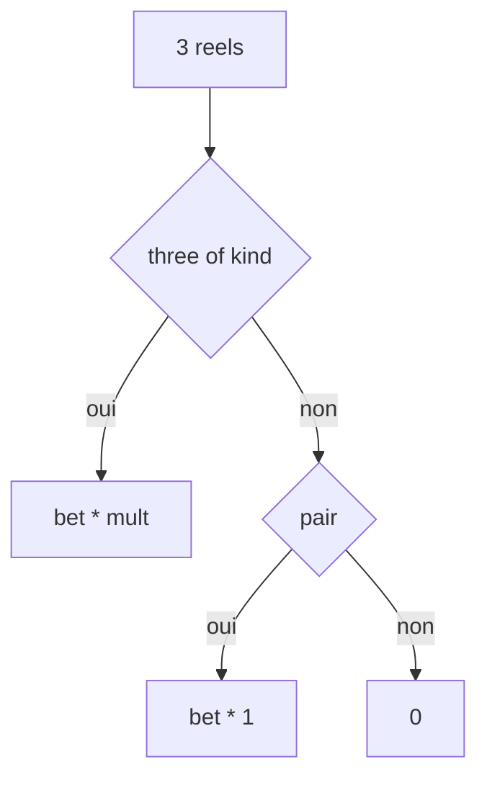

# Slot moteur (`slotMachine.ts` + route spin)

```mermaid
flowchart TD
  A[POST /slot/spin] --> B[auth + idempotency]
  B --> C[validate bet]
  C --> D[debit bet]
  D --> E[rollThreeReels]
  E --> F[computeSlotWin]
  F --> G[credit payout]
  G --> H[ledger stake/payout]
  H --> I[casinoStats + XP]
```

```mermaid
flowchart LR
  S[symbol weights] --> P[pickSymbol]
  P --> R1[cherry]
  P --> R2[lemon]
  P --> R3[bell]
  P --> R4[seven]
  P --> R5[diamond]
```

```mermaid
flowchart TD
  W[3 reels] --> X{three of kind}
  X -- oui --> Y[bet * mult]
  X -- non --> Z{pair}
  Z -- oui --> K[bet * 1]
  Z -- non --> L[0]
```
