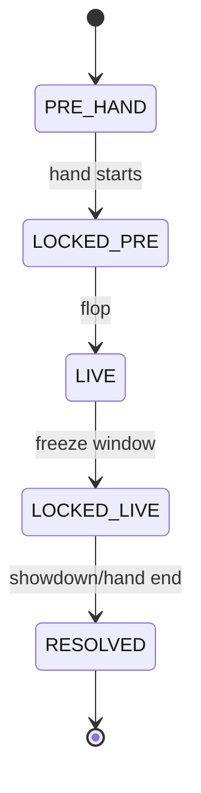
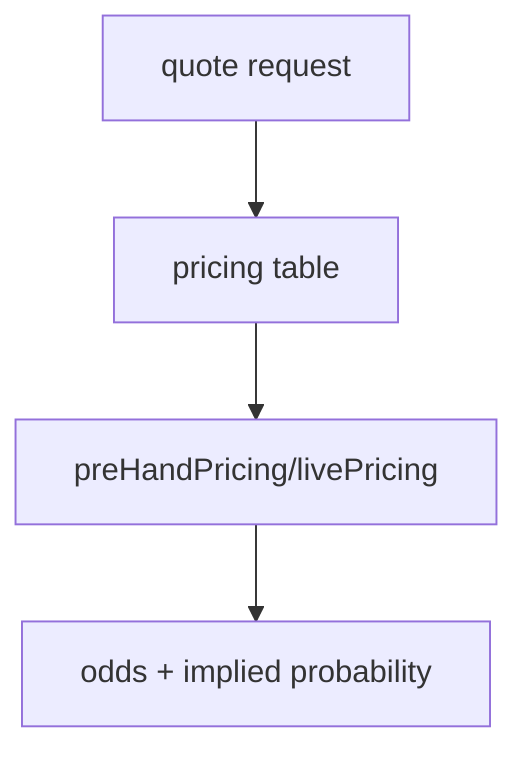
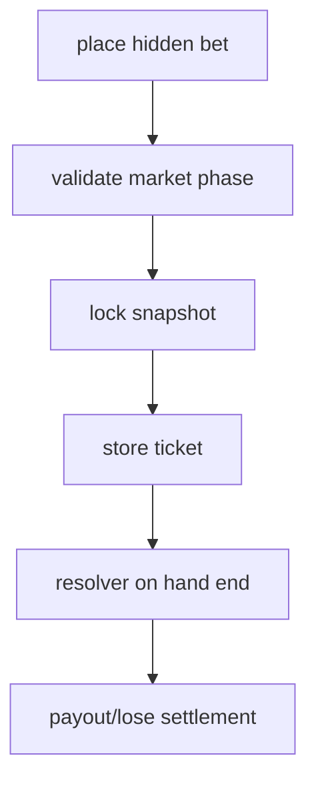

# Hidden bets moteur

```mermaid
stateDiagram-v2
  [*] --> PRE_HAND
  PRE_HAND --> LOCKED_PRE: hand starts
  LOCKED_PRE --> LIVE: flop
  LIVE --> LOCKED_LIVE: freeze window
  LOCKED_LIVE --> RESOLVED: showdown/hand end
  RESOLVED --> [*]
```

```mermaid
flowchart TD
  A[quote request] --> B[pricing table]
  B --> C[preHandPricing/livePricing]
  C --> D[odds + implied probability]
```

```mermaid
flowchart TD
  P[place hidden bet] --> Q[validate market phase]
  Q --> R[lock snapshot]
  R --> S[store ticket]
  S --> T[resolver on hand end]
  T --> U[payout/lose settlement]
```
