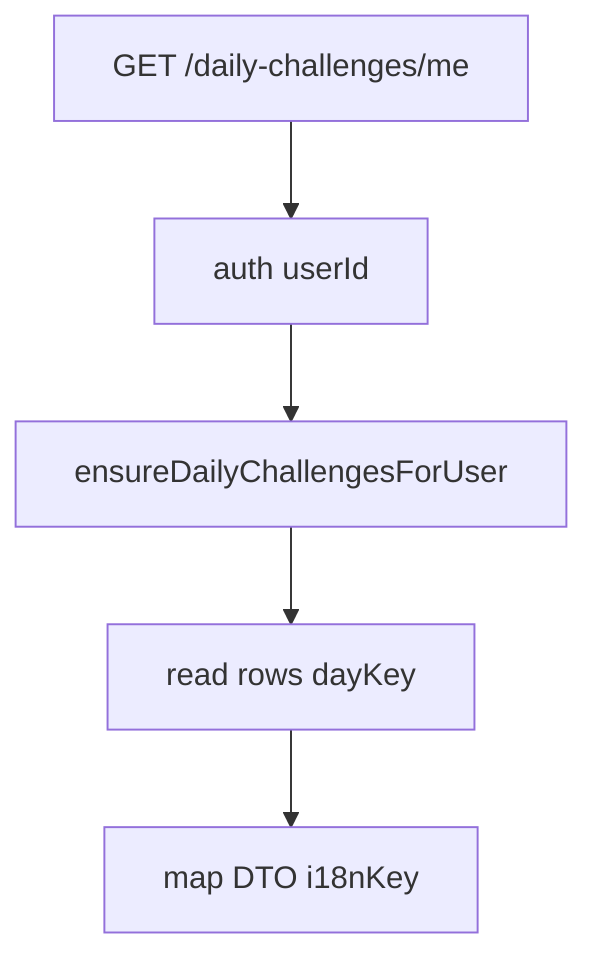
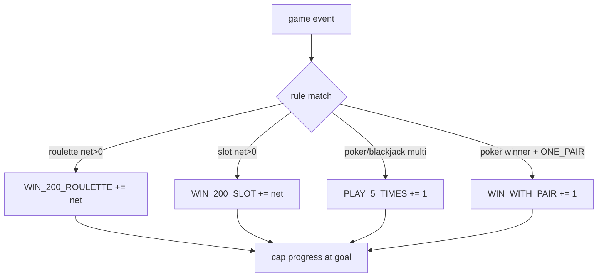
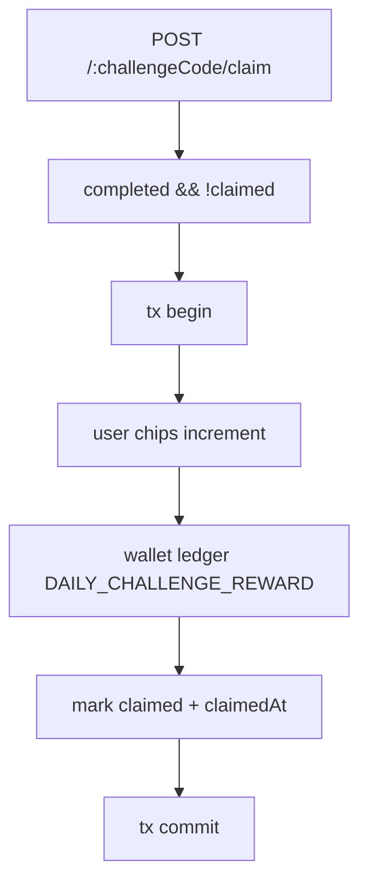

# Daily challenges V2 moteur

```mermaid
flowchart TD
  A[GET /daily-challenges/me] --> B[auth userId]
  B --> C[ensureDailyChallengesForUser]
  C --> D[read rows dayKey]
  D --> E[map DTO i18nKey]
```

```mermaid
flowchart TD
  H[game event] --> I{rule match}
  I -- roulette net>0 --> J[WIN_200_ROULETTE += net]
  I -- slot net>0 --> K[WIN_200_SLOT += net]
  I -- poker/blackjack multi --> L[PLAY_5_TIMES += 1]
  I -- poker winner + ONE_PAIR --> M[WIN_WITH_PAIR += 1]
  J --> N[cap progress at goal]
  K --> N
  L --> N
  M --> N
```

```mermaid
flowchart TD
  C1[POST /:challengeCode/claim] --> C2[completed && !claimed]
  C2 --> C3[tx begin]
  C3 --> C4[user chips increment]
  C4 --> C5[wallet ledger DAILY_CHALLENGE_REWARD]
  C5 --> C6[mark claimed + claimedAt]
  C6 --> C7[tx commit]
```
