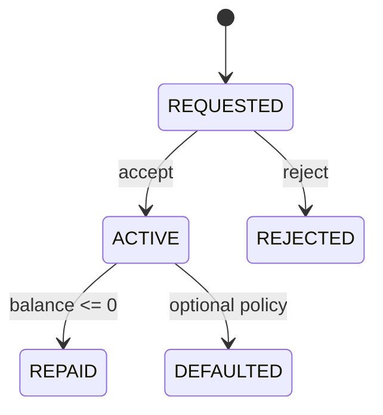
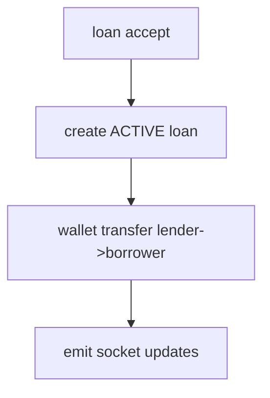
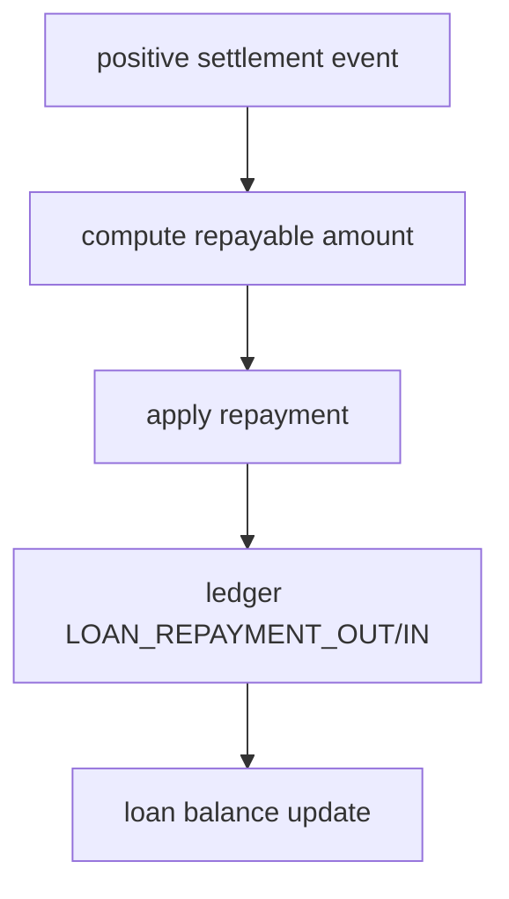

# Friend loans moteur

```mermaid
stateDiagram-v2
  [*] --> REQUESTED
  REQUESTED --> ACTIVE: accept
  REQUESTED --> REJECTED: reject
  ACTIVE --> REPAID: balance <= 0
  ACTIVE --> DEFAULTED: optional policy
```

```mermaid
flowchart TD
  A[loan accept] --> B[create ACTIVE loan]
  B --> C[wallet transfer lender->borrower]
  C --> D[emit socket updates]
```

```mermaid
flowchart TD
  R[positive settlement event] --> S[compute repayable amount]
  S --> T[apply repayment]
  T --> U[ledger LOAN_REPAYMENT_OUT/IN]
  U --> V[loan balance update]
```
