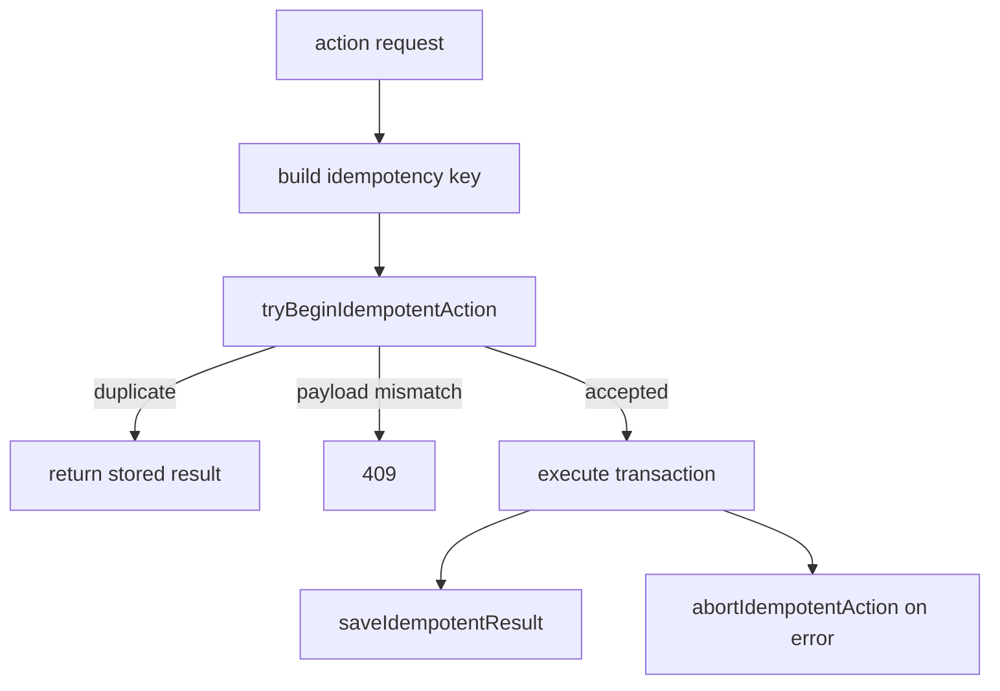
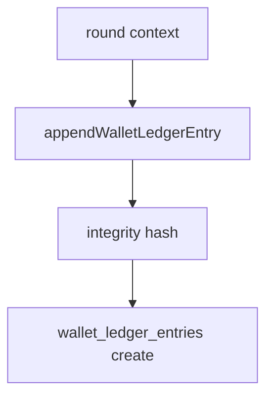

# Idempotence et ledger

```mermaid
flowchart TD
  A[action request] --> B[build idempotency key]
  B --> C[tryBeginIdempotentAction]
  C -->|duplicate| D[return stored result]
  C -->|payload mismatch| E[409]
  C -->|accepted| F[execute transaction]
  F --> G[saveIdempotentResult]
  F --> H[abortIdempotentAction on error]
```

```mermaid
flowchart TD
  L1[round context] --> L2[appendWalletLedgerEntry]
  L2 --> L3[integrity hash]
  L3 --> L4[wallet_ledger_entries create]
```
