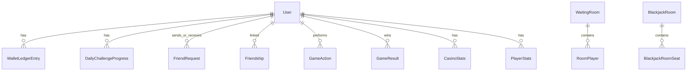
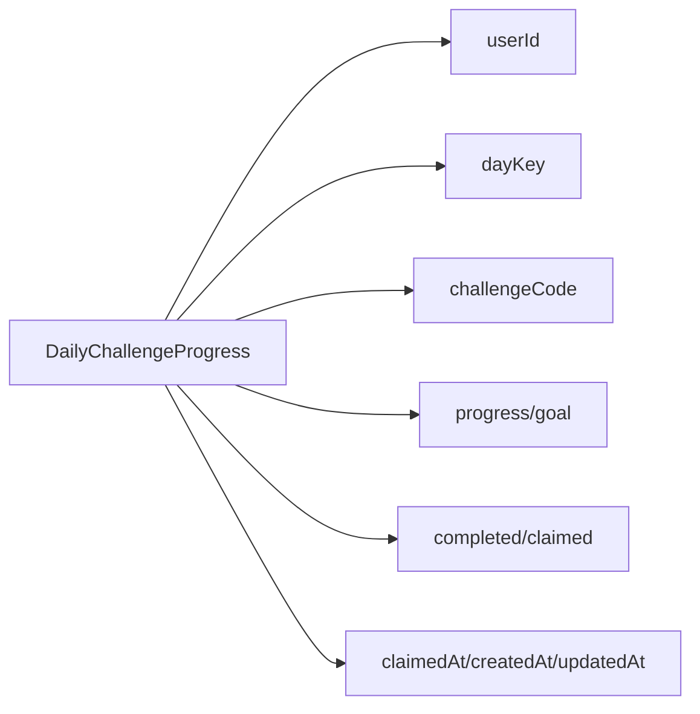

# Prisma modele global

```mermaid
erDiagram
  User ||--o{ WalletLedgerEntry : has
  User ||--o{ DailyChallengeProgress : has
  User ||--o{ FriendRequest : sends_or_receives
  User ||--o{ Friendship : linked
  User ||--o{ GameAction : performs
  User ||--o{ GameResult : wins
  User ||--o{ CasinoStats : has
  User ||--o{ PlayerStats : has
  WaitingRoom ||--o{ RoomPlayer : contains
  BlackjackRoom ||--o{ BlackjackRoomSeat : contains
```

```mermaid
flowchart LR
  D1[DailyChallengeProgress]
  D1 --> D2[userId]
  D1 --> D3[dayKey]
  D1 --> D4[challengeCode]
  D1 --> D5[progress/goal]
  D1 --> D6[completed/claimed]
  D1 --> D7[claimedAt/createdAt/updatedAt]
```
