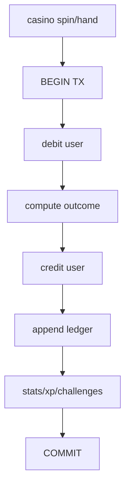
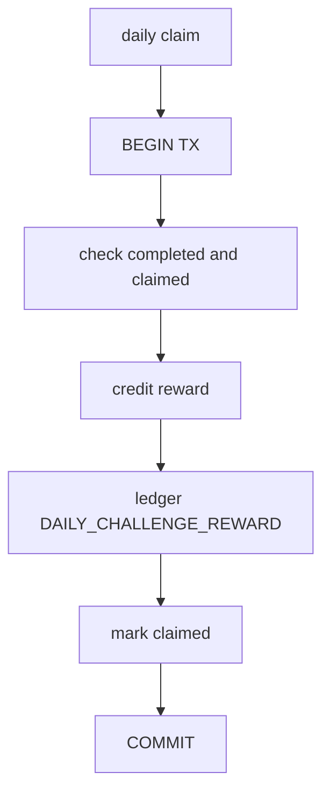

# Flux transactions metier

```mermaid
flowchart TD
  A[casino spin/hand] --> B[BEGIN TX]
  B --> C[debit user]
  C --> D[compute outcome]
  D --> E[credit user]
  E --> F[append ledger]
  F --> G[stats/xp/challenges]
  G --> H[COMMIT]
```

```mermaid
flowchart TD
  X[daily claim] --> Y[BEGIN TX]
  Y --> Z[check completed and claimed]
  Z --> U[credit reward]
  U --> V[ledger DAILY_CHALLENGE_REWARD]
  V --> W[mark claimed]
  W --> T[COMMIT]
```
