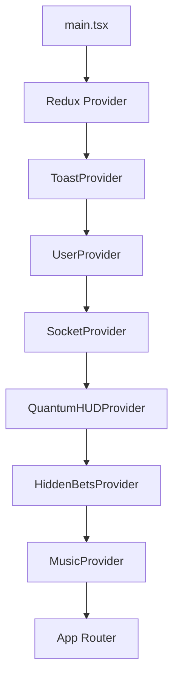
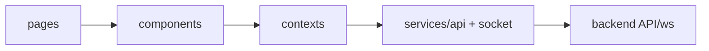

# Architecture frontend

```mermaid
flowchart TD
  A[main.tsx] --> B[Redux Provider]
  B --> C[ToastProvider]
  C --> D[UserProvider]
  D --> E[SocketProvider]
  E --> F[QuantumHUDProvider]
  F --> G[HiddenBetsProvider]
  G --> H[MusicProvider]
  H --> I[App Router]
```

```mermaid
flowchart LR
  P[pages] --> C1[components]
  C1 --> C2[contexts]
  C2 --> S[services/api + socket]
  S --> N[backend API/ws]
```
