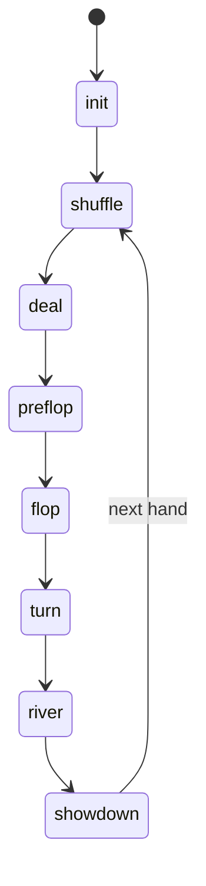
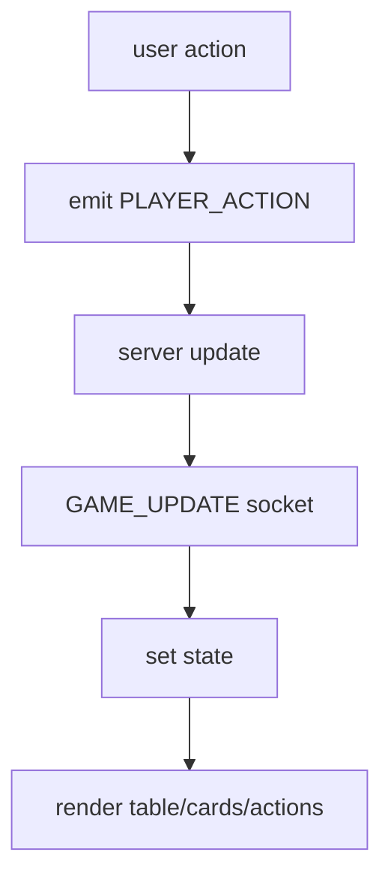

# Game page (`Game.tsx`) automate

```mermaid
stateDiagram-v2
  [*] --> init
  init --> shuffle
  shuffle --> deal
  deal --> preflop
  preflop --> flop
  flop --> turn
  turn --> river
  river --> showdown
  showdown --> shuffle: next hand
```

```mermaid
flowchart TD
  A[user action] --> B[emit PLAYER_ACTION]
  B --> C[server update]
  C --> D[GAME_UPDATE socket]
  D --> E[set state]
  E --> F[render table/cards/actions]
```
