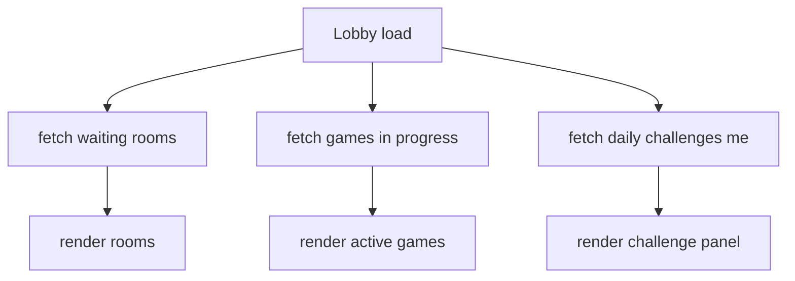
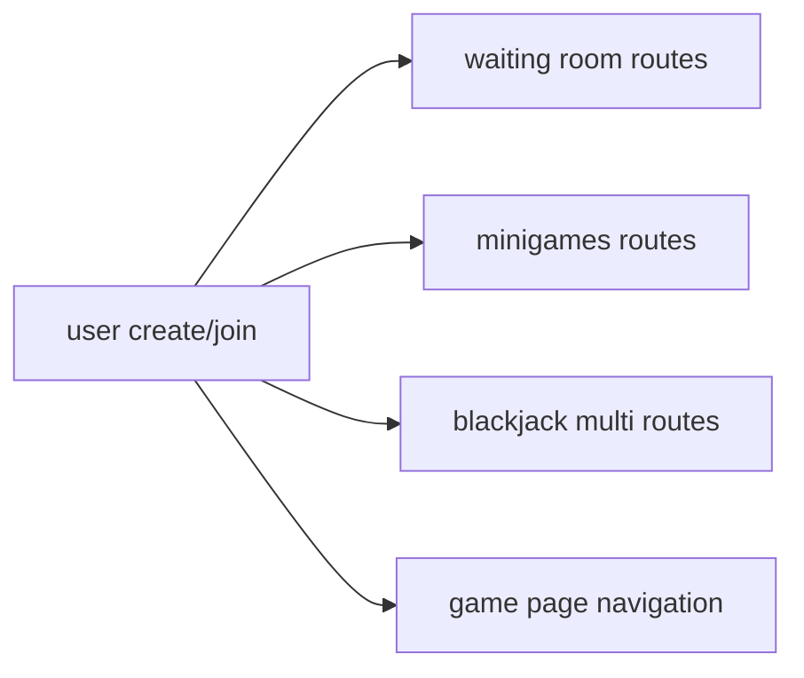

# Lobby flow logique

```mermaid
flowchart TD
  A[Lobby load] --> B[fetch waiting rooms]
  A --> C[fetch games in progress]
  A --> D[fetch daily challenges me]
  B --> E[render rooms]
  C --> F[render active games]
  D --> G[render challenge panel]
```

```mermaid
flowchart LR
  U[user create/join] --> R[waiting room routes]
  U --> M[minigames routes]
  U --> BJ[blackjack multi routes]
  U --> G[game page navigation]
```
