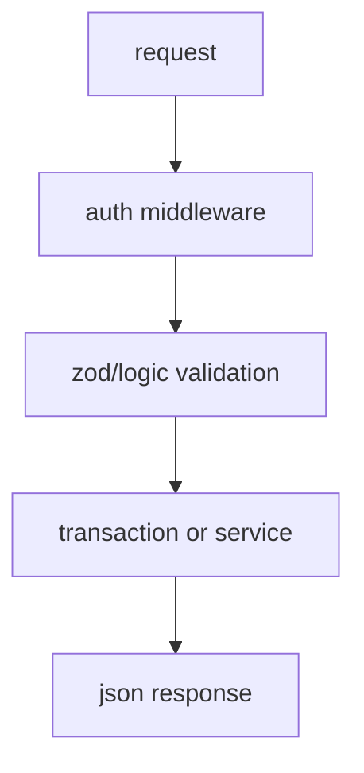

# HTTP API map

```mermaid
flowchart LR
  C[Client] --> A1[/api/auth/*]
  C --> A2[/api/game/*]
  C --> A3[/api/waiting-room/*]
  C --> A4[/api/slot/spin]
  C --> A5[/api/roulette/spin]
  C --> A6[/api/blackjack/*]
  C --> A7[/api/blackjack-tables/*]
  C --> A8[/api/hidden-bets/*]
  C --> A9[/api/daily-challenges/*]
  C --> A10[/api/friends/*]
  C --> A11[/api/invitations/*]
  C --> A12[/api/leaderboard]
```


