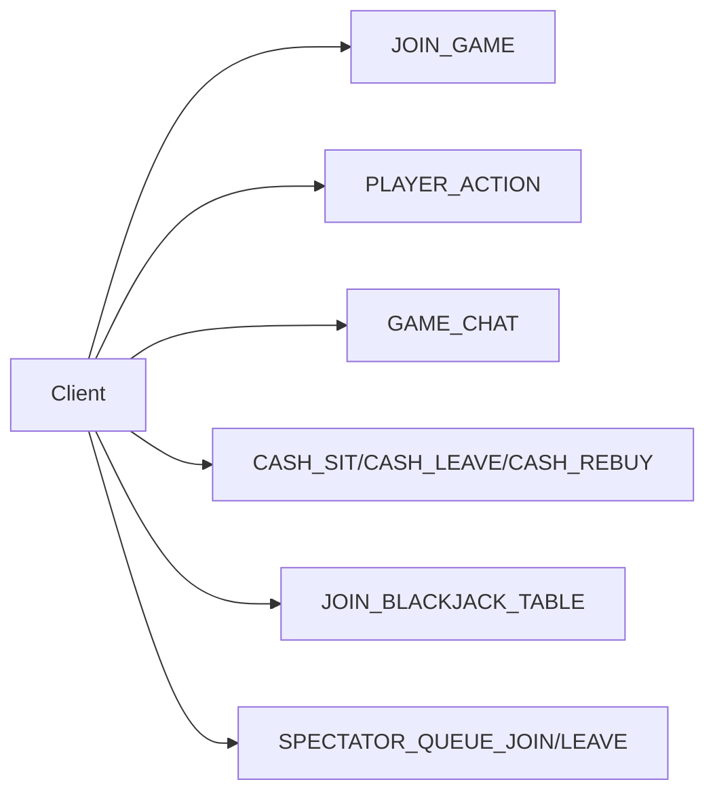
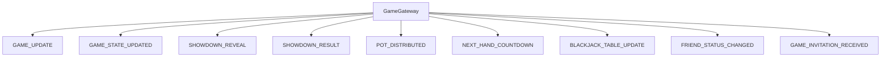
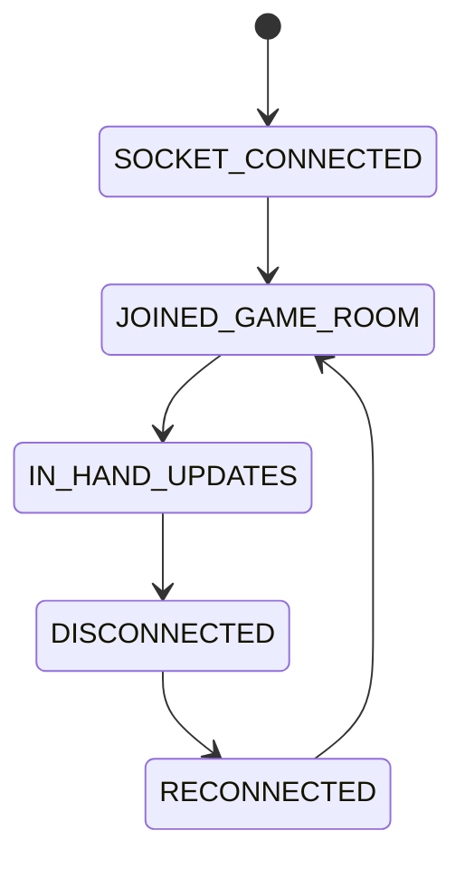

# Socket events map

```mermaid
flowchart LR
  C[Client] --> E1[JOIN_GAME]
  C --> E2[PLAYER_ACTION]
  C --> E3[GAME_CHAT]
  C --> E4[CASH_SIT/CASH_LEAVE/CASH_REBUY]
  C --> E5[JOIN_BLACKJACK_TABLE]
  C --> E6[SPECTATOR_QUEUE_JOIN/LEAVE]
```

```mermaid
flowchart TD
  S[GameGateway] --> O1[GAME_UPDATE]
  S --> O2[GAME_STATE_UPDATED]
  S --> O3[SHOWDOWN_REVEAL]
  S --> O4[SHOWDOWN_RESULT]
  S --> O5[POT_DISTRIBUTED]
  S --> O6[NEXT_HAND_COUNTDOWN]
  S --> O7[BLACKJACK_TABLE_UPDATE]
  S --> O8[FRIEND_STATUS_CHANGED]
  S --> O9[GAME_INVITATION_RECEIVED]
```

```mermaid
stateDiagram-v2
  [*] --> SOCKET_CONNECTED
  SOCKET_CONNECTED --> JOINED_GAME_ROOM
  JOINED_GAME_ROOM --> IN_HAND_UPDATES
  IN_HAND_UPDATES --> DISCONNECTED
  DISCONNECTED --> RECONNECTED
  RECONNECTED --> JOINED_GAME_ROOM
```
