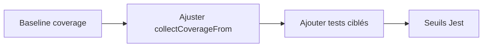

# Couverture Jest serveur à 80 %

## Contexte

- Tests : Jest ([server/jest.config.cjs](server/jest.config.cjs)), `collectCoverageFrom` sur `src/**/*.ts` avec quelques exclusions déjà présentes.
- ~45 fichiers de tests sous [server/src/__tests__](server/src/__tests__) et quelques `*.test.ts` ailleurs ; **aucun `coverageThreshold`** aujourd’hui.
- Fichiers peu rentables pour la couverture « produit » : bootstrap (`index.ts`), scripts one-off, swagger, éventuels stores Redis complexes sans abstractions testables.

## Étape 1 — Ligne de base

- Exécuter `cd server && npm run test:coverage` et noter les % **global** (lines, statements, functions, branches) + le rapport `coverage/lcov-report` pour identifier les **plus gros trous** (souvent : grosses routes, `game.gateway.ts`, services I/O).

## Étape 2 — Périmètre de couverture (inclusions / exclusions)

- Affiner `collectCoverageFrom` dans [server/jest.config.cjs](server/jest.config.cjs) pour **ne pas diluer** la métrique avec du code non pertinent, par exemple (à valider après lecture du rapport) :
  - exclure `src/scripts/**`, `src/run-tests.manual.ts`, [server/src/swagger.docs.ts](server/src/swagger.docs.ts) si présent, fichiers purement d’entrée ;
  - garder routes / logique métier / services dans le périmètre.
- Objectif : 80 % sur le code **métier**, pas sur tout fichier `.ts` par principe.

## Étape 3 — Combler les écarts (stratégie)

Prioriser des tests **rapides et stables** (sans réseau réel) :

1. **Modules purs** déjà partiellement couverts : compléter branches manquantes dans `utils/`, `tournament/*.ts` (hors intégration lourde), `validation/`, `logic/gamification`, etc.
2. **Services avec dépendances** : mocks Prisma / Redis ciblés (pattern déjà utilisé dans [server/src/__tests__/tournament.reward.service.test.ts](server/src/__tests__/tournament.reward.service.test.ts), [server/src/__tests__/casino.idempotency.test.ts](server/src/__tests__/casino.idempotency.test.ts)).
3. **Routes HTTP** : tests d’intégration supertest sur les routes à fort impact et peu couvertes (aligné sur [server/src/__tests__/tournament.routes.integration.test.ts](server/src/__tests__/tournament.routes.integration.test.ts), [server/src/__tests__/friendLoan.routes.integration.test.ts](server/src/__tests__/friendLoan.routes.integration.test.ts)).
4. **Game gateway** : ne viser 80 % ligne-par-ligne sur [server/src/sockets/game.gateway.ts](server/src/sockets/game.gateway.ts) qu’en dernier recours ; préférer extraire des **petites fonctions testables** (si nécessaire) ou tests d’intégration socket ciblés déjà esquissés dans [server/src/__tests__/gameGateway.realtime.integration.test.ts](server/src/__tests__/gameGateway.realtime.integration.test.ts).

Ordre de travail : faire monter la courbe globale avec (1) et (2), puis (3), puis décider pour (4).

## Étape 4 — Verrouillage CI

- Ajouter dans [server/jest.config.cjs](server/jest.config.cjs) :

```js
coverageThreshold: {
  global: {
    lines: 80,
    statements: 80,
    functions: 80,
    branches: 72, // souvent plus dur ; ajuster 72–78 après baseline
  },
},
```

- Ajuster `branches` après la première mesure réelle pour éviter un seuil impossible sans refactor massif.

## Étape 5 — Documentation minimale

- Dans [Docs/TESTING_GUIDE.md](Docs/TESTING_GUIDE.md) (section existante ou courte sous-section) : commande `npm run test:coverage`, emplacement du rapport, règle « ne pas baisser le seuil sans ticket ».

## Livrables

- `jest.config.cjs` : exclusions affinées + `coverageThreshold`.
- Nouveaux / complétés : fichiers `*.test.ts` sous `src/__tests__` ou à côté des modules, jusqu’à **≥ 80 %** (lines/statements/functions) sur le périmètre défini.
- `npm run test:coverage` passe en vert localement (et en CI si applicable).



