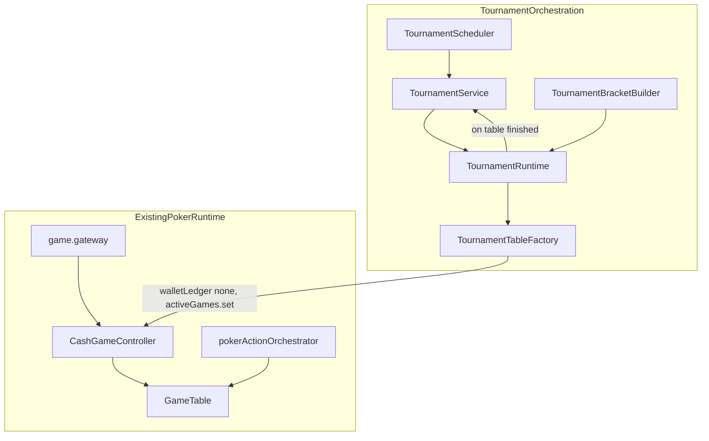

# Plan — Système tournois Quantum Bluff (spec technique)

## Contexte repo (état actuel)

- **Aucun modèle tournoi** dans [`server/prisma/schema.prisma`](server/prisma/schema.prisma) (suppression précédente).
- **Démarrage cash standard** : [`server/src/routes/waitingRoom.routes.ts`](server/src/routes/waitingRoom.routes.ts) crée un `CashGameController`, débite le portefeuille (`User.chips` + ledger `CASH_POKER_BUY_IN`) via `initFromRoomPlayers` + transaction Prisma — incompatible tel quel avec **« pas de buy-in »**.
- **Moteur poker** : `GameTable` + `CashGameController` dans [`server/src/logic/CashGameController.ts`](server/src/logic/CashGameController.ts) ; gateway [`server/src/sockets/game.gateway.ts`](server/src/sockets/game.gateway.ts) et orchestrateur [`server/src/poker/services/pokerActionOrchestrator.service.ts`](server/src/poker/services/pokerActionOrchestrator.service.ts) supposent surtout du cash.
- **Reconnexion / persistance** : [`server/src/shared/activeGames.ts`](server/src/shared/activeGames.ts), [`server/src/poker/recovery/pokerRecovery.service.ts`](server/src/poker/recovery/pokerRecovery.service.ts), `pokerStateStore` — le tournoi devra **rejouer l’état** depuis DB + jeux actifs.

## Décision d’architecture (respect « pas de logique tournoi dans GameTable »)

- **Ne pas** mettre de règles bracket dans `GameTable`.
- **Extension minimale et ciblée de `CashGameController`** (pas des règles de cartes) pour supporter des tables **« stack virtuel / sans ledger wallet »** :
  - option du type `walletLedger: 'cash' | 'none'` (nom à figer) : si `'none'`, **pas** de débit/crédit Prisma à l’ouverture / entre mains pour ces tables ; crédit **unique** en fin de tournoi côté `TournamentService` selon la règle prix choisie.
  - **Fin de « match » de table tournoi** : aujourd’hui, entre deux mains, le cash continue tant qu’il reste des sièges avec jetons. Pour l’élimination directe, il faut **court-circuiter** la boucle inter-mains quand **un seul joueur a des jetons** (tous les autres à 0 / sièges libérés). Ce garde peut vivre dans `CashGameController` comme condition d’arrêt générique « `stopWhenSingleSurvivor: true` » (nom à figer) — ce n’est pas de la logique bracket, c’est un mode de table.
- **Paris cachés** : désactiver pour les `gameId` tournoi (préfixe dédié, ex. `game_tournament_*`) dans la gateway / resolver, pour éviter des prélèvements wallet liés au cash.

## Modèle de données (Prisma)

Nouvelle migration alignée sur la spec §12, adaptée aux besoins runtime :

- **`Tournament`** : `id`, `name`, `hostId`, `visibility` (PUBLIC/PRIVATE), `code` (nullable, hash côté serveur si besoin), `status` (enum proche du cycle §4.1), `maxPlayers` (4–20), `initialStack`, `startAt`, `blindSmall`, `blindBig` (ou JSON `blindConfig` si tu veux alignement strict futur), `createdAt`, `updatedAt`, éventuellement `currentRoundNumber`, `bracketJson` (snapshot déterministe au démarrage).
  - **Snapshot prix finale** (rempli **au moment où la table finale est créée**, transaction atomique avec création `TournamentTable` finale) : `finalTablePlayerIds` (JSON `string[]` des `userId` assis à la finale) et/ou **`finalTableInitialStackSum`** (`Int`, source de vérité pour le crédit chips). Règle figée : `finalPrizeChips = finalTablePlayerCount * initialStack` (équivalent à la somme des stacks initiaux des joueurs présents à la finale si stack uniforme). **Ne pas** recalculer ce montant au `COMPLETED` depuis l’état runtime (recovery / divergences) : toujours lire `finalTableInitialStackSum` (ou dériver uniquement depuis le snapshot stocké).
- **`TournamentPlayer`** : `id`, `tournamentId`, `userId`, `status` enum explicite : **`REGISTERED` | `ACTIVE` | `WAITING_NEXT_ROUND` | `ELIMINATED` | `WINNER`** (le statut attente alimente l’écran waiting), `eliminatedAt`, `finalRank`, **`eliminationOrder`** (global, monotone à chaque élimination sur n’importe quelle table), `eliminatedFromTableId` (optionnel), `qualifiedRound`, timestamps — **contrainte** unicité `(tournamentId, userId)`.
- **`TournamentRound`** : `id`, `tournamentId`, `roundNumber`, `status`, `startedAt`, `completedAt`.
- **`TournamentTable`** : `id`, `roundId`, `gameId` (lien `activeGames`), **`status`** enum Prisma **`PENDING` | `IN_PROGRESS` | `COMPLETED` | `CANCELLED` | `RECOVERING`** (recovery peut passer une ligne en `RECOVERING` le temps de rattacher `activeGames` / rejouer transitions), `winnerUserId` (nullable jusqu’à fin), `playerCount`, timestamps.
- **`TournamentRewardLedger`** (recommandé) : une ligne par effet de bord monétaire / XP déjà appliqué, avec `tournamentId`, `userId`, `kind` (`CHIPS_WINNER` | `XP_PLACEMENT` …), `amount` / `xpDelta`, `createdAt`, **contrainte unique** `(tournamentId, userId, kind)` (ou `idempotencyKey` UUID) pour garantir l’idempotence au redémarrage. Alternative acceptée : champs `Tournament.rewardGrantedAt` + `rewardLedgerReference` si tu préfères une seule ligne chips ; le ledger reste plus propre pour XP + chips + audit.
Index : `(tournamentId, status)`, `(gameId)` pour recovery.

### Classement final et XP (§10.1)

Objectif : attribuer **500 / 400 / 300 / 50** XP (1er / 2e / 3e / autres) en sachant qui est **2e** et **3e**.

- **Finale 1v1** : **1er** = gagnant final ; **2e** = perdant final. **3e (règle simple, sans ambiguïté)** : **`3e` = dernier joueur éliminé avant la finale** (parmi ceux marqués `ELIMINATED` avec `eliminatedFromTableId` ≠ table finale, prendre celui dont l’élimination est la **plus tardive** dans le tournoi — en pratique le plus grand `eliminationOrder` **strictement avant** l’ouverture de la table finale, ou équivalent `eliminatedAt`). Si plusieurs éliminations au **même moment théorique** : **départager par `eliminationOrder`** (plus grand = plus « proche » de la finale = 3e).
- **Finale directe à 3** (spec §3.3) : sur **cette table uniquement**, ordre d’élimination dans la finale : **3e** = premier éliminé de la finale ; **2e** = deuxième éliminé ; **1er** = dernier survivant. `TournamentRuntime` doit consommer **l’ordre d’élimination** (événements ou hook après main où un joueur passe à 0 jetons / siège libéré), pas seulement `winnerUserId`.

Implémentation : à chaque élimination détectée côté orchestration (après synchro sièges / `onHandComplete`), append `TournamentEliminationEvent` (table optionnelle ou JSON append-only) ou mise à jour atomique `TournamentPlayer` (`eliminatedAt`, `eliminationOrder`, `eliminatedFromTableId`) pour rejouer l’historique en recovery.

### Idempotence des chips (prix)

- **Obligatoire** : aucun double crédit si le process redémarre entre « tournoi COMPLETED » et « wallet mis à jour ».
- **Montant** : utiliser **`Tournament.finalTableInitialStackSum`** (défini à la création de la finale), pas un recomptage live post-crash.
- **Recommandation** : table **`TournamentRewardLedger`** avec contrainte d’unicité ; avant `User.chips += prize`, `INSERT` ledger dans une transaction ; si conflit unique → no-op (déjà payé).
- Lier éventuellement à `WalletLedgerEntry` existant via `metadataJson` / `reason` dédié (`TOURNAMENT_PRIZE`) pour traçabilité bancaire.

### Création des tables tournoi (sans toucher au waiting-room)

- **Ne pas** modifier [`server/src/routes/waitingRoom.routes.ts`](server/src/routes/waitingRoom.routes.ts) pour le tournoi (évite les `if tournament` et les régressions cash).
- **`TournamentTableFactory`** (nouveau module, ex. `server/src/tournament/TournamentTableFactory.ts`) : construit `gameId` préfixé `game_tournament_…`, instancie `CashGameController` avec `walletLedger: 'none'`, `stopWhenSingleSurvivor: true`, blinds depuis le tournoi, sièges avec `initialStack` fixe, **aucune** transaction `User.chips` à l’ouverture, `activeGames.set(gameId, …)`, enregistre `TournamentTable.gameId` + statut. Tests ciblés sur la factory isolément.

### Recovery — cas à couvrir explicitement

`TournamentRecoveryService` (boot + job périodique léger) doit réconcilier au minimum :

| Situation | Action attendue |
|-----------|-----------------|
| Table **encore active** (`gameId` dans `activeGames` ou snapshot store) | Ne pas recréer la table ; `status` table reste `IN_PROGRESS` ; éventuellement ré-émettre assignation / resynchroniser sockets. |
| Table **terminée** (un survivant / `TournamentTable` encore `IN_PROGRESS` mais jeu absent) | Option `RECOVERING` → transitions : marquer `COMPLETED`, enregistrer éliminations manquantes, débloquer round suivant si toutes les tables du round sont finies. |
| Joueur en **`WAITING_NEXT_ROUND`**, **next round** pas créé (crash entre « toutes tables OK » et création round N+1) | Reprendre depuis l’état DB : relancer `TournamentRuntime.advanceIfRoundComplete()` idempotent. |
| **Reward déjà** distribué (`TournamentRewardLedger` ou flags) | Skip crédit ; log `reward_already_applied`. |
| Tournoi **COMPLETED** mais reward **non** appliqué | Retry contrôlé `grantRewardsIfMissing()` idempotent (ledger). |

Ordre de réconciliation : lire `Tournament` + `TournamentRound` + `TournamentTable` + ledger → comparer à `activeGames` / `pokerStateStore` → appliquer transitions manquantes **une seule fois** (transactions + unique constraints).

## Bracket déterministe

- Module pur **`TournamentBracketBuilder`** (ex. [`server/src/tournament/bracket/TournamentBracketBuilder.ts`](server/src/tournament/bracket/TournamentBracketBuilder.ts)) : entrée `n` joueurs (4–20), sortie **assignation round 1** conforme au tableau §3.2, plus **règle finale à 3** (§3.3 : table à 3 = finale officielle, pas de HU forcé).
- **Tests unitaires** golden pour `n = 4..20` — faible risque de régression.
- **Seeding** V1 : shuffle Fisher–Yates avec RNG serveur (seed logué `tournamentId` + secret env pour reproductibilité debug si besoin).

### Tests obligatoires (checklist livraison)

À couvrir par des tests automatisés (unitaires et/ou intégration DB + runtime mock) :

1. **Bracket golden** : pour chaque `n` de **4 à 20**, sortie bracket déterministe alignée matrice officielle.
2. **Finale directe à 3** : dernière table à 3 joueurs ; ordre d’élimination → **3e / 2e / 1er** conforme à la spec.
3. **Reward idempotent** : double appel `grantRewardsIfMissing()` ou double boot recovery → **une seule** ligne ledger / un seul crédit chips ; XP idem par `kind`.
4. **Crash simulé** : table marquée finie côté poker / `COMPLETED` attendu, mais **round suivant pas encore créé** → recovery recrée ou avance l’état sans doublon de tables ni de joueurs.
5. **Crash simulé** : tournoi **`COMPLETED`** en DB mais **reward pas encore appliqué** (pas de ligne `CHIPS_WINNER`) → recovery / retry applique le montant depuis **`finalTableInitialStackSum`** une seule fois.

## Services / runtime serveur

Découpage proche de la spec §11 :

| Module | Rôle |
|--------|------|
| `TournamentService` | CRUD join/leave, validation code privé, transitions de statut, **grant XP** (500/400/300/50 via `finalRank`), **grant chips** vainqueur = **`finalTableInitialStackSum`** + ledger idempotent. |
| `TournamentRuntime` | À chaque fin de table : enregistrer **tous** les éliminés avec **ordre** ; statuts joueur **`WAITING_NEXT_ROUND`** quand applicable ; snapshot **`finalTablePlayerIds` / `finalTableInitialStackSum`** à l’instanciation de la **table finale** ; déclencher round suivant quand toutes les tables du round sont `COMPLETED`. |
| `TournamentScheduler` | `node-cron` ou `setInterval` + leader lock Redis (réutiliser le pattern ancien `quantum:tournament:cron:leader` si multi-instance) : countdown → `STARTING` → création tables round 1 → émission sockets. |
| `TournamentWaitingService` | Agrégat « qui attend quoi » (tables encore en cours, qualifiés), alimente `TOURNAMENT_WAITING` / `TOURNAMENT_NEXT_ROUND`. |
| `TournamentRecoveryService` | Au boot (+ garde-fou périodique) : cas listés section « Recovery » ; rattacher `gameId` depuis `TournamentTable` + `activeGames` / `pokerStateStore` ; **ne jamais** double-grant grâce au ledger. |

**Détection fin de table** : après `onHandComplete` / persistance gateway (là où le cash enchaîne déjà `beginNextHandCountdown`), si `stopWhenSingleSurvivor` et exactement un survivant → marquer `TournamentTable` complété, notifier `TournamentRuntime`, **ne pas** relancer `startHand()`.

## API & sockets

- **REST** (plus simple à sécuriser et à documenter) : `POST/GET /api/tournaments`, join/leave, création host — aligné UX lobby.
- **Socket** : événements §13 en complément (countdown, assigned, waiting, next round, completed). Implémentation possible via **room Socket.IO** `tournament:{id}` + `user:{userId}` pour ciblage.
- Ne pas laisser le client **choisir** table ou bracket : le serveur envoie `TOURNAMENT_TABLE_ASSIGNED` avec `gameId` + deep link `/game?gameId=...&tournament=1` (query réservée UI seulement si tu la réintroduis).

## Frontend ([`client/src/features/tournament/`](client/src/features/tournament/))

- `pages/TournamentLobby.tsx` : liste, countdown, join/create (réutiliser le design existant du lobby : cartes glass, typographie — s’inspirer de l’ancien widget supprimé sans copier l’ancienne logique métier).
- `pages/TournamentRoom.tsx` : détail inscriptions + countdown (route dédiée, ex. `/tournaments/:id`).
- `pages/TournamentWaiting.tsx` : UI légère §8 + panneau « voir plus » (progression).
- `components/ZipRushMiniGame.tsx` : mini-jeu **100 % client** (pause sur `TOURNAMENT_NEXT_ROUND` / navigation).
- `components/TournamentBracketPanel.tsx` : arbre / rounds (données issues API).
- `services/tournamentApi.ts` + `hooks/useTournamentSocket.ts`.

## Observabilité (§20)

- Logs structurés `rootLogger` avec `tournamentId`, `roundId`, `tableId`, `gameId`, `userId`.
- Métriques Prometheus (réintroduire compteurs simples dans [`server/src/observability/metrics.ts`](server/src/observability/metrics.ts)) : `active_tournaments`, `active_tournament_tables`, `waiting_players`, compteurs recovery.

## Ordre de livraison recommandé

1. **Prisma + migration** + seed de dev minimal.
2. **`TournamentBracketBuilder` + tests** (matrice 4–20).
3. **`CashGameController` mode sans wallet + arrêt single survivor** + désactivation hidden bets sur préfixe tournoi.
3b. **`TournamentTableFactory`** (aucun changement au flux [`waitingRoom.routes.ts`](server/src/routes/waitingRoom.routes.ts)).
4. **`TournamentService` + REST** (create/join/leave/list/detail).
5. **`TournamentRuntime` + ordre d’élimination + fin de table hook** depuis gateway (point d’intégration unique).
6. **Scheduler + cleanup** (annulation si pas assez de joueurs à `startAt`).
7. **Recovery boot**.
8. **Frontend** (lobby → room → game → waiting) + i18n.
9. **XP / crédit chips** final (transaction Prisma idempotente par `tournamentId`).

## Risques / points de vigilance

- **Cohérence jetons** : en mode `'none'`, vérifier que **toutes** les voies gateway qui créditent/débitent le wallet (ex. fin de partie cash, hidden bets) ignorent ces `gameId`.
- **Spectateurs / rebuy** : pour V1 tournoi, limiter aux flux nécessaires (pas de rebuy, pas de file spectateur cash) pour réduire la surface.
- **Spec « ne pas modifier le runtime »** : les changements `CashGameController` restent **mécaniques** (argent réel vs jetons virtuels + arrêt table) — documenter dans un court `Docs/intern/TOURNAMENT_RUNTIME_CONTRACT.md` si tu veux tracer la décision.

